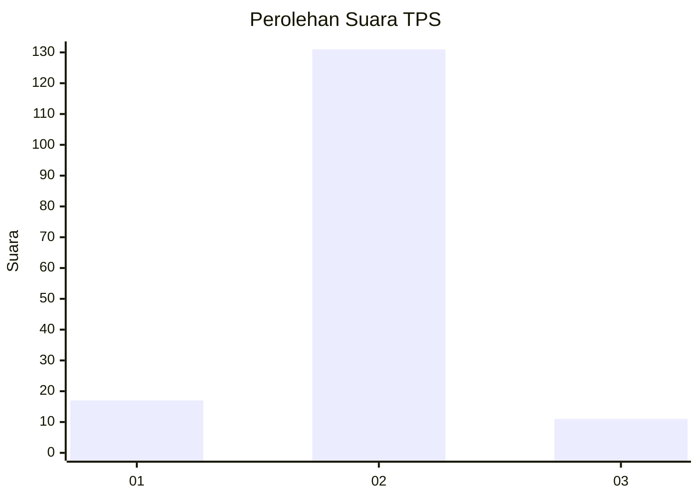
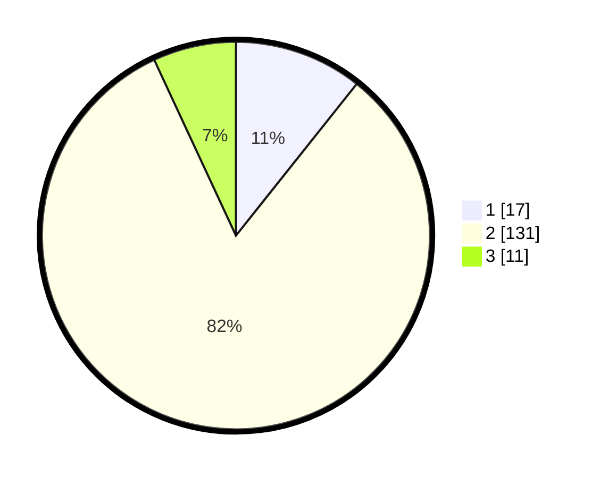

# Hasil

## Grafik

## Tabel

| No. | Nama Paslon    | Suara | Suara (raw) | Persentase |
|:--- |:-------------- | -----:| -----------:| ----------:|
| 1   | ANIES MUHAIMIN | 17    | [17][p-1]   | 10,69      |
| 2   | PRABOWO GIBRAN | 131   | [131][p-2]  | 82,39      |
| 3   | GANJAR MAHFUD  | 11    | [11][p-3]   | 6,92       |

[p-1]: https://github.com/gigit-pemilu/pemilu-2024/blob/main/pilpres/hitung-suara/sub/35-jawa-timur/sub/09-jember/sub/30-silo/sub/2004-silo/sub/027-tps/sub/paslon-1.txt
[p-2]: https://github.com/gigit-pemilu/pemilu-2024/blob/main/pilpres/hitung-suara/sub/35-jawa-timur/sub/09-jember/sub/30-silo/sub/2004-silo/sub/027-tps/sub/paslon-2.txt
[p-3]: https://github.com/gigit-pemilu/pemilu-2024/blob/main/pilpres/hitung-suara/sub/35-jawa-timur/sub/09-jember/sub/30-silo/sub/2004-silo/sub/027-tps/sub/paslon-3.txt

## Foto C Plano

https://sirekap-obj-formc.kpu.go.id/f988/pemilu/ppwp/35/09/30/20/04/3509302004027-20240214-210600--c3d9bcc1-1e4a-4809-bff0-43e3adf5278a.jpg

https://sirekap-obj-formc.kpu.go.id/f988/pemilu/ppwp/35/09/30/20/04/3509302004027-20240214-210717--c14e7213-79aa-40bd-8b94-e94a0a672a9e.jpg

https://sirekap-obj-formc.kpu.go.id/f988/pemilu/ppwp/35/09/30/20/04/3509302004027-20240214-210822--d12c0ae5-08cb-46fd-bec6-d0c97c4723d0.jpg

## Metadata

| Key        | Value               |
| ---------- | ------------------- |
| Time Stamp | 2024-02-15 15:00:29 |

