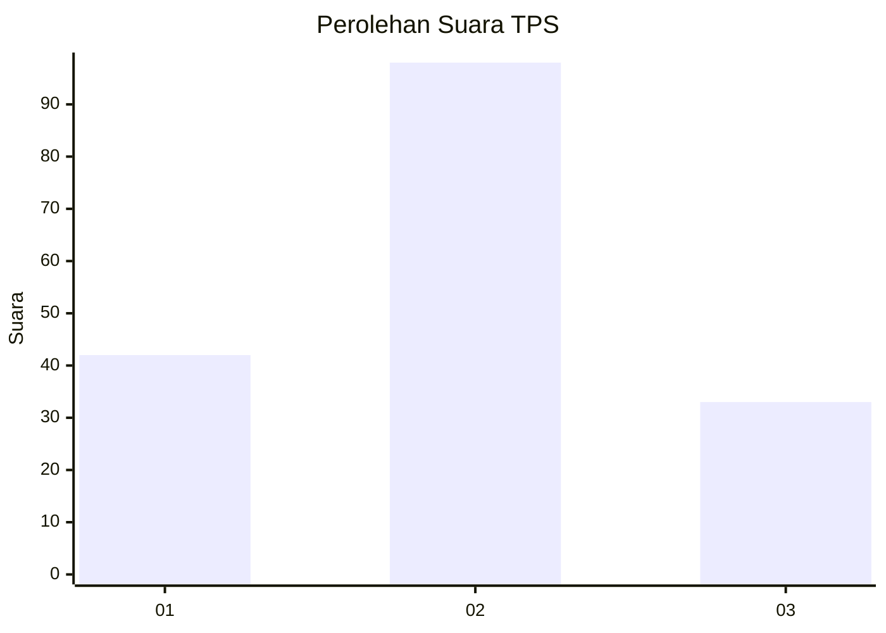
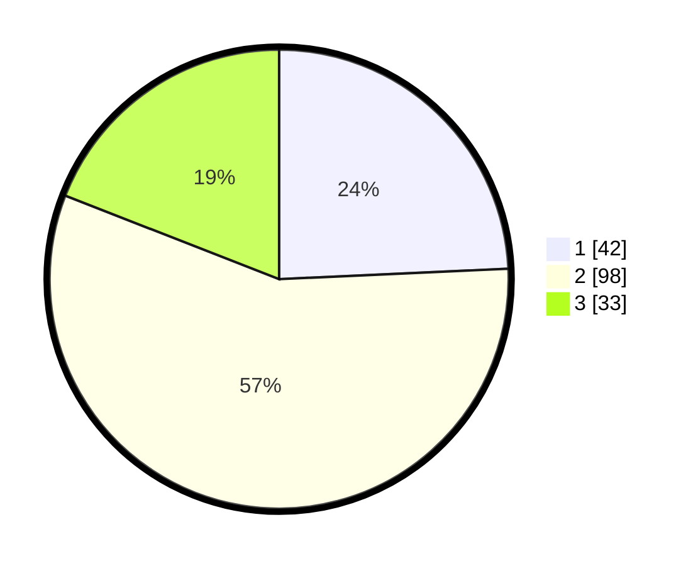

# Hasil

## Grafik

## Tabel

| No. | Nama Paslon    | Suara | Suara (raw) | Persentase |
|:--- |:-------------- | -----:| -----------:| ----------:|
| 1   | ANIES MUHAIMIN | 42    | [42][p-1]   | 24,28      |
| 2   | PRABOWO GIBRAN | 98    | [98][p-2]   | 56,65      |
| 3   | GANJAR MAHFUD  | 33    | [33][p-3]   | 19,08      |

[p-1]: https://github.com/gigit-pemilu/pemilu-2024/blob/main/pilpres/hitung-suara/sub/35-jawa-timur/sub/09-jember/sub/30-silo/sub/2004-silo/sub/029-tps/sub/paslon-1.txt
[p-2]: https://github.com/gigit-pemilu/pemilu-2024/blob/main/pilpres/hitung-suara/sub/35-jawa-timur/sub/09-jember/sub/30-silo/sub/2004-silo/sub/029-tps/sub/paslon-2.txt
[p-3]: https://github.com/gigit-pemilu/pemilu-2024/blob/main/pilpres/hitung-suara/sub/35-jawa-timur/sub/09-jember/sub/30-silo/sub/2004-silo/sub/029-tps/sub/paslon-3.txt

## Foto C Plano

https://sirekap-obj-formc.kpu.go.id/d15b/pemilu/ppwp/35/09/30/20/04/3509302004029-20240214-205627--7fc4c4c8-fb47-4388-8b7a-385bd29e0e0f.jpg

https://sirekap-obj-formc.kpu.go.id/d15b/pemilu/ppwp/35/09/30/20/04/3509302004029-20240214-205814--91d6c41f-4307-412a-b0a6-70ccccaa107c.jpg

https://sirekap-obj-formc.kpu.go.id/d15b/pemilu/ppwp/35/09/30/20/04/3509302004029-20240214-201011--b0e38d63-af74-4dd7-b905-f7ff4ee0c444.jpg

## Metadata

| Key        | Value               |
| ---------- | ------------------- |
| Time Stamp | 2024-02-15 15:00:29 |

