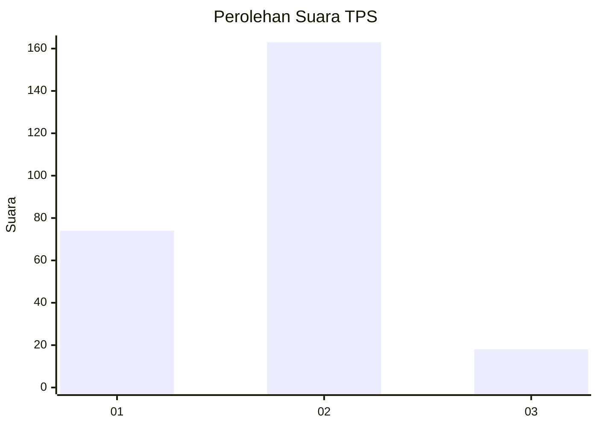
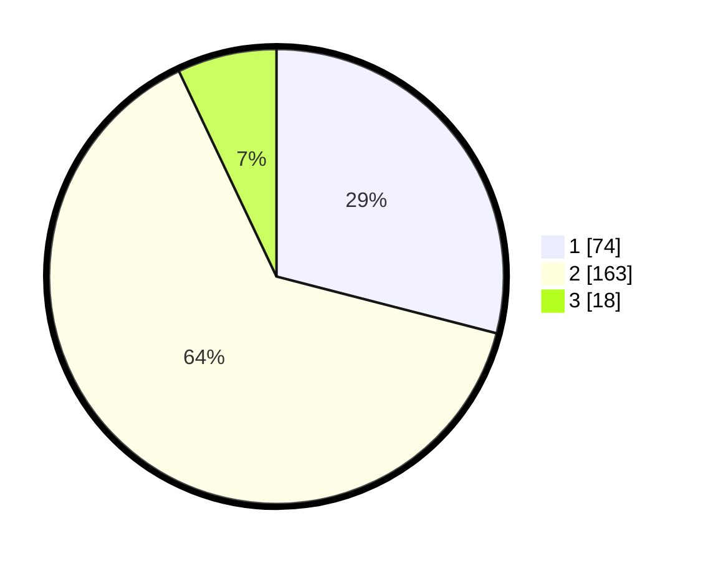

# Hasil

## Grafik

## Tabel

| No. | Nama Paslon    | Suara | Suara (raw) | Persentase |
|:--- |:-------------- | -----:| -----------:| ----------:|
| 1   | ANIES MUHAIMIN | 74    | [74][p-1]   | 29,02      |
| 2   | PRABOWO GIBRAN | 163   | [163][p-2]  | 63,92      |
| 3   | GANJAR MAHFUD  | 18    | [18][p-3]   | 7,06       |

[p-1]: https://github.com/gigit-pemilu/pemilu-2024/blob/main/pilpres/hitung-suara/sub/35-jawa-timur/sub/09-jember/sub/30-silo/sub/2004-silo/sub/030-tps/sub/paslon-1.txt
[p-2]: https://github.com/gigit-pemilu/pemilu-2024/blob/main/pilpres/hitung-suara/sub/35-jawa-timur/sub/09-jember/sub/30-silo/sub/2004-silo/sub/030-tps/sub/paslon-2.txt
[p-3]: https://github.com/gigit-pemilu/pemilu-2024/blob/main/pilpres/hitung-suara/sub/35-jawa-timur/sub/09-jember/sub/30-silo/sub/2004-silo/sub/030-tps/sub/paslon-3.txt

## Foto C Plano

https://sirekap-obj-formc.kpu.go.id/e1bf/pemilu/ppwp/35/09/30/20/04/3509302004030-20240215-165644--cf33c2bf-38ea-4dac-a9bd-0b51dae49c25.jpg

https://sirekap-obj-formc.kpu.go.id/e1bf/pemilu/ppwp/35/09/30/20/04/3509302004030-20240215-164804--934b82ec-70a9-43a7-a6c8-e51f63de357a.jpg

https://sirekap-obj-formc.kpu.go.id/e1bf/pemilu/ppwp/35/09/30/20/04/3509302004030-20240215-165746--c216b6a8-77aa-4d0f-9538-6bda7132e461.jpg

## Metadata

| Key        | Value               |
| ---------- | ------------------- |
| Time Stamp | 2024-02-15 18:00:26 |

