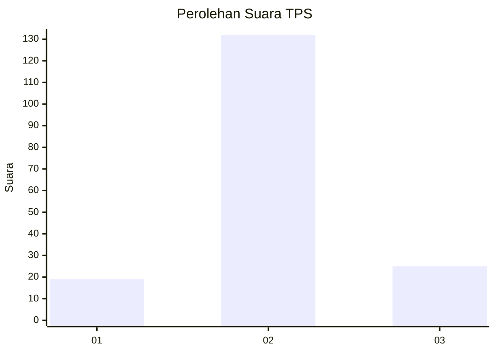
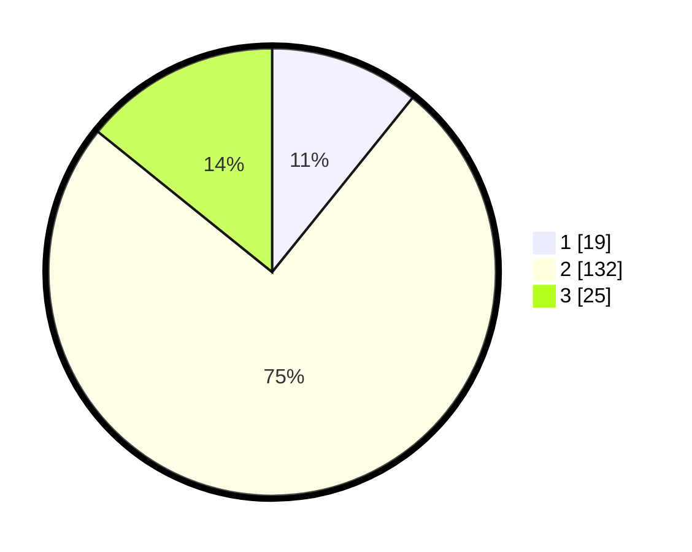

# Hasil

## Grafik

## Tabel

| No. | Nama Paslon    | Suara | Suara (raw) | Persentase |
|:--- |:-------------- | -----:| -----------:| ----------:|
| 1   | ANIES MUHAIMIN | 19    | [19][p-1]   | 10,80      |
| 2   | PRABOWO GIBRAN | 132   | [132][p-2]  | 75,00      |
| 3   | GANJAR MAHFUD  | 25    | [25][p-3]   | 14,20      |

[p-1]: https://github.com/gigit-pemilu/pemilu-2024/blob/main/pilpres/hitung-suara/sub/35-jawa-timur/sub/09-jember/sub/30-silo/sub/2005-pace/sub/001-tps/sub/paslon-1.txt
[p-2]: https://github.com/gigit-pemilu/pemilu-2024/blob/main/pilpres/hitung-suara/sub/35-jawa-timur/sub/09-jember/sub/30-silo/sub/2005-pace/sub/001-tps/sub/paslon-2.txt
[p-3]: https://github.com/gigit-pemilu/pemilu-2024/blob/main/pilpres/hitung-suara/sub/35-jawa-timur/sub/09-jember/sub/30-silo/sub/2005-pace/sub/001-tps/sub/paslon-3.txt

## Foto C Plano

https://sirekap-obj-formc.kpu.go.id/6e5e/pemilu/ppwp/35/09/30/20/05/3509302005001-20240215-125551--e32d0efc-9f89-4f41-a6f3-d7e9f24d9563.jpg

https://sirekap-obj-formc.kpu.go.id/6e5e/pemilu/ppwp/35/09/30/20/05/3509302005001-20240215-125631--162a4a14-3614-4c03-9d2c-efb5cb1a1157.jpg

https://sirekap-obj-formc.kpu.go.id/6e5e/pemilu/ppwp/35/09/30/20/05/3509302005001-20240215-125702--d1f209eb-1384-454e-9a89-d52e7de21efe.jpg

## Metadata

| Key        | Value               |
| ---------- | ------------------- |
| Time Stamp | 2024-02-15 17:00:25 |

