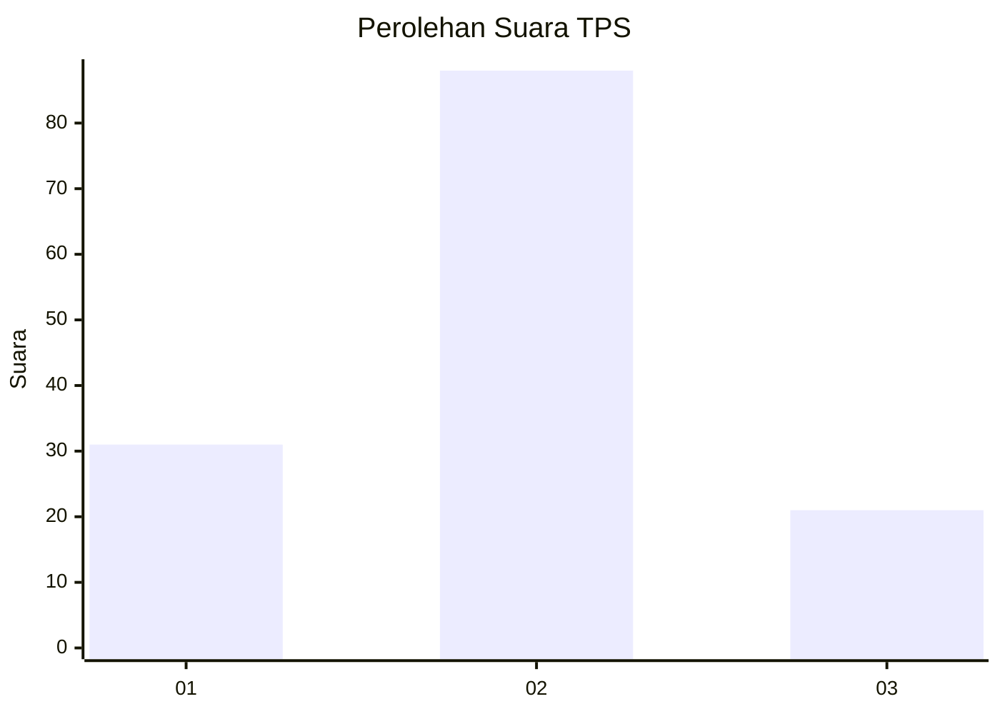
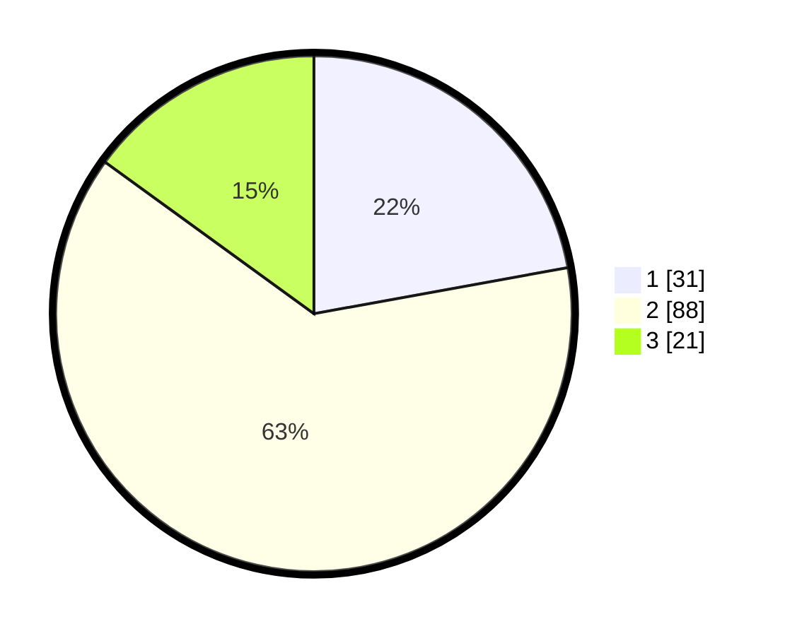

# Hasil

## Grafik

## Tabel

| No. | Nama Paslon    | Suara | Suara (raw) | Persentase |
|:--- |:-------------- | -----:| -----------:| ----------:|
| 1   | ANIES MUHAIMIN | 31    | [31][p-1]   | 22,14      |
| 2   | PRABOWO GIBRAN | 88    | [88][p-2]   | 62,86      |
| 3   | GANJAR MAHFUD  | 21    | [21][p-3]   | 15,00      |

[p-1]: https://github.com/gigit-pemilu/pemilu-2024/blob/main/pilpres/hitung-suara/sub/35-jawa-timur/sub/09-jember/sub/30-silo/sub/2005-pace/sub/002-tps/sub/paslon-1.txt
[p-2]: https://github.com/gigit-pemilu/pemilu-2024/blob/main/pilpres/hitung-suara/sub/35-jawa-timur/sub/09-jember/sub/30-silo/sub/2005-pace/sub/002-tps/sub/paslon-2.txt
[p-3]: https://github.com/gigit-pemilu/pemilu-2024/blob/main/pilpres/hitung-suara/sub/35-jawa-timur/sub/09-jember/sub/30-silo/sub/2005-pace/sub/002-tps/sub/paslon-3.txt

## Foto C Plano

https://sirekap-obj-formc.kpu.go.id/6484/pemilu/ppwp/35/09/30/20/05/3509302005002-20240215-005132--8c6f4a63-a676-4613-9d33-97901bd33c1b.jpg

https://sirekap-obj-formc.kpu.go.id/6484/pemilu/ppwp/35/09/30/20/05/3509302005002-20240215-005519--16fae0b5-2bd8-4210-91fe-7b72397a03c6.jpg

https://sirekap-obj-formc.kpu.go.id/6484/pemilu/ppwp/35/09/30/20/05/3509302005002-20240215-160848--db90d396-6736-48b1-928b-8abb1a792122.jpg

## Metadata

| Key        | Value               |
| ---------- | ------------------- |
| Time Stamp | 2024-02-15 17:00:25 |

