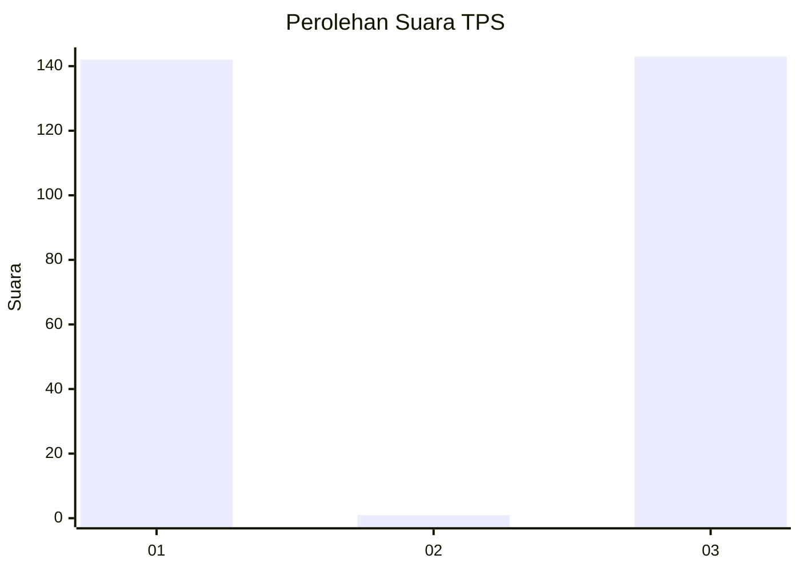
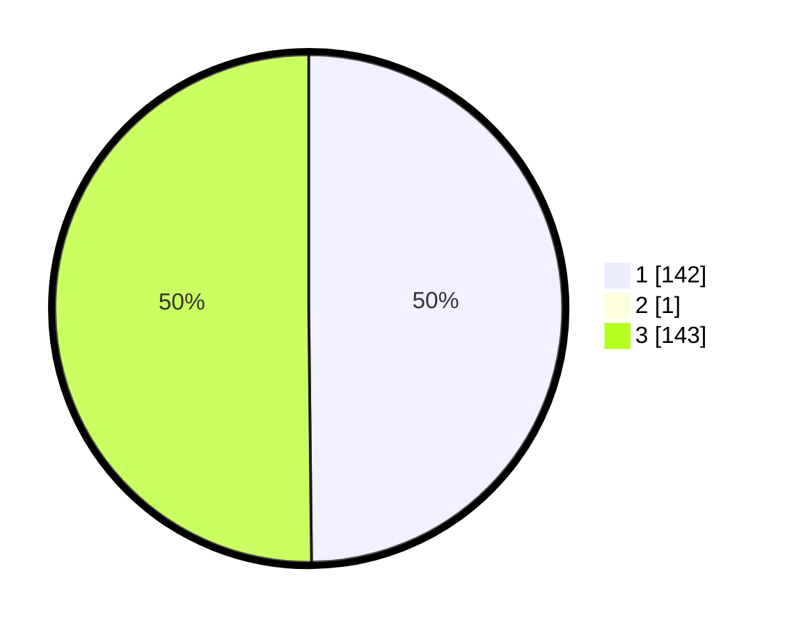

# Hasil

## Grafik

## Tabel

| No. | Nama Paslon    | Suara | Suara (raw) | Persentase |
|:--- |:-------------- | -----:| -----------:| ----------:|
| 1   | ANIES MUHAIMIN | 142   | [142][p-1]  | 49,65      |
| 2   | PRABOWO GIBRAN | 1     | [1][p-2]    | 0,35       |
| 3   | GANJAR MAHFUD  | 143   | [143][p-3]  | 50,00      |

[p-1]: https://github.com/gigit-pemilu/pemilu-2024-35-jawa-timur/blob/main/pilpres/hitung-suara/sub/35-jawa-timur/sub/09-jember/sub/30-silo/sub/2005-pace/sub/005-tps/sub/paslon-1.txt
[p-2]: https://github.com/gigit-pemilu/pemilu-2024-35-jawa-timur/blob/main/pilpres/hitung-suara/sub/35-jawa-timur/sub/09-jember/sub/30-silo/sub/2005-pace/sub/005-tps/sub/paslon-2.txt
[p-3]: https://github.com/gigit-pemilu/pemilu-2024-35-jawa-timur/blob/main/pilpres/hitung-suara/sub/35-jawa-timur/sub/09-jember/sub/30-silo/sub/2005-pace/sub/005-tps/sub/paslon-3.txt

## Foto C Plano

https://sirekap-obj-formc.kpu.go.id/f3a9/pemilu/ppwp/35/09/30/20/05/3509302005005-20240215-125834--158f06c3-4186-4d2b-a288-f721d6a9d6be.jpg

https://sirekap-obj-formc.kpu.go.id/f3a9/pemilu/ppwp/35/09/30/20/05/3509302005005-20240214-220030--201bb898-7d2e-4e6e-be6c-536d7d454063.jpg

https://sirekap-obj-formc.kpu.go.id/f3a9/pemilu/ppwp/35/09/30/20/05/3509302005005-20240214-220129--976d1032-7c32-454d-9373-db1a95b8ddfa.jpg

## Metadata

| Key        | Value               |
| ---------- | ------------------- |
| Time Stamp | 2024-02-15 15:00:29 |

