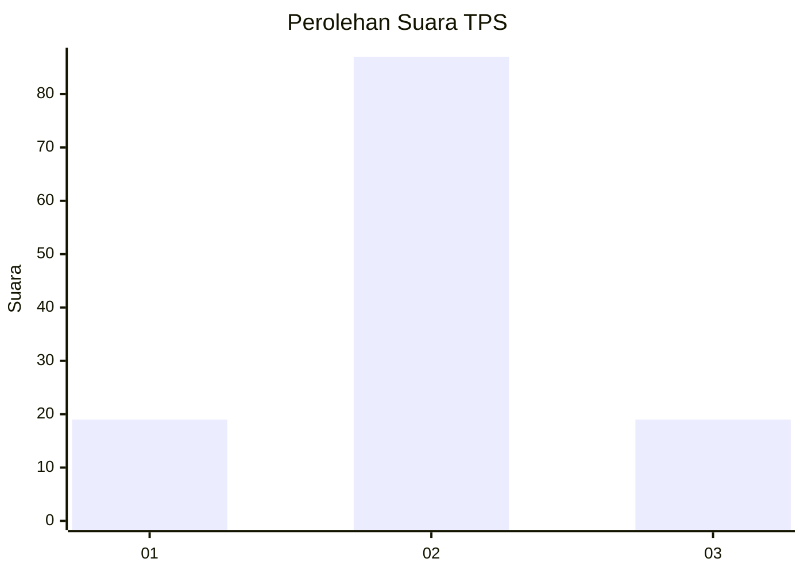
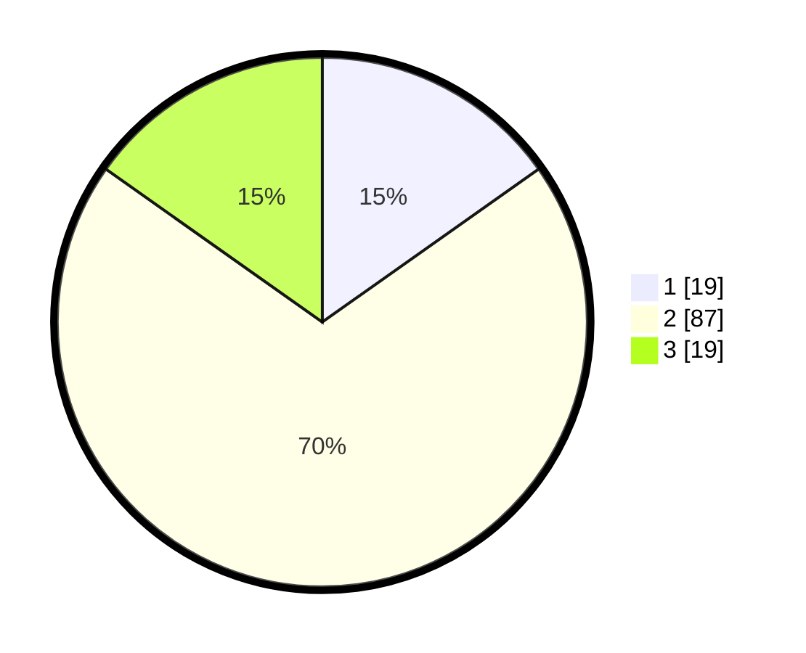

# Hasil

## Grafik

## Tabel

| No. | Nama Paslon    | Suara | Suara (raw) | Persentase |
|:--- |:-------------- | -----:| -----------:| ----------:|
| 1   | ANIES MUHAIMIN | 19    | [19][p-1]   | 15,20      |
| 2   | PRABOWO GIBRAN | 87    | [87][p-2]   | 69,60      |
| 3   | GANJAR MAHFUD  | 19    | [19][p-3]   | 15,20      |

[p-1]: https://github.com/gigit-pemilu/pemilu-2024/blob/main/pilpres/hitung-suara/sub/35-jawa-timur/sub/09-jember/sub/30-silo/sub/2005-pace/sub/007-tps/sub/paslon-1.txt
[p-2]: https://github.com/gigit-pemilu/pemilu-2024/blob/main/pilpres/hitung-suara/sub/35-jawa-timur/sub/09-jember/sub/30-silo/sub/2005-pace/sub/007-tps/sub/paslon-2.txt
[p-3]: https://github.com/gigit-pemilu/pemilu-2024/blob/main/pilpres/hitung-suara/sub/35-jawa-timur/sub/09-jember/sub/30-silo/sub/2005-pace/sub/007-tps/sub/paslon-3.txt

## Foto C Plano

https://sirekap-obj-formc.kpu.go.id/1cdf/pemilu/ppwp/35/09/30/20/05/3509302005007-20240215-073633--bb55dce9-804b-4c0b-b1ab-9c59566959f1.jpg

https://sirekap-obj-formc.kpu.go.id/1cdf/pemilu/ppwp/35/09/30/20/05/3509302005007-20240214-214854--fb6befed-5c43-4294-a687-1cf157785494.jpg

https://sirekap-obj-formc.kpu.go.id/1cdf/pemilu/ppwp/35/09/30/20/05/3509302005007-20240214-193328--d8e97480-6f50-4bd8-9ba4-e60fdaccfe89.jpg

## Metadata

| Key        | Value               |
| ---------- | ------------------- |
| Time Stamp | 2024-02-15 17:00:25 |

