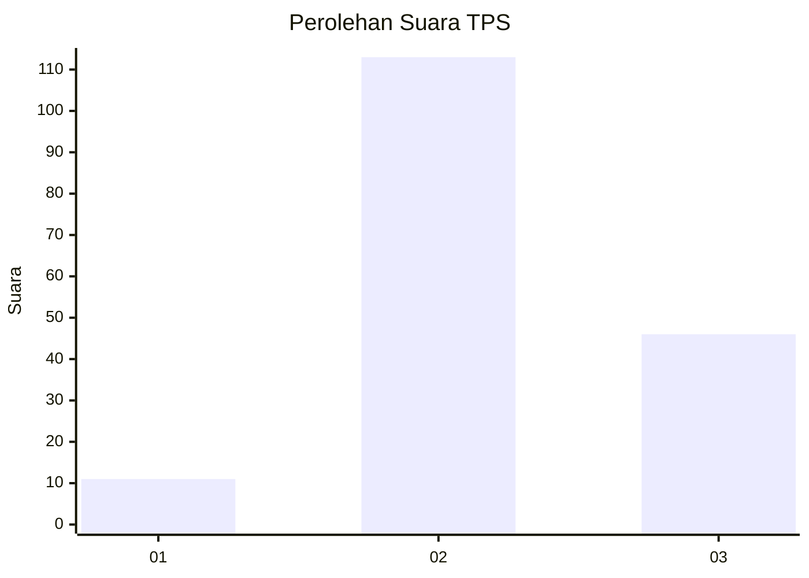

# Hasil

## Grafik

## Tabel

| No. | Nama Paslon    | Suara | Suara (raw) | Persentase |
|:--- |:-------------- | -----:| -----------:| ----------:|
| 1   | ANIES MUHAIMIN | 11    | [11][p-1]   | 6,47       |
| 2   | PRABOWO GIBRAN | 113   | [113][p-2]  | 66,47      |
| 3   | GANJAR MAHFUD  | 46    | [46][p-3]   | 27,06      |

[p-1]: https://github.com/gigit-pemilu/pemilu-2024/blob/main/pilpres/hitung-suara/sub/35-jawa-timur/sub/09-jember/sub/30-silo/sub/2005-pace/sub/008-tps/sub/paslon-1.txt
[p-2]: https://github.com/gigit-pemilu/pemilu-2024/blob/main/pilpres/hitung-suara/sub/35-jawa-timur/sub/09-jember/sub/30-silo/sub/2005-pace/sub/008-tps/sub/paslon-2.txt
[p-3]: https://github.com/gigit-pemilu/pemilu-2024/blob/main/pilpres/hitung-suara/sub/35-jawa-timur/sub/09-jember/sub/30-silo/sub/2005-pace/sub/008-tps/sub/paslon-3.txt

## Foto C Plano

https://sirekap-obj-formc.kpu.go.id/6e51/pemilu/ppwp/35/09/30/20/05/3509302005008-20240215-030320--d6048ae8-48db-4191-aa47-858282a9c5db.jpg

https://sirekap-obj-formc.kpu.go.id/6e51/pemilu/ppwp/35/09/30/20/05/3509302005008-20240215-030532--72bbee9b-2873-4d7f-9fcd-b1f4000b84fa.jpg

https://sirekap-obj-formc.kpu.go.id/6e51/pemilu/ppwp/35/09/30/20/05/3509302005008-20240215-030728--389b8383-6ef5-4a7d-94c6-6081f2ac7bbd.jpg

## Metadata

| Key        | Value               |
| ---------- | ------------------- |
| Time Stamp | 2024-02-15 17:00:25 |

