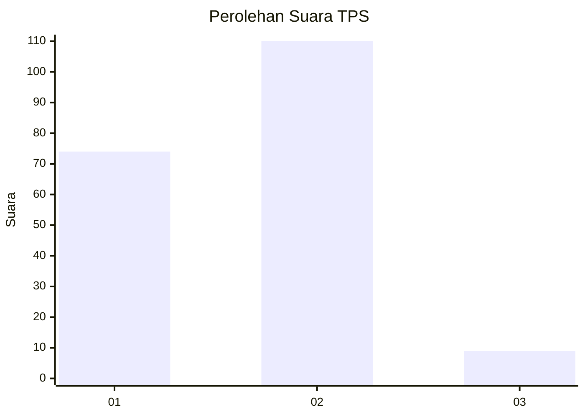
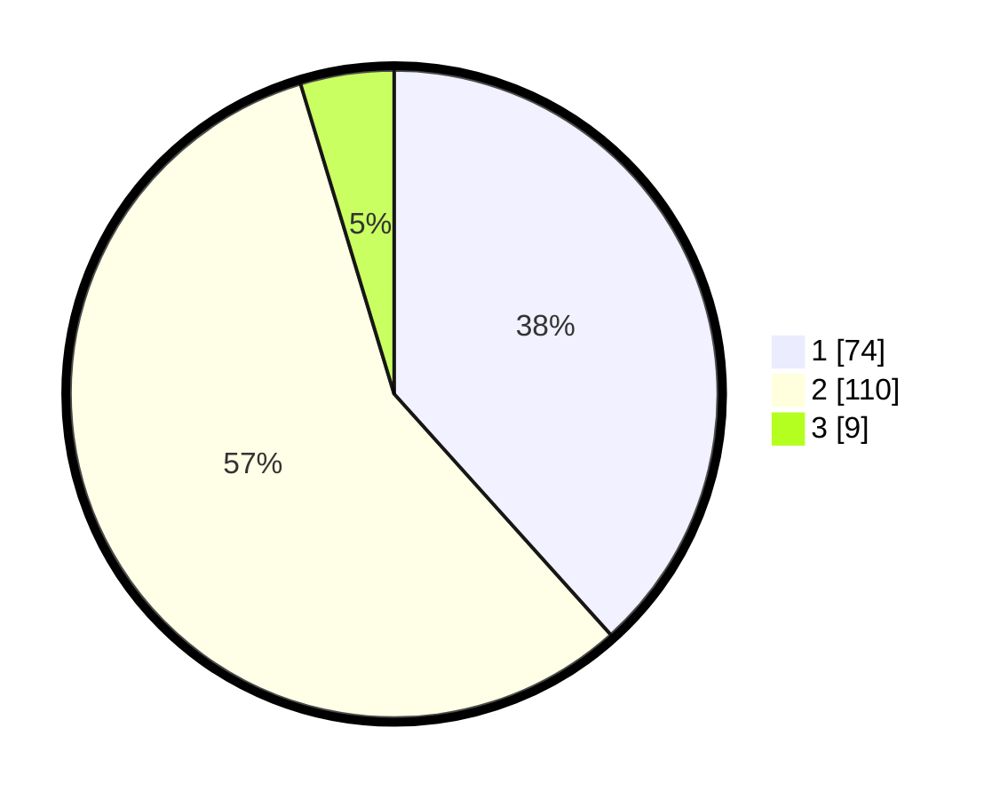

# Hasil

## Grafik

## Tabel

| No. | Nama Paslon    | Suara | Suara (raw) | Persentase |
|:--- |:-------------- | -----:| -----------:| ----------:|
| 1   | ANIES MUHAIMIN | 74    | [74][p-1]   | 38,34      |
| 2   | PRABOWO GIBRAN | 110   | [110][p-2]  | 56,99      |
| 3   | GANJAR MAHFUD  | 9     | [9][p-3]    | 4,66       |

[p-1]: https://github.com/gigit-pemilu/pemilu-2024-35-jawa-timur/blob/main/pilpres/hitung-suara/sub/35-jawa-timur/sub/09-jember/sub/30-silo/sub/2005-pace/sub/015-tps/sub/paslon-1.txt
[p-2]: https://github.com/gigit-pemilu/pemilu-2024-35-jawa-timur/blob/main/pilpres/hitung-suara/sub/35-jawa-timur/sub/09-jember/sub/30-silo/sub/2005-pace/sub/015-tps/sub/paslon-2.txt
[p-3]: https://github.com/gigit-pemilu/pemilu-2024-35-jawa-timur/blob/main/pilpres/hitung-suara/sub/35-jawa-timur/sub/09-jember/sub/30-silo/sub/2005-pace/sub/015-tps/sub/paslon-3.txt

## Foto C Plano

https://sirekap-obj-formc.kpu.go.id/c7b7/pemilu/ppwp/35/09/30/20/05/3509302005015-20240215-004128--9ec4c386-5e0f-4598-ab16-3cdb4d34188b.jpg

https://sirekap-obj-formc.kpu.go.id/c7b7/pemilu/ppwp/35/09/30/20/05/3509302005015-20240215-004236--f79945f4-e19b-4a72-9db8-9550e7b22634.jpg

https://sirekap-obj-formc.kpu.go.id/c7b7/pemilu/ppwp/35/09/30/20/05/3509302005015-20240215-004349--fcea2e2b-c6e8-444c-8bb3-a473c9451365.jpg

## Metadata

| Key        | Value               |
| ---------- | ------------------- |
| Time Stamp | 2024-02-15 17:00:25 |

