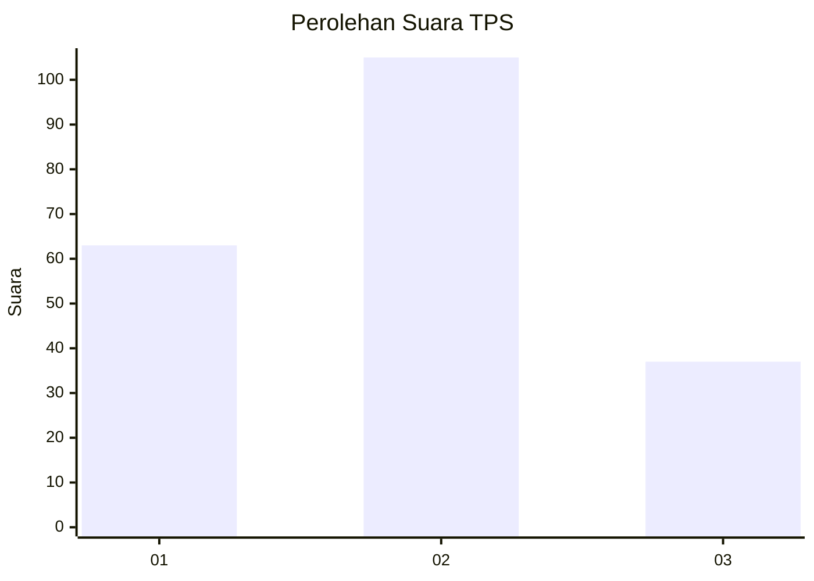
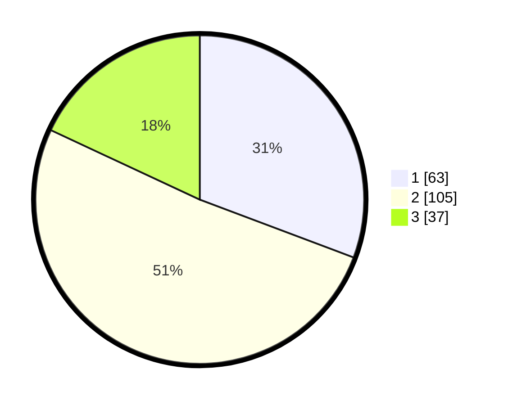

# Hasil

## Grafik

## Tabel

| No. | Nama Paslon    | Suara | Suara (raw) | Persentase |
|:--- |:-------------- | -----:| -----------:| ----------:|
| 1   | ANIES MUHAIMIN | 63    | [63][p-1]   | 30,73      |
| 2   | PRABOWO GIBRAN | 105   | [105][p-2]  | 51,22      |
| 3   | GANJAR MAHFUD  | 37    | [37][p-3]   | 18,05      |

[p-1]: https://github.com/gigit-pemilu/pemilu-2024-35-jawa-timur/blob/main/pilpres/hitung-suara/sub/35-jawa-timur/sub/09-jember/sub/30-silo/sub/2005-pace/sub/016-tps/sub/paslon-1.txt
[p-2]: https://github.com/gigit-pemilu/pemilu-2024-35-jawa-timur/blob/main/pilpres/hitung-suara/sub/35-jawa-timur/sub/09-jember/sub/30-silo/sub/2005-pace/sub/016-tps/sub/paslon-2.txt
[p-3]: https://github.com/gigit-pemilu/pemilu-2024-35-jawa-timur/blob/main/pilpres/hitung-suara/sub/35-jawa-timur/sub/09-jember/sub/30-silo/sub/2005-pace/sub/016-tps/sub/paslon-3.txt

## Foto C Plano

https://sirekap-obj-formc.kpu.go.id/00ea/pemilu/ppwp/35/09/30/20/05/3509302005016-20240214-213508--42ba3eec-3b4e-43c8-85fb-ae53eaf08521.jpg

https://sirekap-obj-formc.kpu.go.id/00ea/pemilu/ppwp/35/09/30/20/05/3509302005016-20240214-213736--356443c0-4270-4c15-a04d-68cb1c427f6e.jpg

https://sirekap-obj-formc.kpu.go.id/00ea/pemilu/ppwp/35/09/30/20/05/3509302005016-20240214-214029--213b997c-f42e-4389-bb3e-3b3f03b095d3.jpg

## Metadata

| Key        | Value               |
| ---------- | ------------------- |
| Time Stamp | 2024-02-15 17:00:25 |

