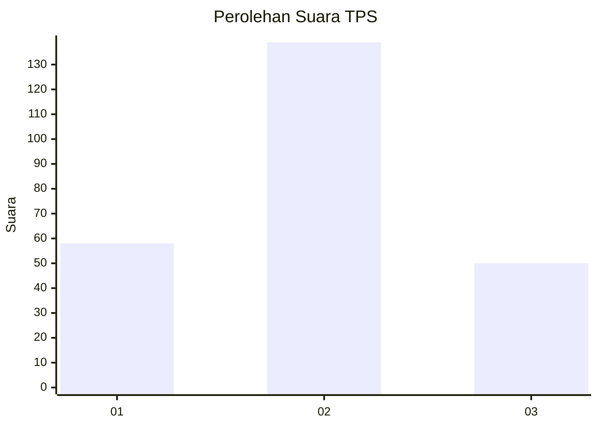
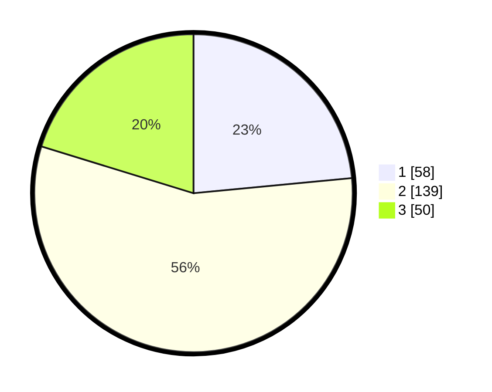

# Hasil

## Grafik

## Tabel

| No. | Nama Paslon    | Suara | Suara (raw) | Persentase |
|:--- |:-------------- | -----:| -----------:| ----------:|
| 1   | ANIES MUHAIMIN | 58    | [58][p-1]   | 23,48      |
| 2   | PRABOWO GIBRAN | 139   | [139][p-2]  | 56,28      |
| 3   | GANJAR MAHFUD  | 50    | [50][p-3]   | 20,24      |

[p-1]: https://github.com/gigit-pemilu/pemilu-2024/blob/main/pilpres/hitung-suara/sub/35-jawa-timur/sub/09-jember/sub/30-silo/sub/2005-pace/sub/017-tps/sub/paslon-1.txt
[p-2]: https://github.com/gigit-pemilu/pemilu-2024/blob/main/pilpres/hitung-suara/sub/35-jawa-timur/sub/09-jember/sub/30-silo/sub/2005-pace/sub/017-tps/sub/paslon-2.txt
[p-3]: https://github.com/gigit-pemilu/pemilu-2024/blob/main/pilpres/hitung-suara/sub/35-jawa-timur/sub/09-jember/sub/30-silo/sub/2005-pace/sub/017-tps/sub/paslon-3.txt

## Foto C Plano

https://sirekap-obj-formc.kpu.go.id/af89/pemilu/ppwp/35/09/30/20/05/3509302005017-20240215-065010--e6380df1-1472-4834-ac25-46d022ab287b.jpg

https://sirekap-obj-formc.kpu.go.id/af89/pemilu/ppwp/35/09/30/20/05/3509302005017-20240215-001635--8fd0f5ee-fbab-46ad-9249-de8bfd8b6a98.jpg

https://sirekap-obj-formc.kpu.go.id/af89/pemilu/ppwp/35/09/30/20/05/3509302005017-20240215-001846--89e5af58-98be-4a8e-9893-ebb538c183bd.jpg

## Metadata

| Key        | Value               |
| ---------- | ------------------- |
| Time Stamp | 2024-02-24 22:31:28 |

