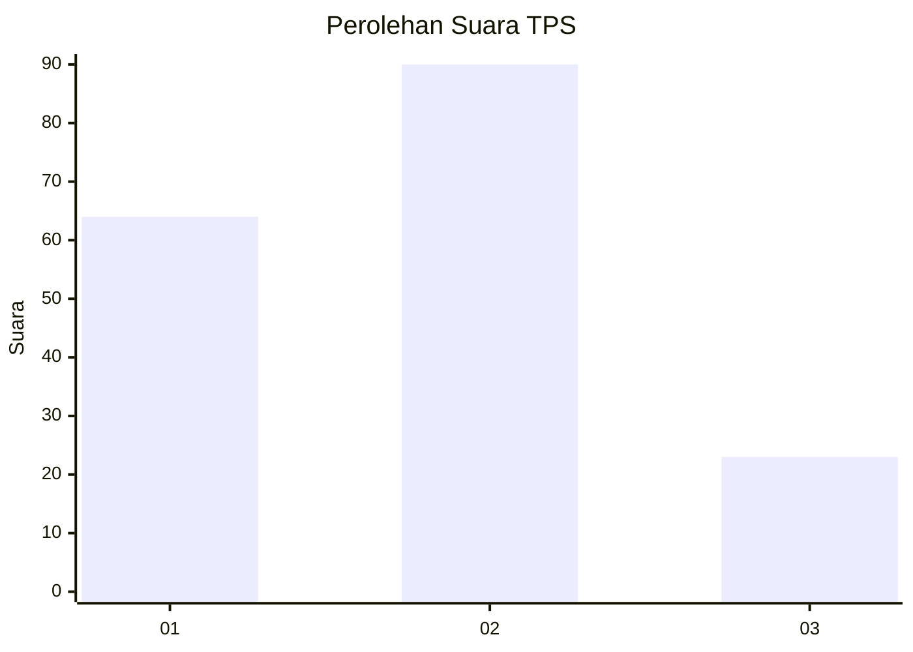
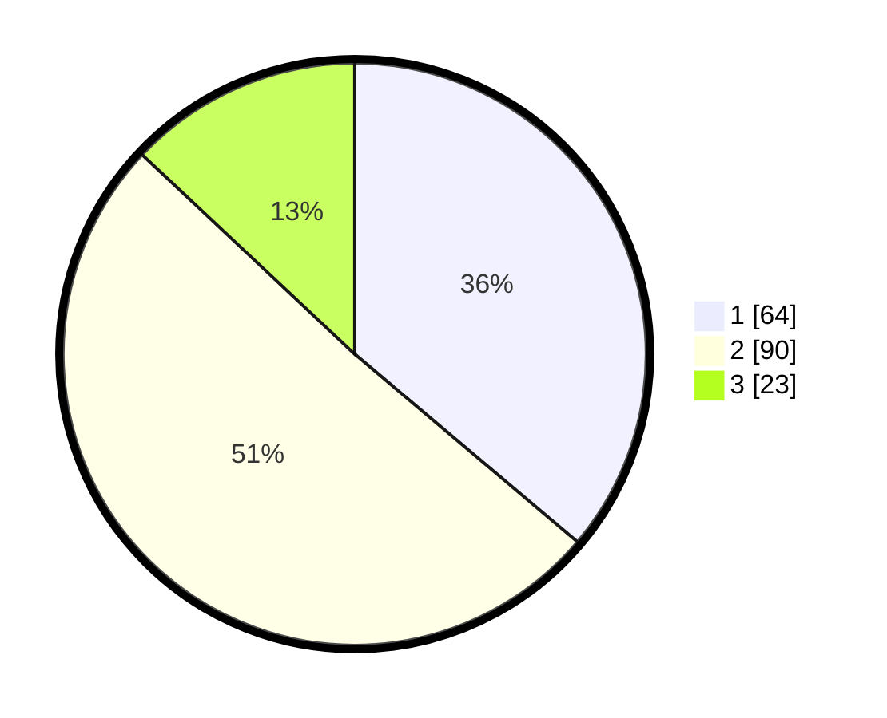

# Hasil

## Grafik

## Tabel

| No. | Nama Paslon    | Suara | Suara (raw) | Persentase |
|:--- |:-------------- | -----:| -----------:| ----------:|
| 1   | ANIES MUHAIMIN | 64    | [64][p-1]   | 36,16      |
| 2   | PRABOWO GIBRAN | 90    | [90][p-2]   | 50,85      |
| 3   | GANJAR MAHFUD  | 23    | [23][p-3]   | 12,99      |

[p-1]: https://github.com/gigit-pemilu/pemilu-2024-35-jawa-timur/blob/main/pilpres/hitung-suara/sub/35-jawa-timur/sub/09-jember/sub/30-silo/sub/2005-pace/sub/021-tps/sub/paslon-1.txt
[p-2]: https://github.com/gigit-pemilu/pemilu-2024-35-jawa-timur/blob/main/pilpres/hitung-suara/sub/35-jawa-timur/sub/09-jember/sub/30-silo/sub/2005-pace/sub/021-tps/sub/paslon-2.txt
[p-3]: https://github.com/gigit-pemilu/pemilu-2024-35-jawa-timur/blob/main/pilpres/hitung-suara/sub/35-jawa-timur/sub/09-jember/sub/30-silo/sub/2005-pace/sub/021-tps/sub/paslon-3.txt

## Foto C Plano

https://sirekap-obj-formc.kpu.go.id/a8a8/pemilu/ppwp/35/09/30/20/05/3509302005021-20240215-043218--c374ce54-79b3-49e3-976a-99f6cd48ad49.jpg

https://sirekap-obj-formc.kpu.go.id/a8a8/pemilu/ppwp/35/09/30/20/05/3509302005021-20240215-043446--c8c5d62a-44b3-49b9-9e9a-c445d1688def.jpg

https://sirekap-obj-formc.kpu.go.id/a8a8/pemilu/ppwp/35/09/30/20/05/3509302005021-20240215-043531--068748d2-2414-4019-aae5-55b220275028.jpg

## Metadata

| Key        | Value               |
| ---------- | ------------------- |
| Time Stamp | 2024-02-15 20:00:44 |

