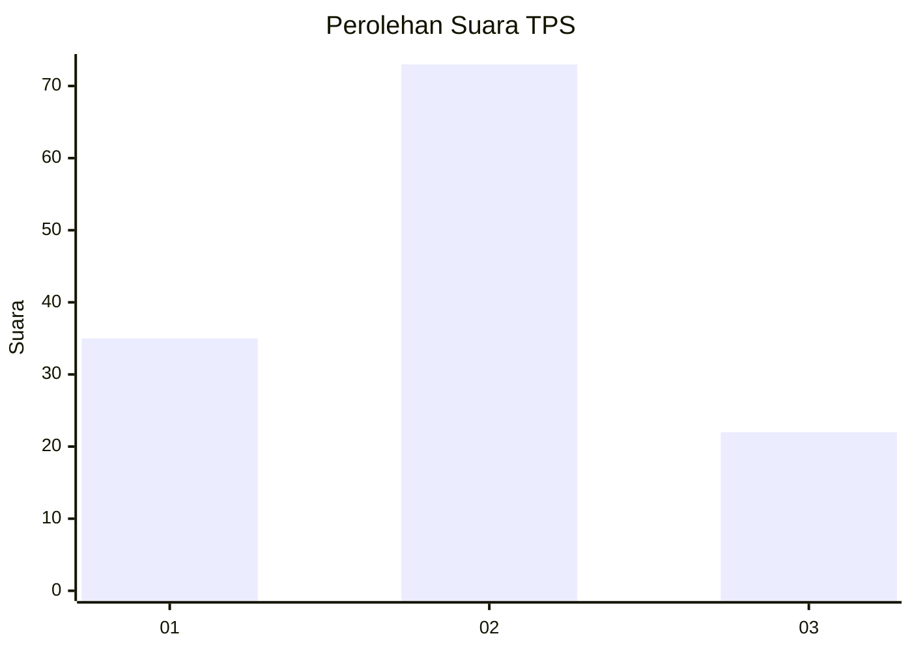
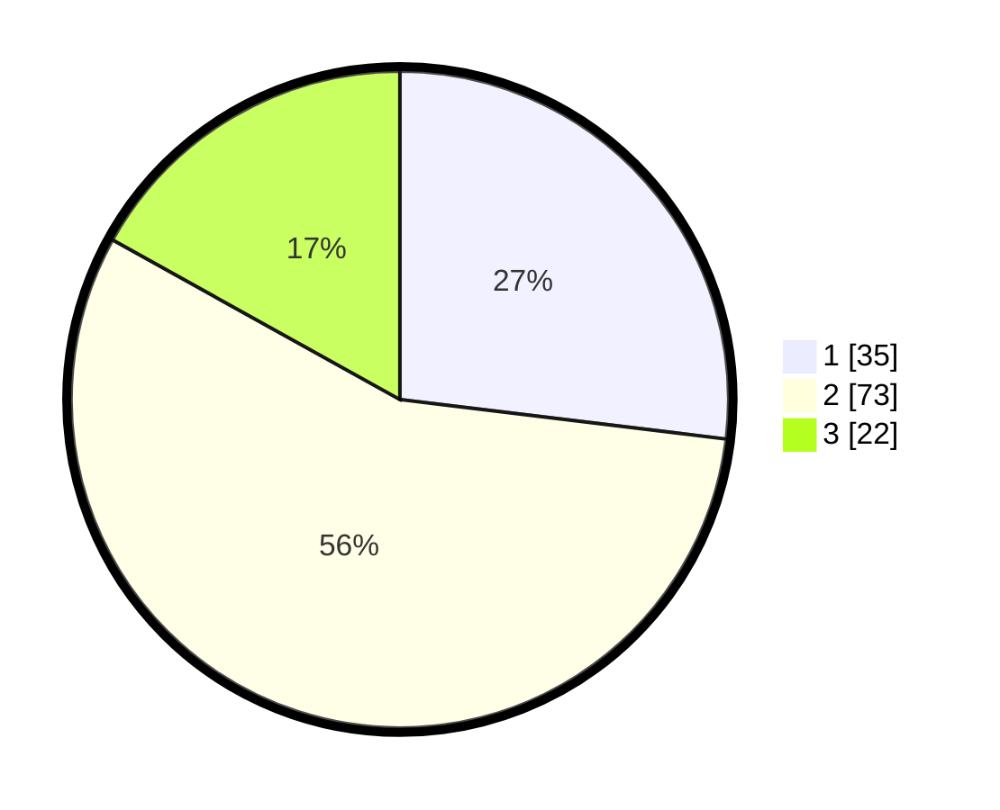

# Hasil

## Grafik

## Tabel

| No. | Nama Paslon    | Suara | Suara (raw) | Persentase |
|:--- |:-------------- | -----:| -----------:| ----------:|
| 1   | ANIES MUHAIMIN | 35    | [35][p-1]   | 26,92      |
| 2   | PRABOWO GIBRAN | 73    | [73][p-2]   | 56,15      |
| 3   | GANJAR MAHFUD  | 22    | [22][p-3]   | 16,92      |

[p-1]: https://github.com/gigit-pemilu/pemilu-2024/blob/main/pilpres/hitung-suara/sub/35-jawa-timur/sub/09-jember/sub/30-silo/sub/2005-pace/sub/022-tps/sub/paslon-1.txt
[p-2]: https://github.com/gigit-pemilu/pemilu-2024/blob/main/pilpres/hitung-suara/sub/35-jawa-timur/sub/09-jember/sub/30-silo/sub/2005-pace/sub/022-tps/sub/paslon-2.txt
[p-3]: https://github.com/gigit-pemilu/pemilu-2024/blob/main/pilpres/hitung-suara/sub/35-jawa-timur/sub/09-jember/sub/30-silo/sub/2005-pace/sub/022-tps/sub/paslon-3.txt

## Foto C Plano

https://sirekap-obj-formc.kpu.go.id/50b3/pemilu/ppwp/35/09/30/20/05/3509302005022-20240215-131658--e0f8793d-1f59-47a6-88df-6e51dfc4b620.jpg

https://sirekap-obj-formc.kpu.go.id/50b3/pemilu/ppwp/35/09/30/20/05/3509302005022-20240215-161003--bebd8d89-b09f-4ef1-9513-03832d051428.jpg

https://sirekap-obj-formc.kpu.go.id/50b3/pemilu/ppwp/35/09/30/20/05/3509302005022-20240215-131950--12b2a000-f6c5-49fa-9560-5fc22e5a209a.jpg

## Metadata

| Key        | Value               |
| ---------- | ------------------- |
| Time Stamp | 2024-02-24 22:31:28 |

