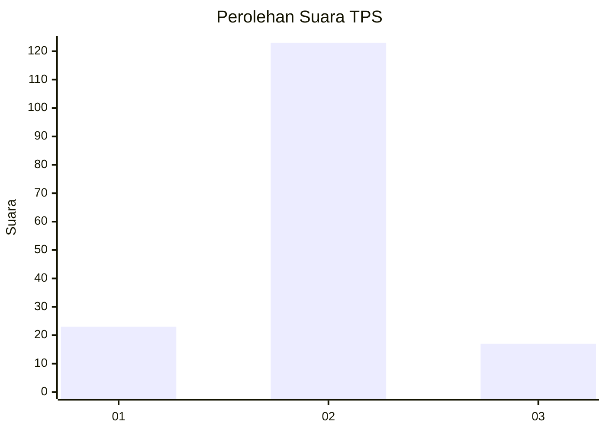
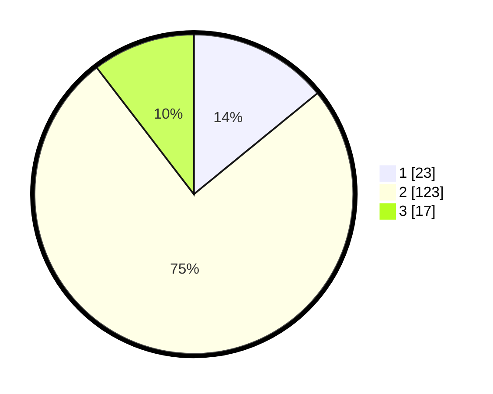

# Hasil

## Grafik

## Tabel

| No. | Nama Paslon    | Suara | Suara (raw) | Persentase |
|:--- |:-------------- | -----:| -----------:| ----------:|
| 1   | ANIES MUHAIMIN | 23    | [23][p-1]   | 14,11      |
| 2   | PRABOWO GIBRAN | 123   | [123][p-2]  | 75,46      |
| 3   | GANJAR MAHFUD  | 17    | [17][p-3]   | 10,43      |

[p-1]: https://github.com/gigit-pemilu/pemilu-2024/blob/main/pilpres/hitung-suara/sub/35-jawa-timur/sub/09-jember/sub/30-silo/sub/2005-pace/sub/023-tps/sub/paslon-1.txt
[p-2]: https://github.com/gigit-pemilu/pemilu-2024/blob/main/pilpres/hitung-suara/sub/35-jawa-timur/sub/09-jember/sub/30-silo/sub/2005-pace/sub/023-tps/sub/paslon-2.txt
[p-3]: https://github.com/gigit-pemilu/pemilu-2024/blob/main/pilpres/hitung-suara/sub/35-jawa-timur/sub/09-jember/sub/30-silo/sub/2005-pace/sub/023-tps/sub/paslon-3.txt

## Foto C Plano

https://sirekap-obj-formc.kpu.go.id/5f85/pemilu/ppwp/35/09/30/20/05/3509302005023-20240215-140650--092239e5-a006-45a8-b19f-9bca804dde60.jpg

https://sirekap-obj-formc.kpu.go.id/5f85/pemilu/ppwp/35/09/30/20/05/3509302005023-20240215-140908--7809ce23-aedf-44bc-aa9a-a3b61f4510d0.jpg

https://sirekap-obj-formc.kpu.go.id/5f85/pemilu/ppwp/35/09/30/20/05/3509302005023-20240215-141204--5a4bb1ac-8bbc-47f8-9477-4b3b45e4113e.jpg

## Metadata

| Key        | Value               |
| ---------- | ------------------- |
| Time Stamp | 2024-02-15 15:00:29 |

