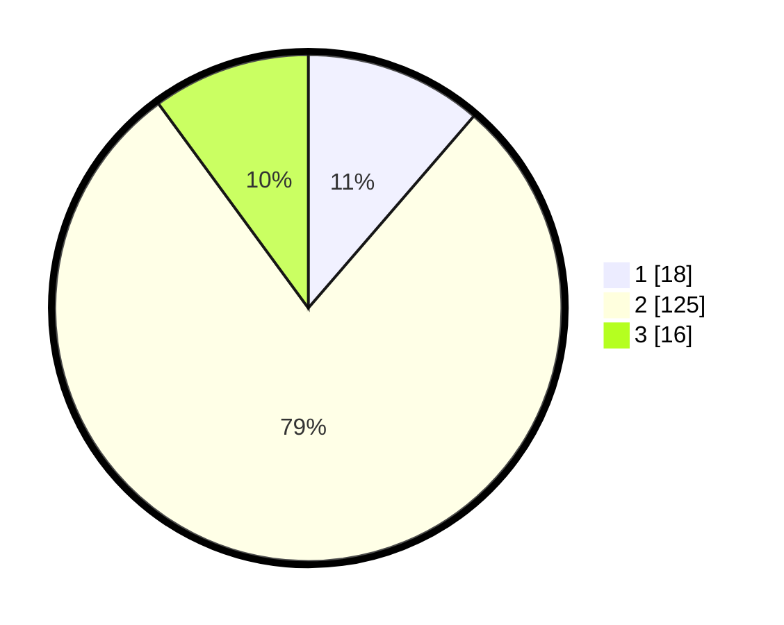

# Hasil

## Grafik

## Tabel

| No. | Nama Paslon    | Suara | Suara (raw) | Persentase |
|:--- |:-------------- | -----:| -----------:| ----------:|
| 1   | ANIES MUHAIMIN | 18    | [18][p-1]   | 11,32      |
| 2   | PRABOWO GIBRAN | 125   | [125][p-2]  | 78,62      |
| 3   | GANJAR MAHFUD  | 16    | [16][p-3]   | 10,06      |

[p-1]: https://github.com/gigit-pemilu/pemilu-2024-35-jawa-timur/blob/main/pilpres/hitung-suara/sub/35-jawa-timur/sub/09-jember/sub/30-silo/sub/2005-pace/sub/033-tps/sub/paslon-1.txt
[p-2]: https://github.com/gigit-pemilu/pemilu-2024-35-jawa-timur/blob/main/pilpres/hitung-suara/sub/35-jawa-timur/sub/09-jember/sub/30-silo/sub/2005-pace/sub/033-tps/sub/paslon-2.txt
[p-3]: https://github.com/gigit-pemilu/pemilu-2024-35-jawa-timur/blob/main/pilpres/hitung-suara/sub/35-jawa-timur/sub/09-jember/sub/30-silo/sub/2005-pace/sub/033-tps/sub/paslon-3.txt

## Foto C Plano

https://sirekap-obj-formc.kpu.go.id/2ede/pemilu/ppwp/35/09/30/20/05/3509302005033-20240214-212213--3a8aba71-2aba-4d51-aa5e-6fed39c9f1bc.jpg

https://sirekap-obj-formc.kpu.go.id/2ede/pemilu/ppwp/35/09/30/20/05/3509302005033-20240215-000904--b144b898-c385-4c85-a76c-8116d6e2ca59.jpg

https://sirekap-obj-formc.kpu.go.id/2ede/pemilu/ppwp/35/09/30/20/05/3509302005033-20240215-000733--25b33ef6-5a85-4237-9157-87cc68d5edd9.jpg

## Metadata

| Key        | Value               |
| ---------- | ------------------- |
| Time Stamp | 2024-02-15 17:00:25 |

