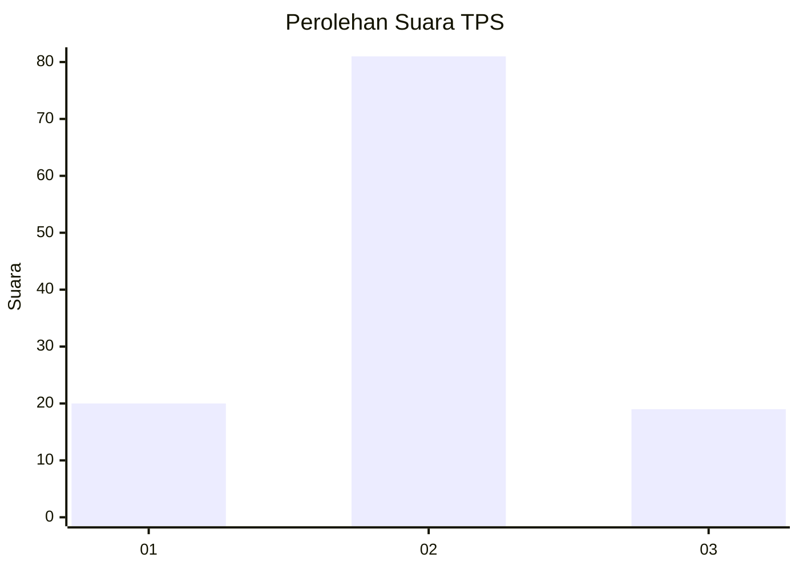
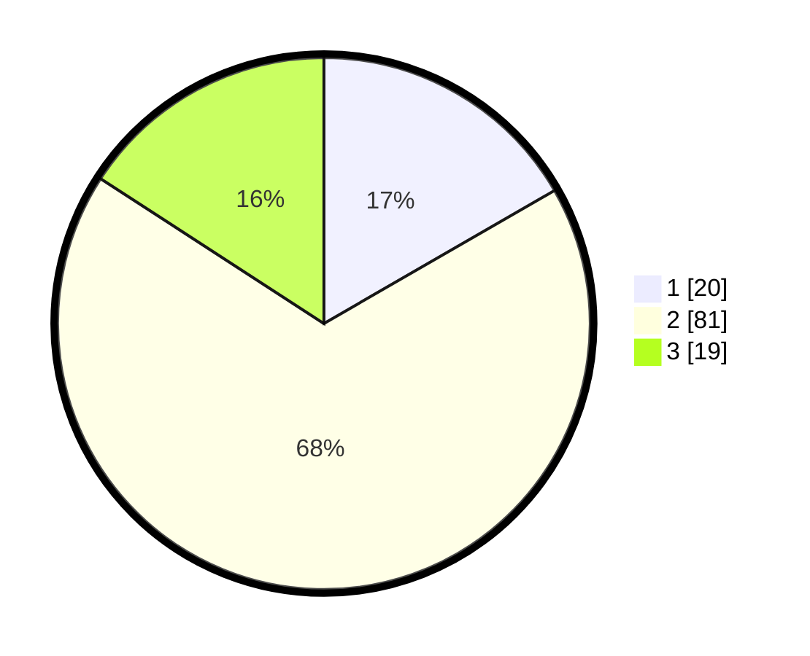

# Hasil

## Grafik

## Tabel

| No. | Nama Paslon    | Suara | Suara (raw) | Persentase |
|:--- |:-------------- | -----:| -----------:| ----------:|
| 1   | ANIES MUHAIMIN | 20    | [20][p-1]   | 16,67      |
| 2   | PRABOWO GIBRAN | 81    | [81][p-2]   | 67,50      |
| 3   | GANJAR MAHFUD  | 19    | [19][p-3]   | 15,83      |

[p-1]: https://github.com/gigit-pemilu/pemilu-2024-35-jawa-timur/blob/main/pilpres/hitung-suara/sub/35-jawa-timur/sub/09-jember/sub/30-silo/sub/2005-pace/sub/034-tps/sub/paslon-1.txt
[p-2]: https://github.com/gigit-pemilu/pemilu-2024-35-jawa-timur/blob/main/pilpres/hitung-suara/sub/35-jawa-timur/sub/09-jember/sub/30-silo/sub/2005-pace/sub/034-tps/sub/paslon-2.txt
[p-3]: https://github.com/gigit-pemilu/pemilu-2024-35-jawa-timur/blob/main/pilpres/hitung-suara/sub/35-jawa-timur/sub/09-jember/sub/30-silo/sub/2005-pace/sub/034-tps/sub/paslon-3.txt

## Foto C Plano

https://sirekap-obj-formc.kpu.go.id/4c78/pemilu/ppwp/35/09/30/20/05/3509302005034-20240215-140825--e593d98a-6eaf-4087-970d-1728bde9b9b8.jpg

https://sirekap-obj-formc.kpu.go.id/4c78/pemilu/ppwp/35/09/30/20/05/3509302005034-20240215-140907--14b84cbd-b527-4373-a906-e4fa9600f451.jpg

https://sirekap-obj-formc.kpu.go.id/4c78/pemilu/ppwp/35/09/30/20/05/3509302005034-20240215-141250--d6aaee95-5303-4a39-9dd3-1af478e5273a.jpg

## Metadata

| Key        | Value               |
| ---------- | ------------------- |
| Time Stamp | 2024-02-15 17:30:25 |

