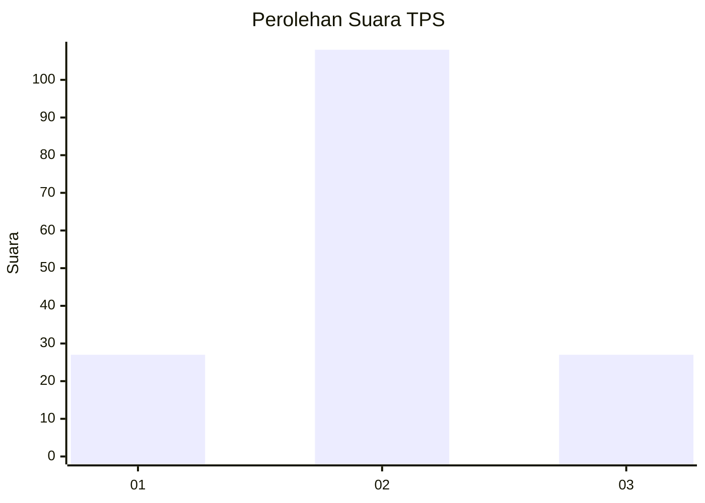
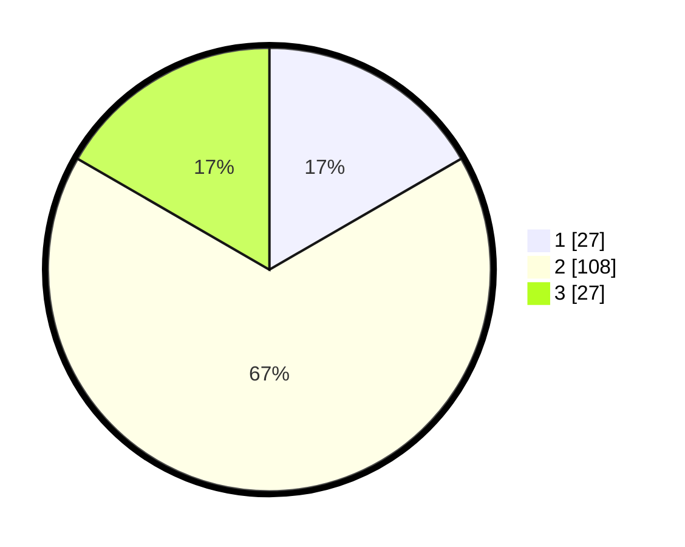

# Hasil

## Grafik

## Tabel

| No. | Nama Paslon    | Suara | Suara (raw) | Persentase |
|:--- |:-------------- | -----:| -----------:| ----------:|
| 1   | ANIES MUHAIMIN | 27    | [27][p-1]   | 16,67      |
| 2   | PRABOWO GIBRAN | 108   | [108][p-2]  | 66,67      |
| 3   | GANJAR MAHFUD  | 27    | [27][p-3]   | 16,67      |

[p-1]: https://github.com/gigit-pemilu/pemilu-2024-35-jawa-timur/blob/main/pilpres/hitung-suara/sub/35-jawa-timur/sub/09-jember/sub/30-silo/sub/2005-pace/sub/036-tps/sub/paslon-1.txt
[p-2]: https://github.com/gigit-pemilu/pemilu-2024-35-jawa-timur/blob/main/pilpres/hitung-suara/sub/35-jawa-timur/sub/09-jember/sub/30-silo/sub/2005-pace/sub/036-tps/sub/paslon-2.txt
[p-3]: https://github.com/gigit-pemilu/pemilu-2024-35-jawa-timur/blob/main/pilpres/hitung-suara/sub/35-jawa-timur/sub/09-jember/sub/30-silo/sub/2005-pace/sub/036-tps/sub/paslon-3.txt

## Foto C Plano

https://sirekap-obj-formc.kpu.go.id/750d/pemilu/ppwp/35/09/30/20/05/3509302005036-20240214-230131--de4bb700-0bac-42a7-8a8a-7a3c0b77d9b4.jpg

https://sirekap-obj-formc.kpu.go.id/750d/pemilu/ppwp/35/09/30/20/05/3509302005036-20240214-204940--d94ca464-8e1d-4bd6-985e-f7e952e6fbdc.jpg

https://sirekap-obj-formc.kpu.go.id/750d/pemilu/ppwp/35/09/30/20/05/3509302005036-20240214-205049--ed0f6071-d7dc-427d-b7e6-c27c27e0bf8c.jpg

## Metadata

| Key        | Value               |
| ---------- | ------------------- |
| Time Stamp | 2024-02-15 17:00:25 |

