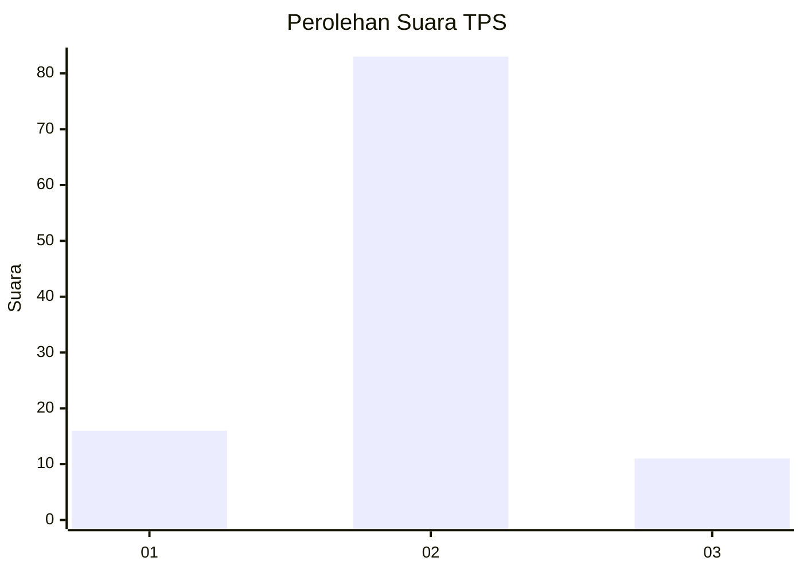
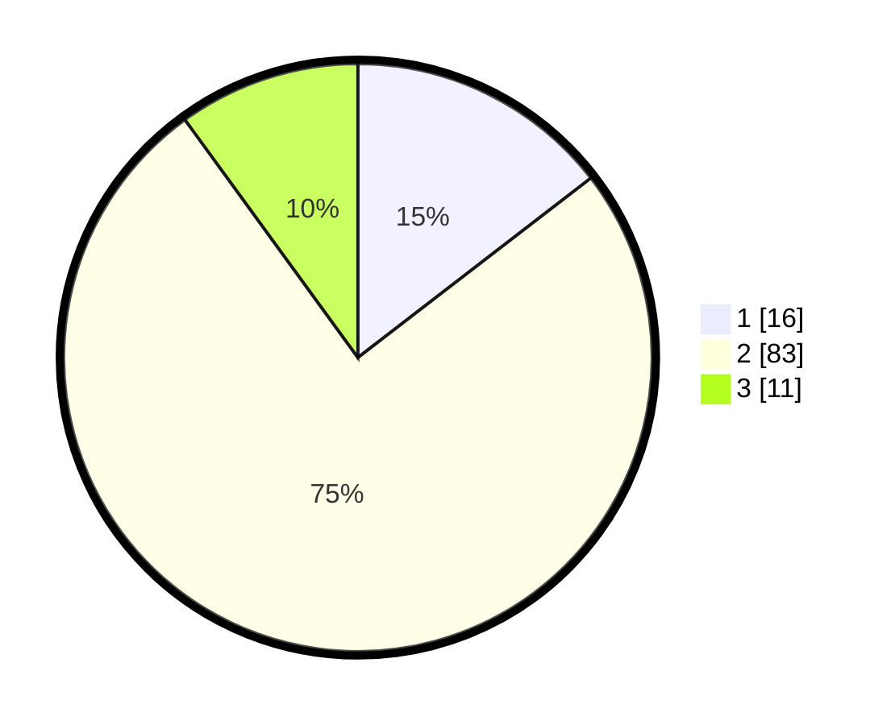

# Hasil

## Grafik

## Tabel

| No. | Nama Paslon    | Suara | Suara (raw) | Persentase |
|:--- |:-------------- | -----:| -----------:| ----------:|
| 1   | ANIES MUHAIMIN | 16    | [16][p-1]   | 14,55      |
| 2   | PRABOWO GIBRAN | 83    | [83][p-2]   | 75,45      |
| 3   | GANJAR MAHFUD  | 11    | [11][p-3]   | 10,00      |

[p-1]: https://github.com/gigit-pemilu/pemilu-2024-35-jawa-timur/blob/main/pilpres/hitung-suara/sub/35-jawa-timur/sub/09-jember/sub/30-silo/sub/2005-pace/sub/039-tps/sub/paslon-1.txt
[p-2]: https://github.com/gigit-pemilu/pemilu-2024-35-jawa-timur/blob/main/pilpres/hitung-suara/sub/35-jawa-timur/sub/09-jember/sub/30-silo/sub/2005-pace/sub/039-tps/sub/paslon-2.txt
[p-3]: https://github.com/gigit-pemilu/pemilu-2024-35-jawa-timur/blob/main/pilpres/hitung-suara/sub/35-jawa-timur/sub/09-jember/sub/30-silo/sub/2005-pace/sub/039-tps/sub/paslon-3.txt

## Foto C Plano

https://sirekap-obj-formc.kpu.go.id/de0c/pemilu/ppwp/35/09/30/20/05/3509302005039-20240214-224202--51ccf2c6-02be-4b8d-8964-5d0fb2fbf8fb.jpg

https://sirekap-obj-formc.kpu.go.id/de0c/pemilu/ppwp/35/09/30/20/05/3509302005039-20240214-224356--670a4551-4618-450f-8a65-71998582e5d4.jpg

https://sirekap-obj-formc.kpu.go.id/de0c/pemilu/ppwp/35/09/30/20/05/3509302005039-20240214-224650--d469234e-0bb0-4013-ba83-4061af10cf51.jpg

## Metadata

| Key        | Value               |
| ---------- | ------------------- |
| Time Stamp | 2024-02-15 15:00:29 |

