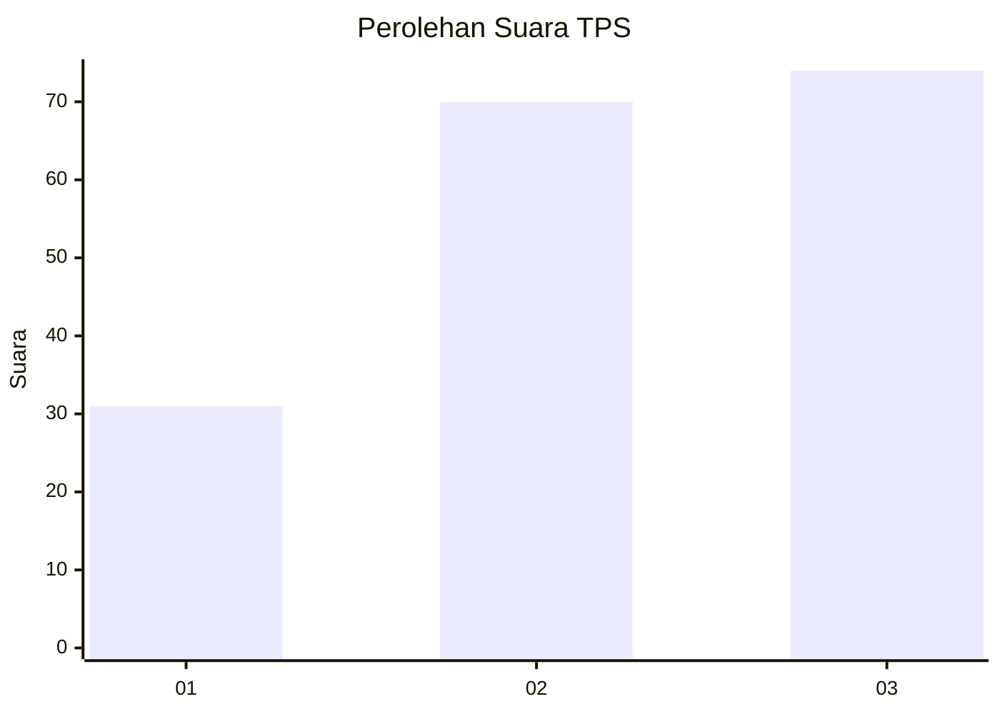
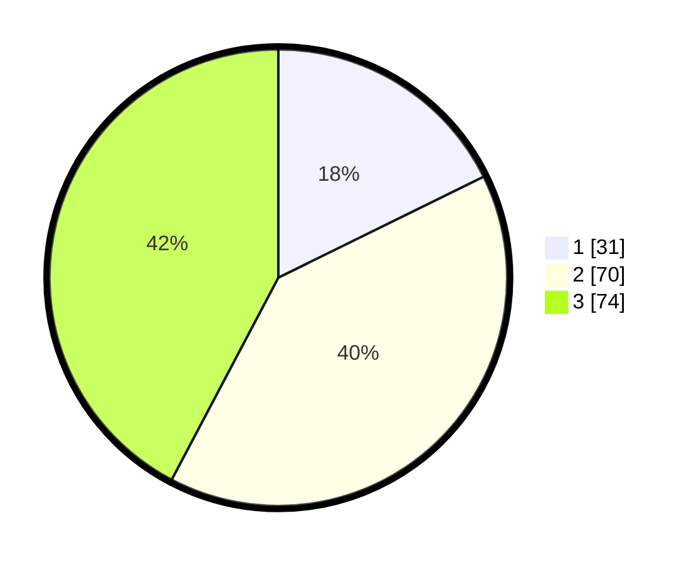

# Hasil

## Grafik

## Tabel

| No. | Nama Paslon    | Suara | Suara (raw) | Persentase |
|:--- |:-------------- | -----:| -----------:| ----------:|
| 1   | ANIES MUHAIMIN | 31    | [31][p-1]   | 17,71      |
| 2   | PRABOWO GIBRAN | 70    | [70][p-2]   | 40,00      |
| 3   | GANJAR MAHFUD  | 74    | [74][p-3]   | 42,29      |

[p-1]: https://github.com/gigit-pemilu/pemilu-2024/blob/main/pilpres/hitung-suara/sub/35-jawa-timur/sub/09-jember/sub/30-silo/sub/2005-pace/sub/045-tps/sub/paslon-1.txt
[p-2]: https://github.com/gigit-pemilu/pemilu-2024/blob/main/pilpres/hitung-suara/sub/35-jawa-timur/sub/09-jember/sub/30-silo/sub/2005-pace/sub/045-tps/sub/paslon-2.txt
[p-3]: https://github.com/gigit-pemilu/pemilu-2024/blob/main/pilpres/hitung-suara/sub/35-jawa-timur/sub/09-jember/sub/30-silo/sub/2005-pace/sub/045-tps/sub/paslon-3.txt

## Foto C Plano

https://sirekap-obj-formc.kpu.go.id/989d/pemilu/ppwp/35/09/30/20/05/3509302005045-20240214-213235--908b62ef-b144-4b2a-9beb-759c5e9c7136.jpg

https://sirekap-obj-formc.kpu.go.id/989d/pemilu/ppwp/35/09/30/20/05/3509302005045-20240214-213349--c40b6354-1e93-44c7-8c79-ac384f9ab0f0.jpg

https://sirekap-obj-formc.kpu.go.id/989d/pemilu/ppwp/35/09/30/20/05/3509302005045-20240214-213456--3fca7ecc-6d4a-431a-81af-d85fdc8d0549.jpg

## Metadata

| Key        | Value               |
| ---------- | ------------------- |
| Time Stamp | 2024-02-15 17:00:25 |

