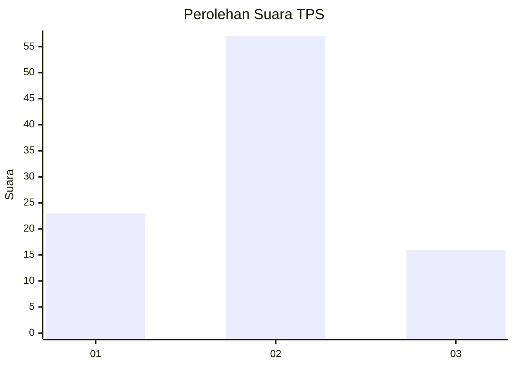
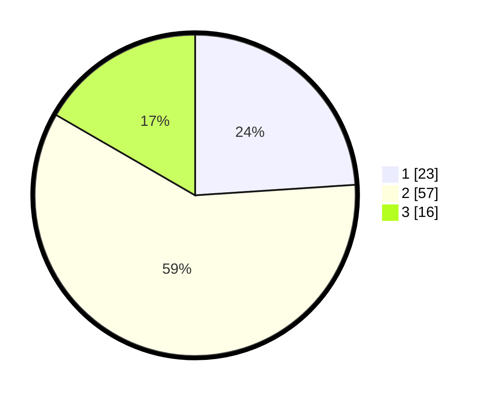

# Hasil

## Grafik

## Tabel

| No. | Nama Paslon    | Suara | Suara (raw) | Persentase |
|:--- |:-------------- | -----:| -----------:| ----------:|
| 1   | ANIES MUHAIMIN | 23    | [23][p-1]   | 23,96      |
| 2   | PRABOWO GIBRAN | 57    | [57][p-2]   | 59,38      |
| 3   | GANJAR MAHFUD  | 16    | [16][p-3]   | 16,67      |

[p-1]: https://github.com/gigit-pemilu/pemilu-2024/blob/main/pilpres/hitung-suara/sub/35-jawa-timur/sub/09-jember/sub/30-silo/sub/2005-pace/sub/048-tps/sub/paslon-1.txt
[p-2]: https://github.com/gigit-pemilu/pemilu-2024/blob/main/pilpres/hitung-suara/sub/35-jawa-timur/sub/09-jember/sub/30-silo/sub/2005-pace/sub/048-tps/sub/paslon-2.txt
[p-3]: https://github.com/gigit-pemilu/pemilu-2024/blob/main/pilpres/hitung-suara/sub/35-jawa-timur/sub/09-jember/sub/30-silo/sub/2005-pace/sub/048-tps/sub/paslon-3.txt

## Foto C Plano

https://sirekap-obj-formc.kpu.go.id/1859/pemilu/ppwp/35/09/30/20/05/3509302005048-20240215-074836--a27ec5f6-ed9f-4151-bc84-b9e5d182194e.jpg

https://sirekap-obj-formc.kpu.go.id/1859/pemilu/ppwp/35/09/30/20/05/3509302005048-20240215-034806--df18ec9a-be2a-474e-bf28-1844bf39db87.jpg

https://sirekap-obj-formc.kpu.go.id/1859/pemilu/ppwp/35/09/30/20/05/3509302005048-20240215-075256--ad5c957b-22e4-4ee7-afb0-ce0092afbb0f.jpg

## Metadata

| Key        | Value               |
| ---------- | ------------------- |
| Time Stamp | 2024-02-15 18:00:26 |

