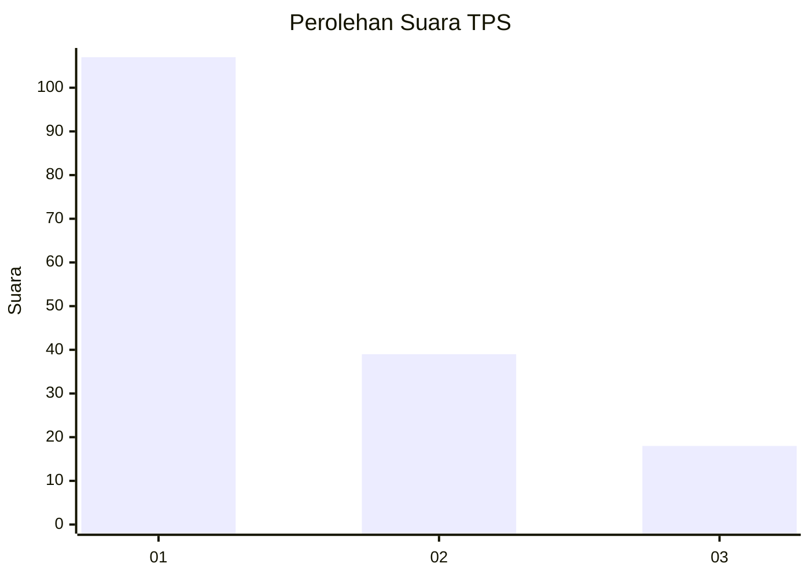
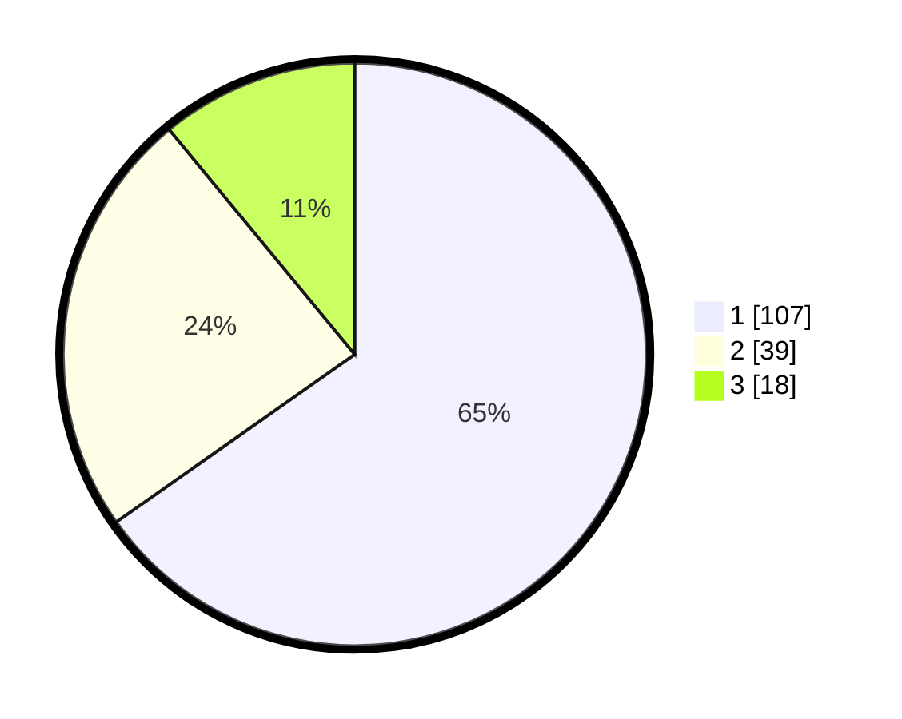

# Hasil

## Grafik

## Tabel

| No. | Nama Paslon    | Suara | Suara (raw) | Persentase |
|:--- |:-------------- | -----:| -----------:| ----------:|
| 1   | ANIES MUHAIMIN | 107   | [107][p-1]  | 65,24      |
| 2   | PRABOWO GIBRAN | 39    | [39][p-2]   | 23,78      |
| 3   | GANJAR MAHFUD  | 18    | [18][p-3]   | 10,98      |

[p-1]: https://github.com/gigit-pemilu/pemilu-2024-35-jawa-timur/blob/main/pilpres/hitung-suara/sub/35-jawa-timur/sub/09-jember/sub/30-silo/sub/2005-pace/sub/049-tps/sub/paslon-1.txt
[p-2]: https://github.com/gigit-pemilu/pemilu-2024-35-jawa-timur/blob/main/pilpres/hitung-suara/sub/35-jawa-timur/sub/09-jember/sub/30-silo/sub/2005-pace/sub/049-tps/sub/paslon-2.txt
[p-3]: https://github.com/gigit-pemilu/pemilu-2024-35-jawa-timur/blob/main/pilpres/hitung-suara/sub/35-jawa-timur/sub/09-jember/sub/30-silo/sub/2005-pace/sub/049-tps/sub/paslon-3.txt

## Foto C Plano

https://sirekap-obj-formc.kpu.go.id/00d0/pemilu/ppwp/35/09/30/20/05/3509302005049-20240215-225124--ef15677f-0596-41d2-a95f-2e748f55fa24.jpg

https://sirekap-obj-formc.kpu.go.id/00d0/pemilu/ppwp/35/09/30/20/05/3509302005049-20240214-221635--0bfd1c94-6107-49fb-b9b9-b468159b8407.jpg

https://sirekap-obj-formc.kpu.go.id/00d0/pemilu/ppwp/35/09/30/20/05/3509302005049-20240214-221838--f6952dce-6cf4-4b35-9ce6-f1334f83ca70.jpg

## Metadata

| Key        | Value               |
| ---------- | ------------------- |
| Time Stamp | 2024-02-15 23:29:50 |

