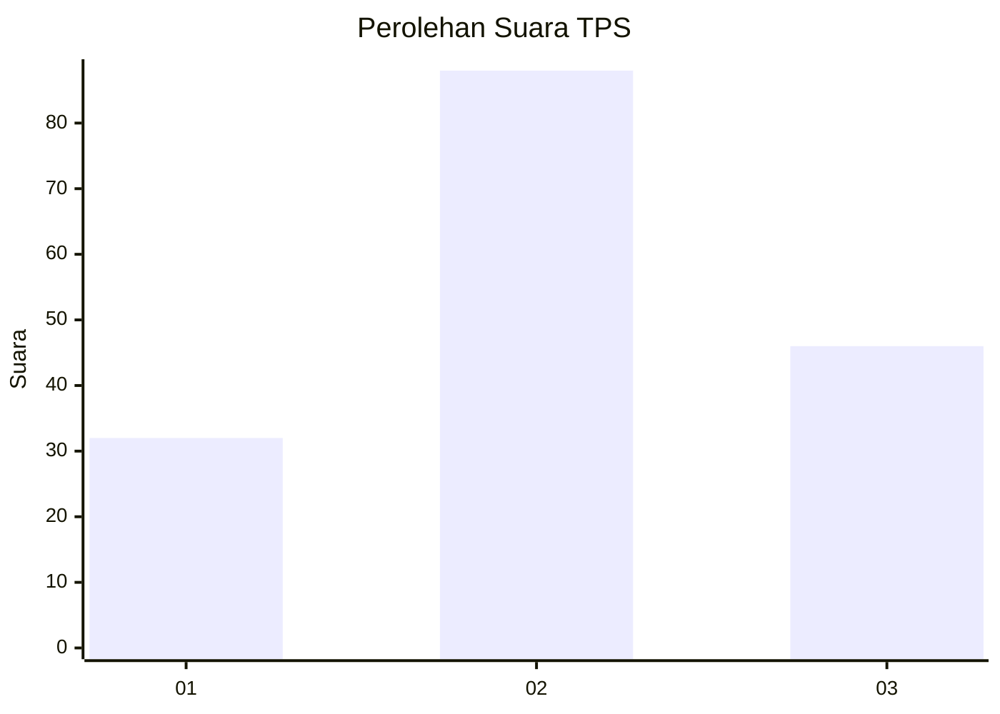
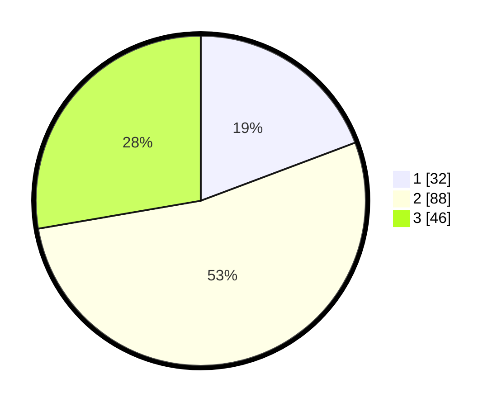

# Hasil

## Grafik

## Tabel

| No. | Nama Paslon    | Suara | Suara (raw) | Persentase |
|:--- |:-------------- | -----:| -----------:| ----------:|
| 1   | ANIES MUHAIMIN | 32    | [32][p-1]   | 19,28      |
| 2   | PRABOWO GIBRAN | 88    | [88][p-2]   | 53,01      |
| 3   | GANJAR MAHFUD  | 46    | [46][p-3]   | 27,71      |

[p-1]: https://github.com/gigit-pemilu/pemilu-2024-35-jawa-timur/blob/main/pilpres/hitung-suara/sub/35-jawa-timur/sub/09-jember/sub/30-silo/sub/2005-pace/sub/051-tps/sub/paslon-1.txt
[p-2]: https://github.com/gigit-pemilu/pemilu-2024-35-jawa-timur/blob/main/pilpres/hitung-suara/sub/35-jawa-timur/sub/09-jember/sub/30-silo/sub/2005-pace/sub/051-tps/sub/paslon-2.txt
[p-3]: https://github.com/gigit-pemilu/pemilu-2024-35-jawa-timur/blob/main/pilpres/hitung-suara/sub/35-jawa-timur/sub/09-jember/sub/30-silo/sub/2005-pace/sub/051-tps/sub/paslon-3.txt

## Foto C Plano

https://sirekap-obj-formc.kpu.go.id/78b7/pemilu/ppwp/35/09/30/20/05/3509302005051-20240215-182218--26091ff8-5733-4abb-969c-fc1de8f81087.jpg

https://sirekap-obj-formc.kpu.go.id/78b7/pemilu/ppwp/35/09/30/20/05/3509302005051-20240215-183217--a79a4d4f-62f2-4553-9343-baf8f991c2ce.jpg

https://sirekap-obj-formc.kpu.go.id/78b7/pemilu/ppwp/35/09/30/20/05/3509302005051-20240215-183329--0b132d30-f7a7-4735-ba90-0ecbe04d87fd.jpg

## Metadata

| Key        | Value               |
| ---------- | ------------------- |
| Time Stamp | 2024-02-16 00:00:26 |

