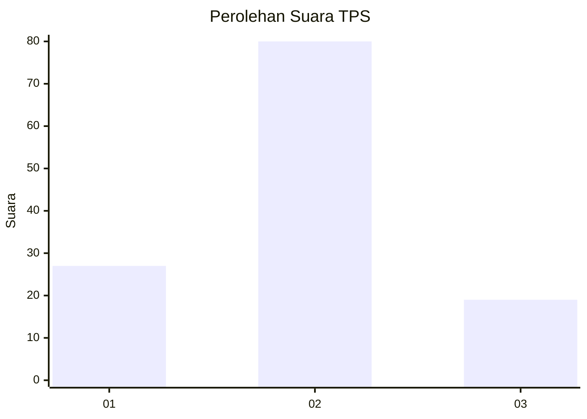
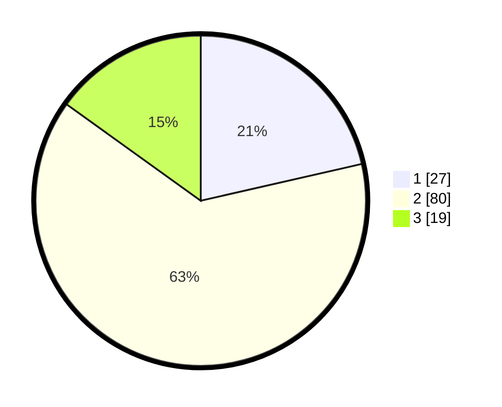

# Hasil

## Grafik

## Tabel

| No. | Nama Paslon    | Suara | Suara (raw) | Persentase |
|:--- |:-------------- | -----:| -----------:| ----------:|
| 1   | ANIES MUHAIMIN | 27    | [27][p-1]   | 21,43      |
| 2   | PRABOWO GIBRAN | 80    | [80][p-2]   | 63,49      |
| 3   | GANJAR MAHFUD  | 19    | [19][p-3]   | 15,08      |

[p-1]: https://github.com/gigit-pemilu/pemilu-2024/blob/main/pilpres/hitung-suara/sub/35-jawa-timur/sub/09-jember/sub/30-silo/sub/2005-pace/sub/053-tps/sub/paslon-1.txt
[p-2]: https://github.com/gigit-pemilu/pemilu-2024/blob/main/pilpres/hitung-suara/sub/35-jawa-timur/sub/09-jember/sub/30-silo/sub/2005-pace/sub/053-tps/sub/paslon-2.txt
[p-3]: https://github.com/gigit-pemilu/pemilu-2024/blob/main/pilpres/hitung-suara/sub/35-jawa-timur/sub/09-jember/sub/30-silo/sub/2005-pace/sub/053-tps/sub/paslon-3.txt

## Foto C Plano

https://sirekap-obj-formc.kpu.go.id/1a05/pemilu/ppwp/35/09/30/20/05/3509302005053-20240216-114926--71ae3e13-02e3-4b10-ab02-cf96ce63236d.jpg

https://sirekap-obj-formc.kpu.go.id/1a05/pemilu/ppwp/35/09/30/20/05/3509302005053-20240216-114943--1e9d492e-292d-4d79-95e2-78bd3be9e7fd.jpg

https://sirekap-obj-formc.kpu.go.id/1a05/pemilu/ppwp/35/09/30/20/05/3509302005053-20240216-114958--13fdc541-6997-4446-ab9a-6b066bea0437.jpg

## Metadata

| Key        | Value               |
| ---------- | ------------------- |
| Time Stamp | 2024-02-24 22:31:28 |

