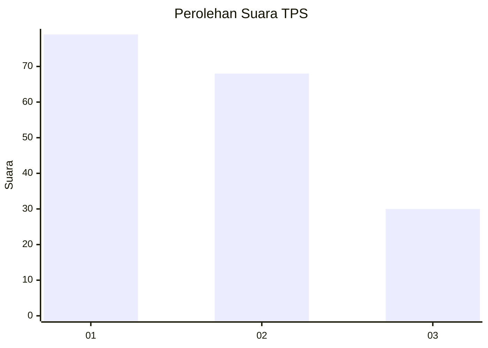
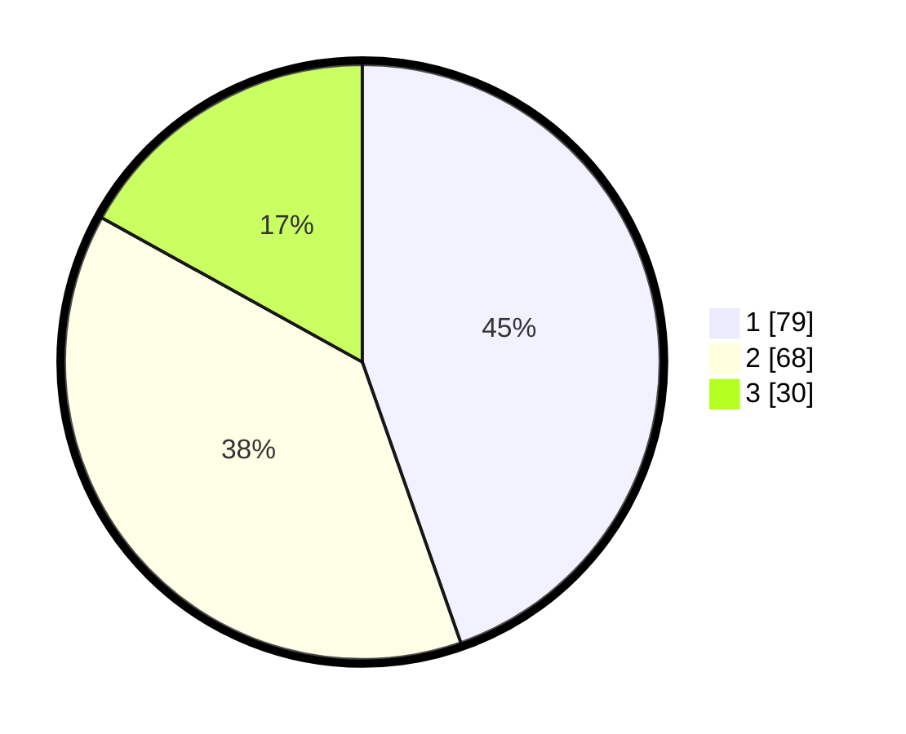

# Hasil

## Grafik

## Tabel

| No. | Nama Paslon    | Suara | Suara (raw) | Persentase |
|:--- |:-------------- | -----:| -----------:| ----------:|
| 1   | ANIES MUHAIMIN | 79    | [79][p-1]   | 44,63      |
| 2   | PRABOWO GIBRAN | 68    | [68][p-2]   | 38,42      |
| 3   | GANJAR MAHFUD  | 30    | [30][p-3]   | 16,95      |

[p-1]: https://github.com/gigit-pemilu/pemilu-2024/blob/main/pilpres/hitung-suara/sub/35-jawa-timur/sub/09-jember/sub/30-silo/sub/2006-mulyorejo/sub/003-tps/sub/paslon-1.txt
[p-2]: https://github.com/gigit-pemilu/pemilu-2024/blob/main/pilpres/hitung-suara/sub/35-jawa-timur/sub/09-jember/sub/30-silo/sub/2006-mulyorejo/sub/003-tps/sub/paslon-2.txt
[p-3]: https://github.com/gigit-pemilu/pemilu-2024/blob/main/pilpres/hitung-suara/sub/35-jawa-timur/sub/09-jember/sub/30-silo/sub/2006-mulyorejo/sub/003-tps/sub/paslon-3.txt

## Foto C Plano

https://sirekap-obj-formc.kpu.go.id/2867/pemilu/ppwp/35/09/30/20/06/3509302006003-20240214-221640--85caa9a5-a5b4-41c1-adb4-840974a78c05.jpg

https://sirekap-obj-formc.kpu.go.id/2867/pemilu/ppwp/35/09/30/20/06/3509302006003-20240214-221825--1a9ac0b0-0059-4fc6-ac14-de67a8cbe260.jpg

https://sirekap-obj-formc.kpu.go.id/2867/pemilu/ppwp/35/09/30/20/06/3509302006003-20240214-221940--d2211e9c-60c3-450f-82a8-a093cba7cfd9.jpg

## Metadata

| Key        | Value               |
| ---------- | ------------------- |
| Time Stamp | 2024-02-15 15:00:29 |

