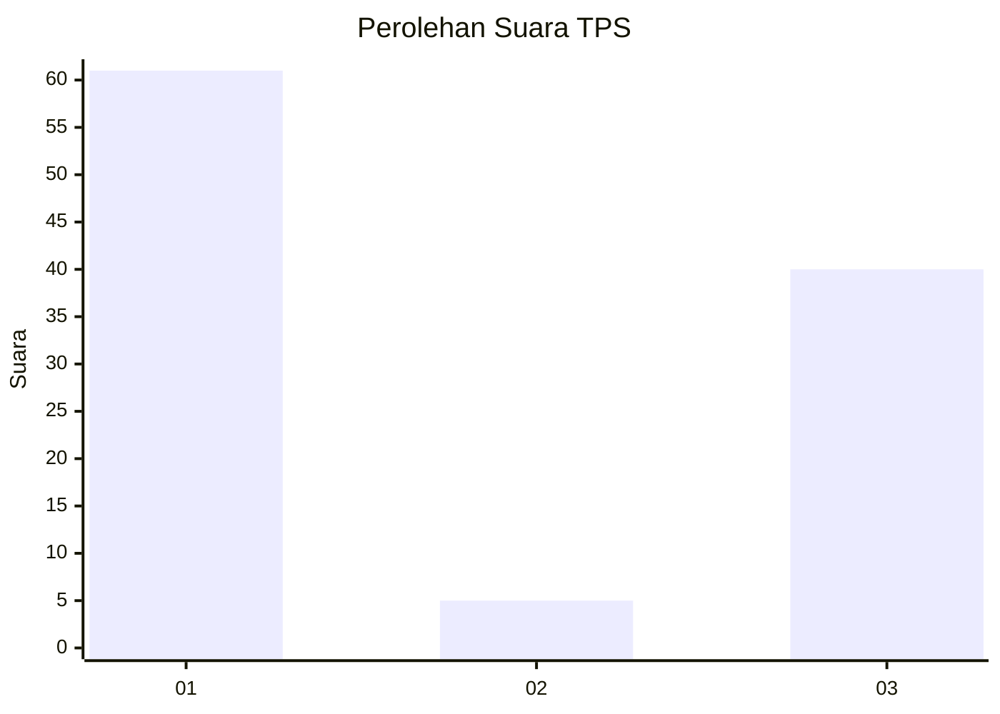
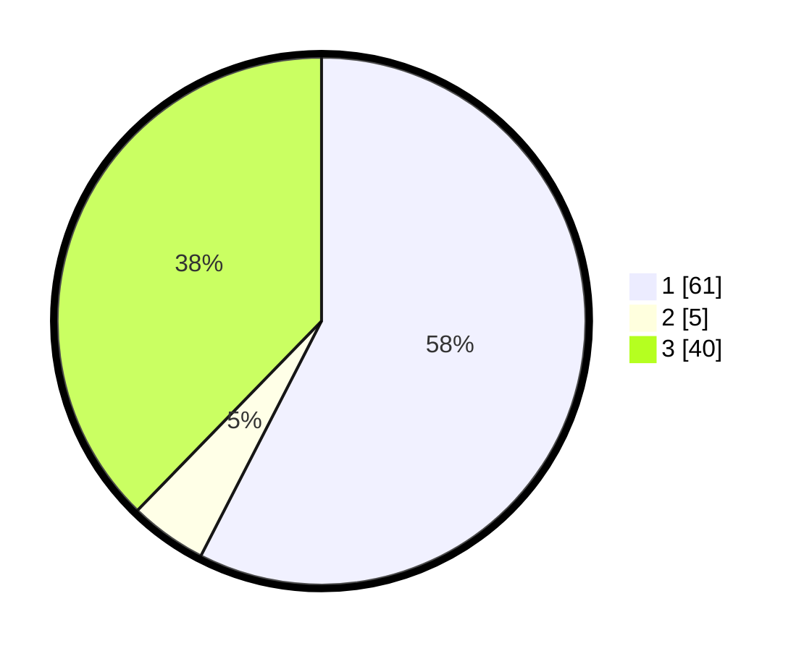

# Hasil

## Grafik

## Tabel

| No. | Nama Paslon    | Suara | Suara (raw) | Persentase |
|:--- |:-------------- | -----:| -----------:| ----------:|
| 1   | ANIES MUHAIMIN | 61    | [61][p-1]   | 57,55      |
| 2   | PRABOWO GIBRAN | 5     | [5][p-2]    | 4,72       |
| 3   | GANJAR MAHFUD  | 40    | [40][p-3]   | 37,74      |

[p-1]: https://github.com/gigit-pemilu/pemilu-2024/blob/main/pilpres/hitung-suara/sub/35-jawa-timur/sub/09-jember/sub/30-silo/sub/2006-mulyorejo/sub/010-tps/sub/paslon-1.txt
[p-2]: https://github.com/gigit-pemilu/pemilu-2024/blob/main/pilpres/hitung-suara/sub/35-jawa-timur/sub/09-jember/sub/30-silo/sub/2006-mulyorejo/sub/010-tps/sub/paslon-2.txt
[p-3]: https://github.com/gigit-pemilu/pemilu-2024/blob/main/pilpres/hitung-suara/sub/35-jawa-timur/sub/09-jember/sub/30-silo/sub/2006-mulyorejo/sub/010-tps/sub/paslon-3.txt

## Foto C Plano

https://sirekap-obj-formc.kpu.go.id/cd1c/pemilu/ppwp/35/09/30/20/06/3509302006010-20240216-080318--ed36d260-2775-49a4-b1f1-0bb3342a42a9.jpg

https://sirekap-obj-formc.kpu.go.id/cd1c/pemilu/ppwp/35/09/30/20/06/3509302006010-20240216-080332--3e55601f-9a2b-457d-b4a1-6e1a72f728bd.jpg

## Metadata

| Key        | Value               |
| ---------- | ------------------- |
| Time Stamp | 2024-02-16 08:30:27 |

