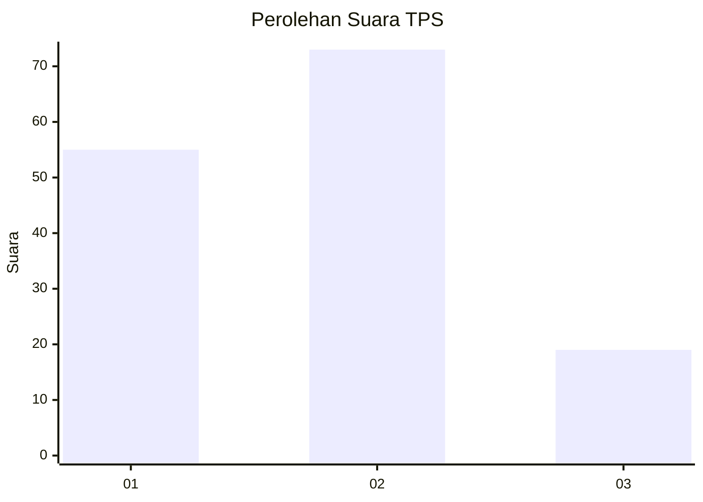
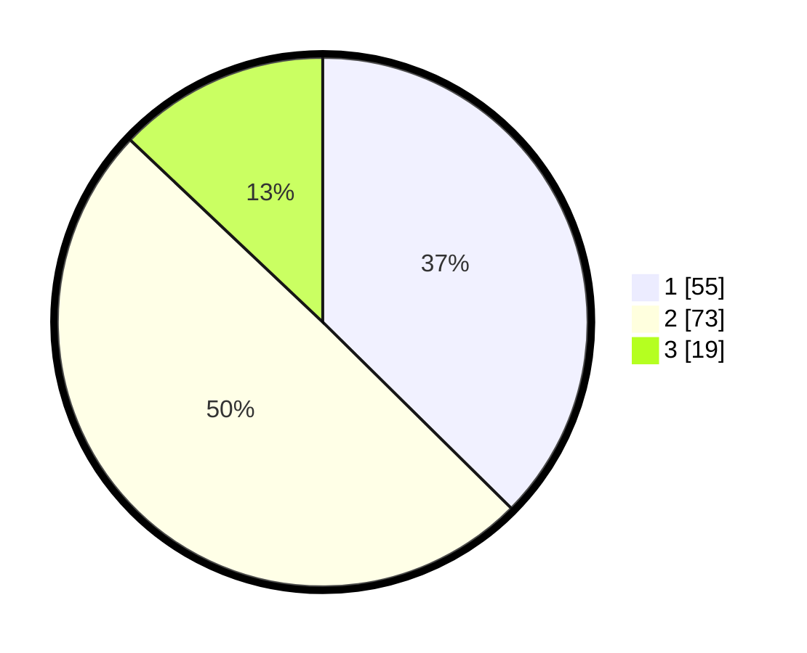

# Hasil

## Grafik

## Tabel

| No. | Nama Paslon    | Suara | Suara (raw) | Persentase |
|:--- |:-------------- | -----:| -----------:| ----------:|
| 1   | ANIES MUHAIMIN | 55    | [55][p-1]   | 37,41      |
| 2   | PRABOWO GIBRAN | 73    | [73][p-2]   | 49,66      |
| 3   | GANJAR MAHFUD  | 19    | [19][p-3]   | 12,93      |

[p-1]: https://github.com/gigit-pemilu/pemilu-2024-35-jawa-timur/blob/main/pilpres/hitung-suara/sub/35-jawa-timur/sub/09-jember/sub/30-silo/sub/2006-mulyorejo/sub/020-tps/sub/paslon-1.txt
[p-2]: https://github.com/gigit-pemilu/pemilu-2024-35-jawa-timur/blob/main/pilpres/hitung-suara/sub/35-jawa-timur/sub/09-jember/sub/30-silo/sub/2006-mulyorejo/sub/020-tps/sub/paslon-2.txt
[p-3]: https://github.com/gigit-pemilu/pemilu-2024-35-jawa-timur/blob/main/pilpres/hitung-suara/sub/35-jawa-timur/sub/09-jember/sub/30-silo/sub/2006-mulyorejo/sub/020-tps/sub/paslon-3.txt

## Foto C Plano

https://sirekap-obj-formc.kpu.go.id/bff0/pemilu/ppwp/35/09/30/20/06/3509302006020-20240214-223221--d4b69776-ff6a-48f3-a36b-327fa7aa9f01.jpg

https://sirekap-obj-formc.kpu.go.id/bff0/pemilu/ppwp/35/09/30/20/06/3509302006020-20240214-223306--67b15502-2103-4bb3-b172-0fa52ecffa64.jpg

https://sirekap-obj-formc.kpu.go.id/bff0/pemilu/ppwp/35/09/30/20/06/3509302006020-20240214-223358--8c9d5e6f-d5ad-4af8-ae86-d788afc8bc81.jpg

## Metadata

| Key        | Value               |
| ---------- | ------------------- |
| Time Stamp | 2024-02-15 17:30:25 |

