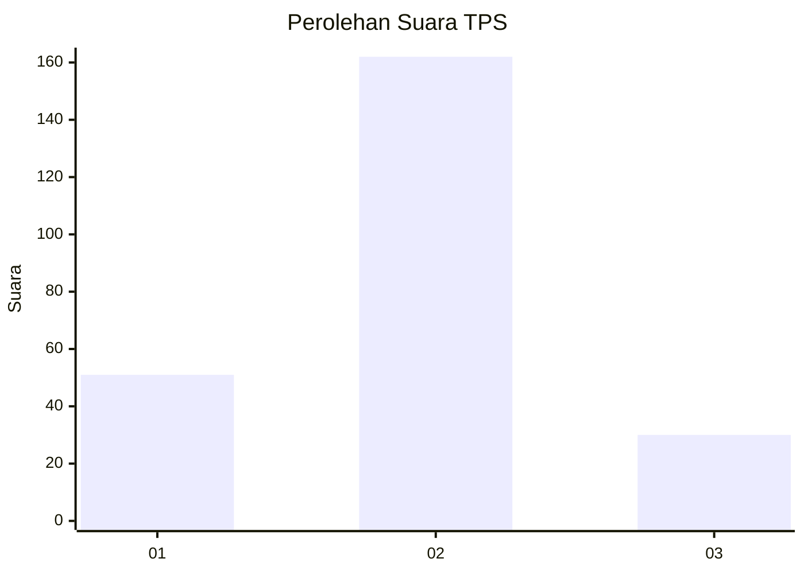
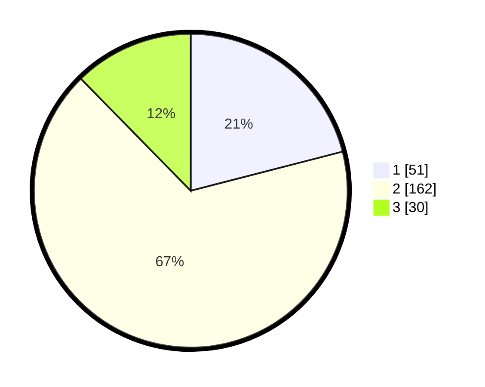

# Hasil

## Grafik

## Tabel

| No. | Nama Paslon    | Suara | Suara (raw) | Persentase |
|:--- |:-------------- | -----:| -----------:| ----------:|
| 1   | ANIES MUHAIMIN | 51    | [51][p-1]   | 20,99      |
| 2   | PRABOWO GIBRAN | 162   | [162][p-2]  | 66,67      |
| 3   | GANJAR MAHFUD  | 30    | [30][p-3]   | 12,35      |

[p-1]: https://github.com/gigit-pemilu/pemilu-2024/blob/main/pilpres/hitung-suara/sub/35-jawa-timur/sub/09-jember/sub/30-silo/sub/2006-mulyorejo/sub/027-tps/sub/paslon-1.txt
[p-2]: https://github.com/gigit-pemilu/pemilu-2024/blob/main/pilpres/hitung-suara/sub/35-jawa-timur/sub/09-jember/sub/30-silo/sub/2006-mulyorejo/sub/027-tps/sub/paslon-2.txt
[p-3]: https://github.com/gigit-pemilu/pemilu-2024/blob/main/pilpres/hitung-suara/sub/35-jawa-timur/sub/09-jember/sub/30-silo/sub/2006-mulyorejo/sub/027-tps/sub/paslon-3.txt

## Foto C Plano

https://sirekap-obj-formc.kpu.go.id/5dfd/pemilu/ppwp/35/09/30/20/06/3509302006027-20240214-234554--d51aaed2-421d-48ba-a42c-5f2261a33862.jpg

https://sirekap-obj-formc.kpu.go.id/5dfd/pemilu/ppwp/35/09/30/20/06/3509302006027-20240214-234850--bca34ea8-752b-485e-96a6-cbea8c79b92e.jpg

https://sirekap-obj-formc.kpu.go.id/5dfd/pemilu/ppwp/35/09/30/20/06/3509302006027-20240214-235026--f86c4919-f4b4-44e1-980c-b9cc644e2457.jpg

## Metadata

| Key        | Value               |
| ---------- | ------------------- |
| Time Stamp | 2024-02-15 15:00:29 |

