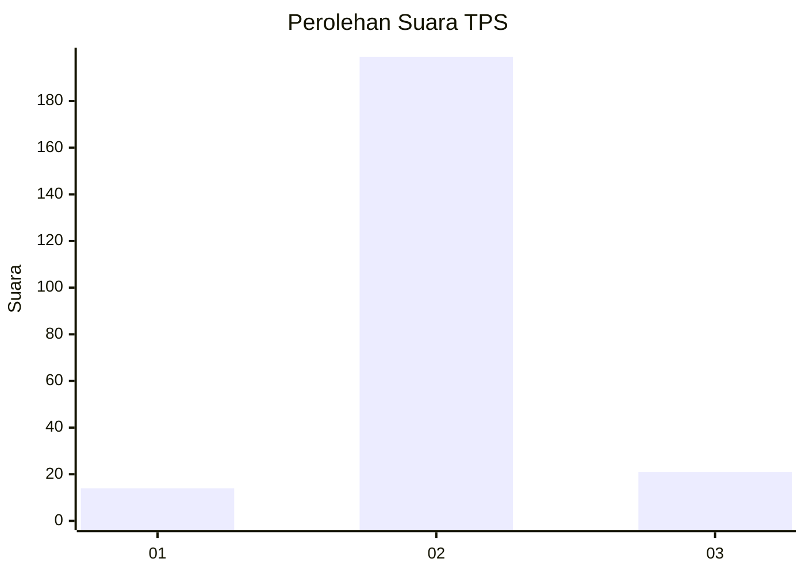
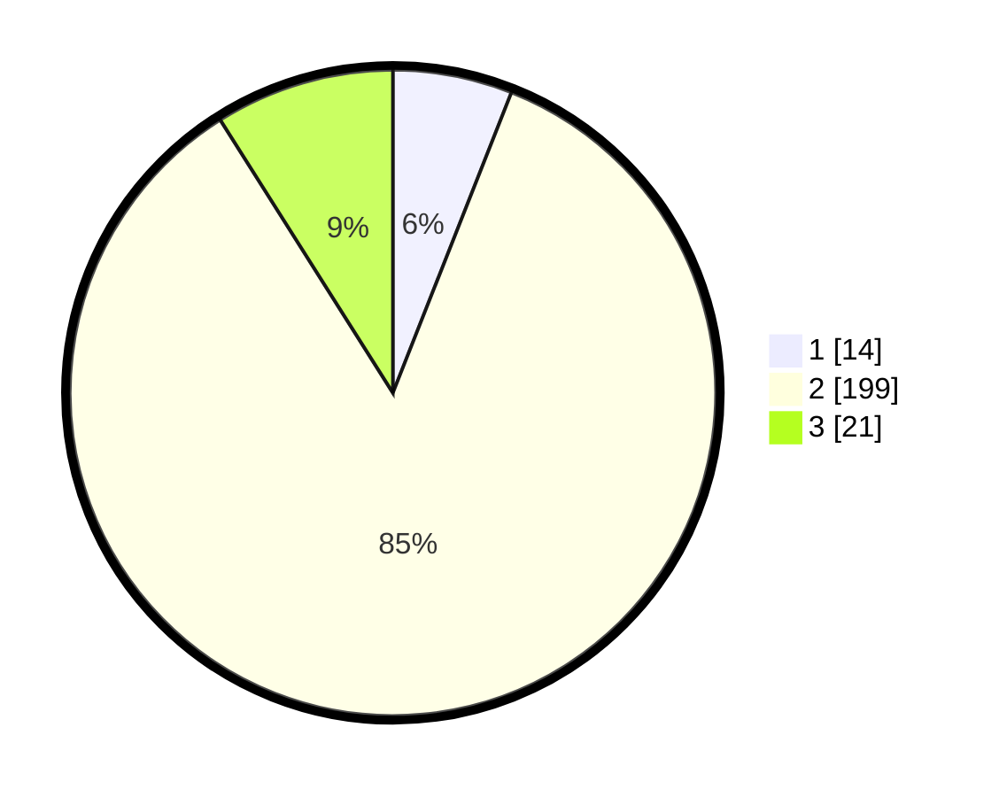

# Hasil

## Grafik

## Tabel

| No. | Nama Paslon    | Suara | Suara (raw) | Persentase |
|:--- |:-------------- | -----:| -----------:| ----------:|
| 1   | ANIES MUHAIMIN | 14    | [14][p-1]   | 5,98       |
| 2   | PRABOWO GIBRAN | 199   | [199][p-2]  | 85,04      |
| 3   | GANJAR MAHFUD  | 21    | [21][p-3]   | 8,97       |

[p-1]: https://github.com/gigit-pemilu/pemilu-2024/blob/main/pilpres/hitung-suara/sub/35-jawa-timur/sub/09-jember/sub/30-silo/sub/2006-mulyorejo/sub/031-tps/sub/paslon-1.txt
[p-2]: https://github.com/gigit-pemilu/pemilu-2024/blob/main/pilpres/hitung-suara/sub/35-jawa-timur/sub/09-jember/sub/30-silo/sub/2006-mulyorejo/sub/031-tps/sub/paslon-2.txt
[p-3]: https://github.com/gigit-pemilu/pemilu-2024/blob/main/pilpres/hitung-suara/sub/35-jawa-timur/sub/09-jember/sub/30-silo/sub/2006-mulyorejo/sub/031-tps/sub/paslon-3.txt

## Foto C Plano

https://sirekap-obj-formc.kpu.go.id/ba6b/pemilu/ppwp/35/09/30/20/06/3509302006031-20240214-160128--fc4b0595-2991-477c-a008-764b66d0743c.jpg

https://sirekap-obj-formc.kpu.go.id/ba6b/pemilu/ppwp/35/09/30/20/06/3509302006031-20240214-190624--0ea16d46-f23d-4e2c-afaf-050d89f44887.jpg

https://sirekap-obj-formc.kpu.go.id/ba6b/pemilu/ppwp/35/09/30/20/06/3509302006031-20240214-184558--753705da-2613-490b-b2c6-e0408bc8107f.jpg

## Metadata

| Key        | Value               |
| ---------- | ------------------- |
| Time Stamp | 2024-02-14 21:46:01 |

