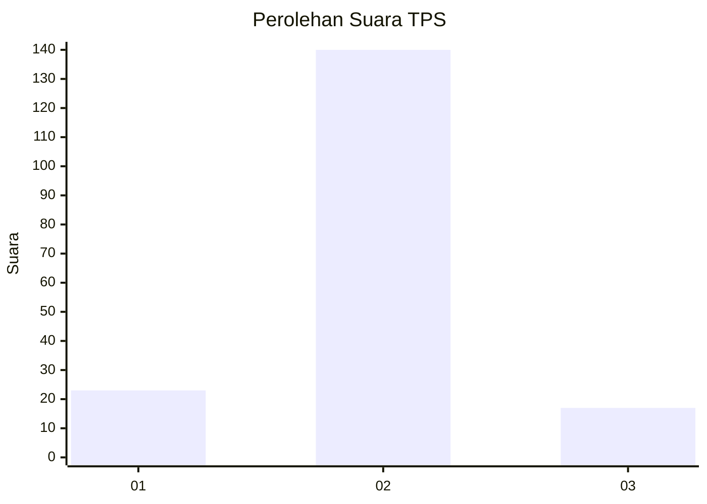
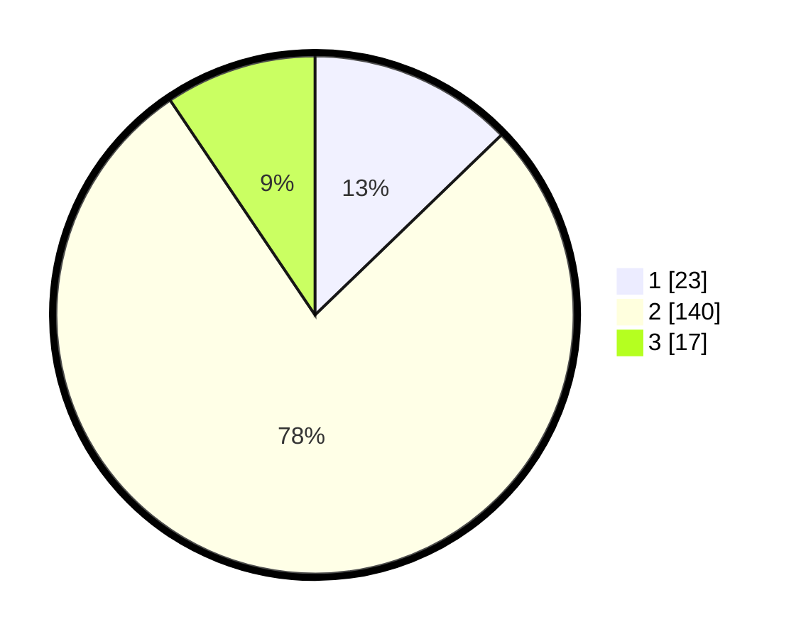

# Hasil

## Grafik

## Tabel

| No. | Nama Paslon    | Suara | Suara (raw) | Persentase |
|:--- |:-------------- | -----:| -----------:| ----------:|
| 1   | ANIES MUHAIMIN | 23    | [23][p-1]   | 12,78      |
| 2   | PRABOWO GIBRAN | 140   | [140][p-2]  | 77,78      |
| 3   | GANJAR MAHFUD  | 17    | [17][p-3]   | 9,44       |

[p-1]: https://github.com/gigit-pemilu/pemilu-2024-35-jawa-timur/blob/main/pilpres/hitung-suara/sub/35-jawa-timur/sub/09-jember/sub/30-silo/sub/2007-sumberjati/sub/009-tps/sub/paslon-1.txt
[p-2]: https://github.com/gigit-pemilu/pemilu-2024-35-jawa-timur/blob/main/pilpres/hitung-suara/sub/35-jawa-timur/sub/09-jember/sub/30-silo/sub/2007-sumberjati/sub/009-tps/sub/paslon-2.txt
[p-3]: https://github.com/gigit-pemilu/pemilu-2024-35-jawa-timur/blob/main/pilpres/hitung-suara/sub/35-jawa-timur/sub/09-jember/sub/30-silo/sub/2007-sumberjati/sub/009-tps/sub/paslon-3.txt

## Foto C Plano

https://sirekap-obj-formc.kpu.go.id/6fdc/pemilu/ppwp/35/09/30/20/07/3509302007009-20240218-162919--98f1b561-ff43-471c-a21e-3c19f8dfae73.jpg

https://sirekap-obj-formc.kpu.go.id/6fdc/pemilu/ppwp/35/09/30/20/07/3509302007009-20240221-190700--6d9537dc-831b-4a7f-b845-8dfe508432c0.jpg

https://sirekap-obj-formc.kpu.go.id/6fdc/pemilu/ppwp/35/09/30/20/07/3509302007009-20240221-191004--795eaddb-f993-439a-be2d-b4eedcda74e4.jpg

## Metadata

| Key        | Value               |
| ---------- | ------------------- |
| Time Stamp | 2024-02-24 22:31:28 |

