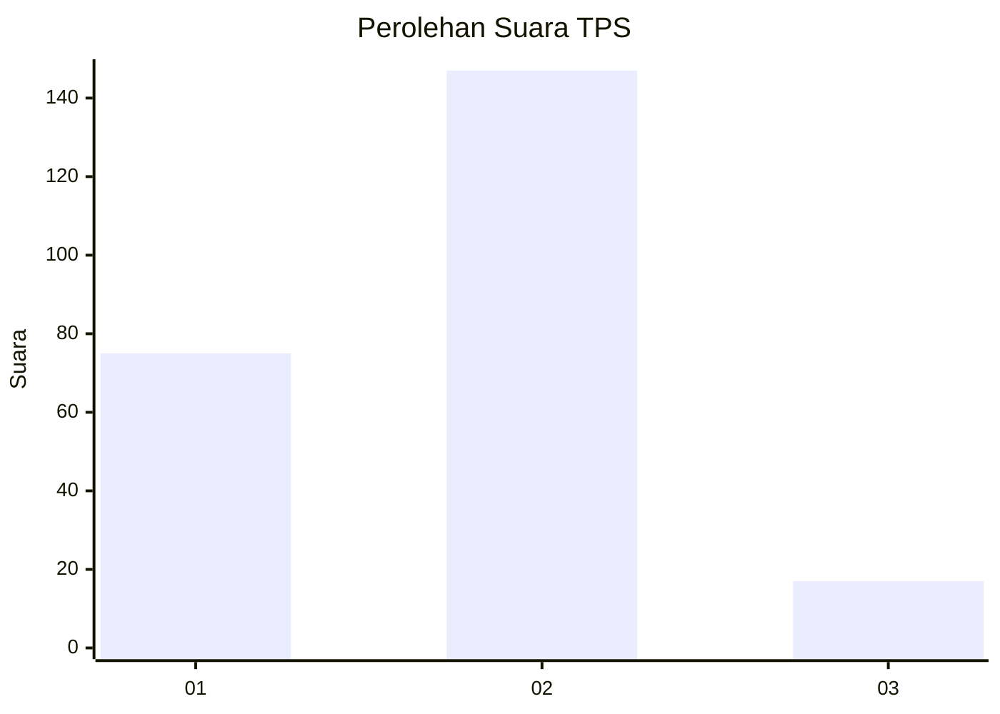
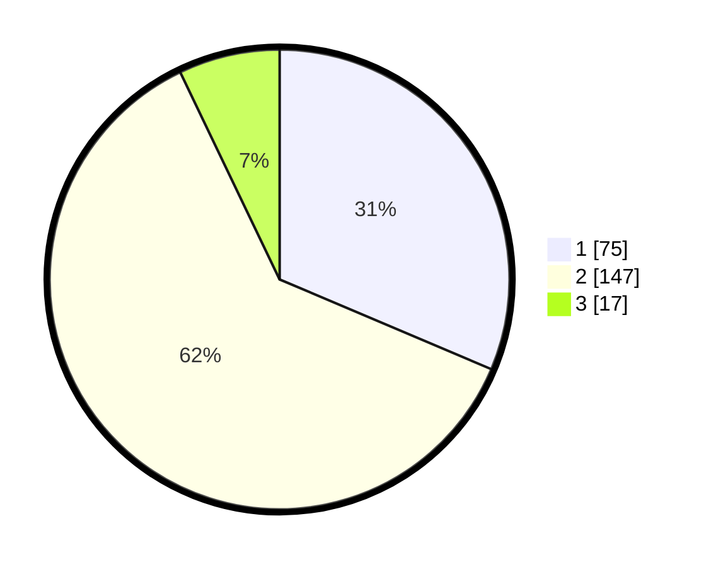

# Hasil

## Grafik

## Tabel

| No. | Nama Paslon    | Suara | Suara (raw) | Persentase |
|:--- |:-------------- | -----:| -----------:| ----------:|
| 1   | ANIES MUHAIMIN | 75    | [75][p-1]   | 31,38      |
| 2   | PRABOWO GIBRAN | 147   | [147][p-2]  | 61,51      |
| 3   | GANJAR MAHFUD  | 17    | [17][p-3]   | 7,11       |

[p-1]: https://github.com/gigit-pemilu/pemilu-2024-35-jawa-timur/blob/main/pilpres/hitung-suara/sub/35-jawa-timur/sub/09-jember/sub/30-silo/sub/2007-sumberjati/sub/014-tps/sub/paslon-1.txt
[p-2]: https://github.com/gigit-pemilu/pemilu-2024-35-jawa-timur/blob/main/pilpres/hitung-suara/sub/35-jawa-timur/sub/09-jember/sub/30-silo/sub/2007-sumberjati/sub/014-tps/sub/paslon-2.txt
[p-3]: https://github.com/gigit-pemilu/pemilu-2024-35-jawa-timur/blob/main/pilpres/hitung-suara/sub/35-jawa-timur/sub/09-jember/sub/30-silo/sub/2007-sumberjati/sub/014-tps/sub/paslon-3.txt

## Foto C Plano

https://sirekap-obj-formc.kpu.go.id/fa80/pemilu/ppwp/35/09/30/20/07/3509302007014-20240215-111153--8687d58b-929c-4e48-b5d9-2df02e9f1249.jpg

https://sirekap-obj-formc.kpu.go.id/fa80/pemilu/ppwp/35/09/30/20/07/3509302007014-20240215-111215--d1b204e8-47b9-416e-aa31-fabdde54343c.jpg

https://sirekap-obj-formc.kpu.go.id/fa80/pemilu/ppwp/35/09/30/20/07/3509302007014-20240215-115303--a8c26d6c-44ad-4191-bbc7-75d5a89e76d3.jpg

## Metadata

| Key        | Value               |
| ---------- | ------------------- |
| Time Stamp | 2024-02-15 17:30:25 |

