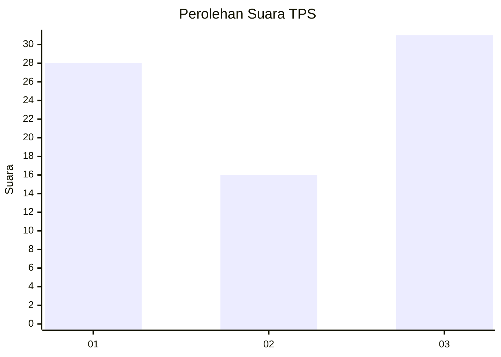
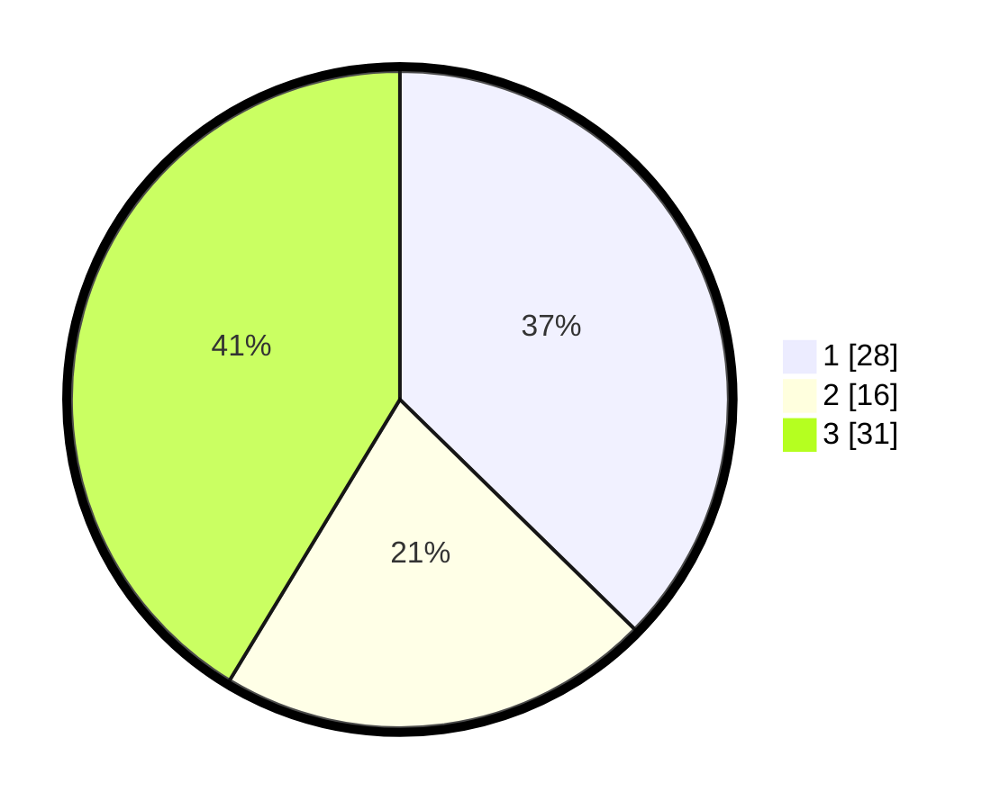

# Hasil

## Grafik

## Tabel

| No. | Nama Paslon    | Suara | Suara (raw) | Persentase |
|:--- |:-------------- | -----:| -----------:| ----------:|
| 1   | ANIES MUHAIMIN | 28    | [28][p-1]   | 37,33      |
| 2   | PRABOWO GIBRAN | 16    | [16][p-2]   | 21,33      |
| 3   | GANJAR MAHFUD  | 31    | [31][p-3]   | 41,33      |

[p-1]: https://github.com/gigit-pemilu/pemilu-2024-35-jawa-timur/blob/main/pilpres/hitung-suara/sub/35-jawa-timur/sub/09-jember/sub/30-silo/sub/2007-sumberjati/sub/015-tps/sub/paslon-1.txt
[p-2]: https://github.com/gigit-pemilu/pemilu-2024-35-jawa-timur/blob/main/pilpres/hitung-suara/sub/35-jawa-timur/sub/09-jember/sub/30-silo/sub/2007-sumberjati/sub/015-tps/sub/paslon-2.txt
[p-3]: https://github.com/gigit-pemilu/pemilu-2024-35-jawa-timur/blob/main/pilpres/hitung-suara/sub/35-jawa-timur/sub/09-jember/sub/30-silo/sub/2007-sumberjati/sub/015-tps/sub/paslon-3.txt

## Foto C Plano

https://sirekap-obj-formc.kpu.go.id/30ad/pemilu/ppwp/35/09/30/20/07/3509302007015-20240221-180536--f41c84a1-1424-44a6-a062-2293967fd77f.jpg

https://sirekap-obj-formc.kpu.go.id/30ad/pemilu/ppwp/35/09/30/20/07/3509302007015-20240221-180523--428d818c-fbf8-44dd-9f05-d025814f2b2d.jpg

https://sirekap-obj-formc.kpu.go.id/30ad/pemilu/ppwp/35/09/30/20/07/3509302007015-20240217-163536--bd17fa1c-d15f-4769-be4b-03ad35a258f3.jpg

## Metadata

| Key        | Value               |
| ---------- | ------------------- |
| Time Stamp | 2024-02-24 22:31:28 |

