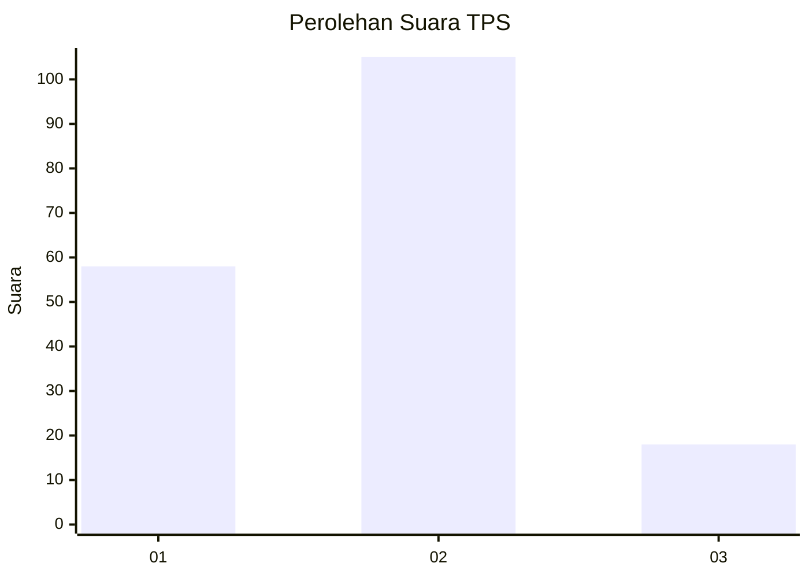
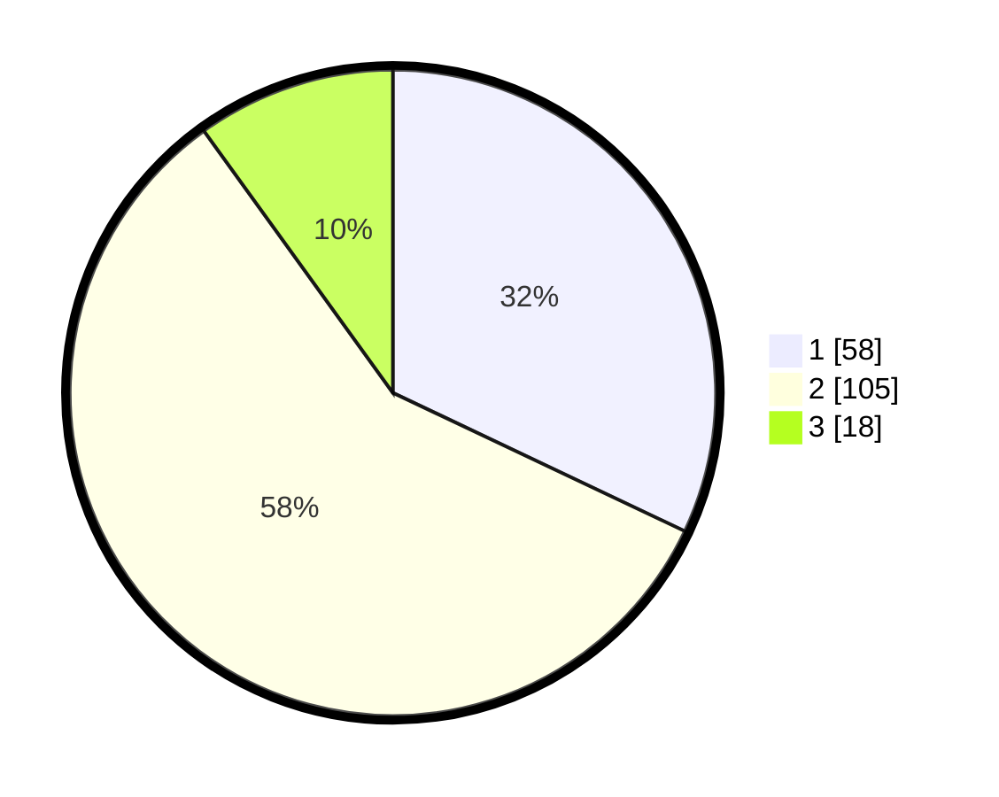

# Hasil

## Grafik

## Tabel

| No. | Nama Paslon    | Suara | Suara (raw) | Persentase |
|:--- |:-------------- | -----:| -----------:| ----------:|
| 1   | ANIES MUHAIMIN | 58    | [58][p-1]   | 32,04      |
| 2   | PRABOWO GIBRAN | 105   | [105][p-2]  | 58,01      |
| 3   | GANJAR MAHFUD  | 18    | [18][p-3]   | 9,94       |

[p-1]: https://github.com/gigit-pemilu/pemilu-2024-35-jawa-timur/blob/main/pilpres/hitung-suara/sub/35-jawa-timur/sub/09-jember/sub/30-silo/sub/2007-sumberjati/sub/018-tps/sub/paslon-1.txt
[p-2]: https://github.com/gigit-pemilu/pemilu-2024-35-jawa-timur/blob/main/pilpres/hitung-suara/sub/35-jawa-timur/sub/09-jember/sub/30-silo/sub/2007-sumberjati/sub/018-tps/sub/paslon-2.txt
[p-3]: https://github.com/gigit-pemilu/pemilu-2024-35-jawa-timur/blob/main/pilpres/hitung-suara/sub/35-jawa-timur/sub/09-jember/sub/30-silo/sub/2007-sumberjati/sub/018-tps/sub/paslon-3.txt

## Foto C Plano

https://sirekap-obj-formc.kpu.go.id/8281/pemilu/ppwp/35/09/30/20/07/3509302007018-20240215-030834--273dd836-ba04-4146-a84a-3918fd4c5a8c.jpg

https://sirekap-obj-formc.kpu.go.id/8281/pemilu/ppwp/35/09/30/20/07/3509302007018-20240215-030917--1808431b-b208-44e1-b674-0a8150f476be.jpg

https://sirekap-obj-formc.kpu.go.id/8281/pemilu/ppwp/35/09/30/20/07/3509302007018-20240215-031011--6c07e583-a1da-48cc-bf37-8d1b2abf3cf1.jpg

## Metadata

| Key        | Value               |
| ---------- | ------------------- |
| Time Stamp | 2024-02-15 15:00:29 |

