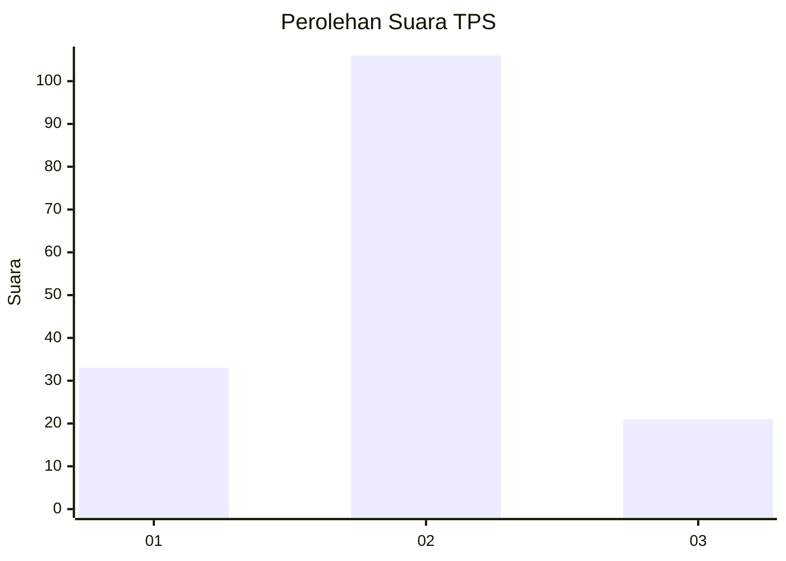
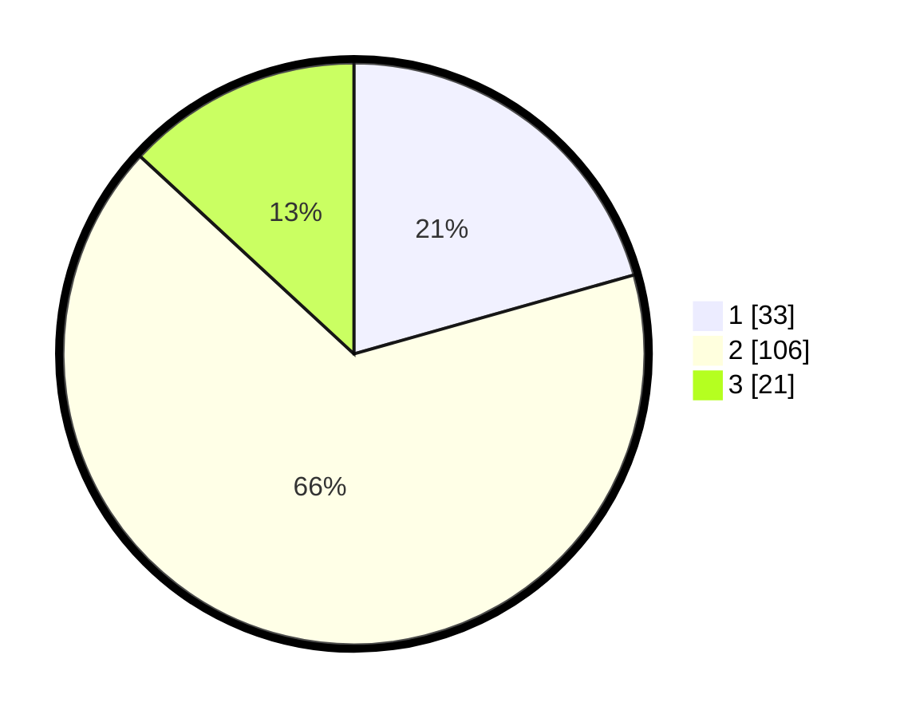

# Hasil

## Grafik

## Tabel

| No. | Nama Paslon    | Suara | Suara (raw) | Persentase |
|:--- |:-------------- | -----:| -----------:| ----------:|
| 1   | ANIES MUHAIMIN | 33    | [33][p-1]   | 20,63      |
| 2   | PRABOWO GIBRAN | 106   | [106][p-2]  | 66,25      |
| 3   | GANJAR MAHFUD  | 21    | [21][p-3]   | 13,13      |

[p-1]: https://github.com/gigit-pemilu/pemilu-2024/blob/main/pilpres/hitung-suara/sub/35-jawa-timur/sub/09-jember/sub/30-silo/sub/2007-sumberjati/sub/022-tps/sub/paslon-1.txt
[p-2]: https://github.com/gigit-pemilu/pemilu-2024/blob/main/pilpres/hitung-suara/sub/35-jawa-timur/sub/09-jember/sub/30-silo/sub/2007-sumberjati/sub/022-tps/sub/paslon-2.txt
[p-3]: https://github.com/gigit-pemilu/pemilu-2024/blob/main/pilpres/hitung-suara/sub/35-jawa-timur/sub/09-jember/sub/30-silo/sub/2007-sumberjati/sub/022-tps/sub/paslon-3.txt

## Foto C Plano

https://sirekap-obj-formc.kpu.go.id/7f6a/pemilu/ppwp/35/09/30/20/07/3509302007022-20240221-191823--aa8e52fd-c004-49fb-98e9-69de137de79b.jpg

https://sirekap-obj-formc.kpu.go.id/7f6a/pemilu/ppwp/35/09/30/20/07/3509302007022-20240214-214010--e34a69e3-f69f-4012-94e0-82da5fa31d82.jpg

https://sirekap-obj-formc.kpu.go.id/7f6a/pemilu/ppwp/35/09/30/20/07/3509302007022-20240214-214057--5452d027-0459-46e4-bef6-78431f31713d.jpg

## Metadata

| Key        | Value               |
| ---------- | ------------------- |
| Time Stamp | 2024-02-21 20:00:00 |

