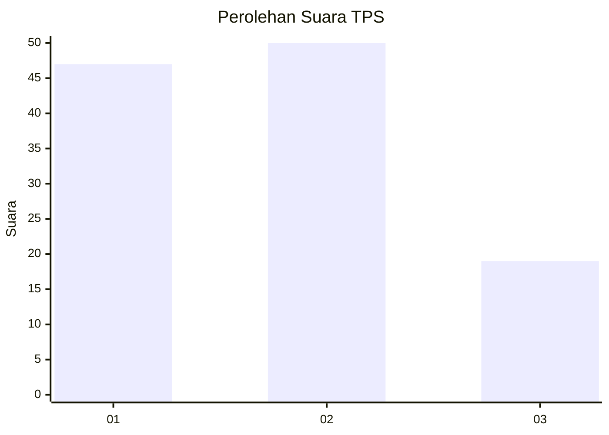
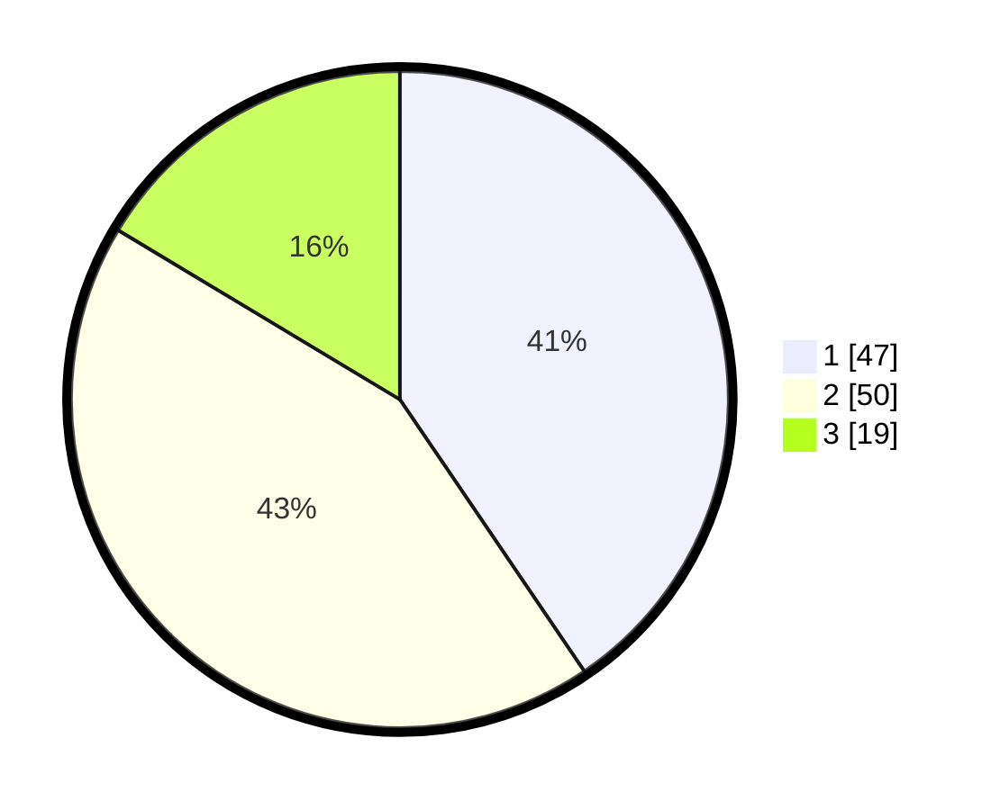

# Hasil

## Grafik

## Tabel

| No. | Nama Paslon    | Suara | Suara (raw) | Persentase |
|:--- |:-------------- | -----:| -----------:| ----------:|
| 1   | ANIES MUHAIMIN | 47    | [47][p-1]   | 40,52      |
| 2   | PRABOWO GIBRAN | 50    | [50][p-2]   | 43,10      |
| 3   | GANJAR MAHFUD  | 19    | [19][p-3]   | 16,38      |

[p-1]: https://github.com/gigit-pemilu/pemilu-2024/blob/main/pilpres/hitung-suara/sub/35-jawa-timur/sub/09-jember/sub/30-silo/sub/2007-sumberjati/sub/026-tps/sub/paslon-1.txt
[p-2]: https://github.com/gigit-pemilu/pemilu-2024/blob/main/pilpres/hitung-suara/sub/35-jawa-timur/sub/09-jember/sub/30-silo/sub/2007-sumberjati/sub/026-tps/sub/paslon-2.txt
[p-3]: https://github.com/gigit-pemilu/pemilu-2024/blob/main/pilpres/hitung-suara/sub/35-jawa-timur/sub/09-jember/sub/30-silo/sub/2007-sumberjati/sub/026-tps/sub/paslon-3.txt

## Foto C Plano

https://sirekap-obj-formc.kpu.go.id/336a/pemilu/ppwp/35/09/30/20/07/3509302007026-20240215-090232--fa5cc98e-95e7-48c3-9260-25a8cf7d1e66.jpg

https://sirekap-obj-formc.kpu.go.id/336a/pemilu/ppwp/35/09/30/20/07/3509302007026-20240215-090359--1c8f2b17-ca88-46ee-9a39-d887959d8b4b.jpg

https://sirekap-obj-formc.kpu.go.id/336a/pemilu/ppwp/35/09/30/20/07/3509302007026-20240215-090514--4e40aaa3-905c-4aab-b22c-4b0a82d85195.jpg

## Metadata

| Key        | Value               |
| ---------- | ------------------- |
| Time Stamp | 2024-02-15 19:00:26 |

