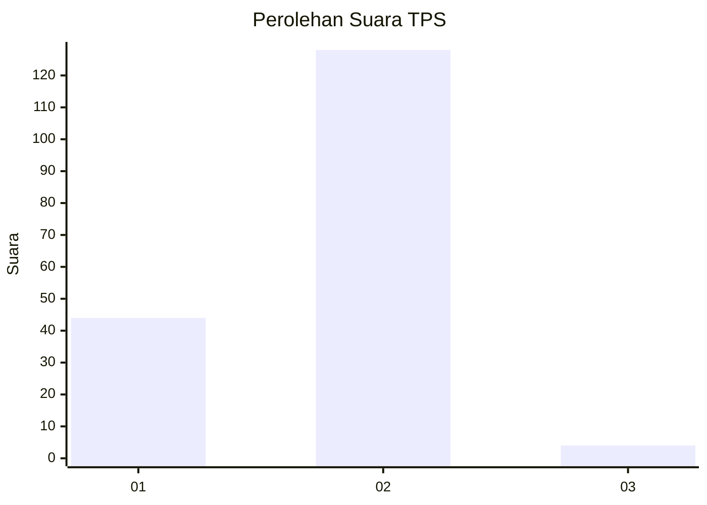
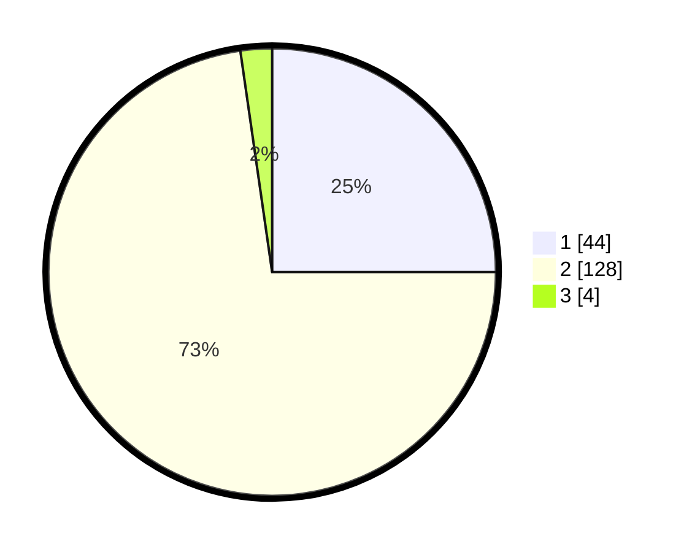

# Hasil

## Grafik

## Tabel

| No. | Nama Paslon    | Suara | Suara (raw) | Persentase |
|:--- |:-------------- | -----:| -----------:| ----------:|
| 1   | ANIES MUHAIMIN | 44    | [44][p-1]   | 25,00      |
| 2   | PRABOWO GIBRAN | 128   | [128][p-2]  | 72,73      |
| 3   | GANJAR MAHFUD  | 4     | [4][p-3]    | 2,27       |

[p-1]: https://github.com/gigit-pemilu/pemilu-2024/blob/main/pilpres/hitung-suara/sub/35-jawa-timur/sub/09-jember/sub/30-silo/sub/2007-sumberjati/sub/029-tps/sub/paslon-1.txt
[p-2]: https://github.com/gigit-pemilu/pemilu-2024/blob/main/pilpres/hitung-suara/sub/35-jawa-timur/sub/09-jember/sub/30-silo/sub/2007-sumberjati/sub/029-tps/sub/paslon-2.txt
[p-3]: https://github.com/gigit-pemilu/pemilu-2024/blob/main/pilpres/hitung-suara/sub/35-jawa-timur/sub/09-jember/sub/30-silo/sub/2007-sumberjati/sub/029-tps/sub/paslon-3.txt

## Foto C Plano

https://sirekap-obj-formc.kpu.go.id/8fa5/pemilu/ppwp/35/09/30/20/07/3509302007029-20240214-214701--f8a2eb7f-6f5b-4f26-a12c-9f05edf51fde.jpg

https://sirekap-obj-formc.kpu.go.id/8fa5/pemilu/ppwp/35/09/30/20/07/3509302007029-20240214-215056--1d880b67-7f59-4d4a-8183-4eb343497276.jpg

https://sirekap-obj-formc.kpu.go.id/8fa5/pemilu/ppwp/35/09/30/20/07/3509302007029-20240214-215158--ba276e8f-8a71-436a-b58b-93a1ee271a8b.jpg

## Metadata

| Key        | Value               |
| ---------- | ------------------- |
| Time Stamp | 2024-02-15 17:30:25 |

