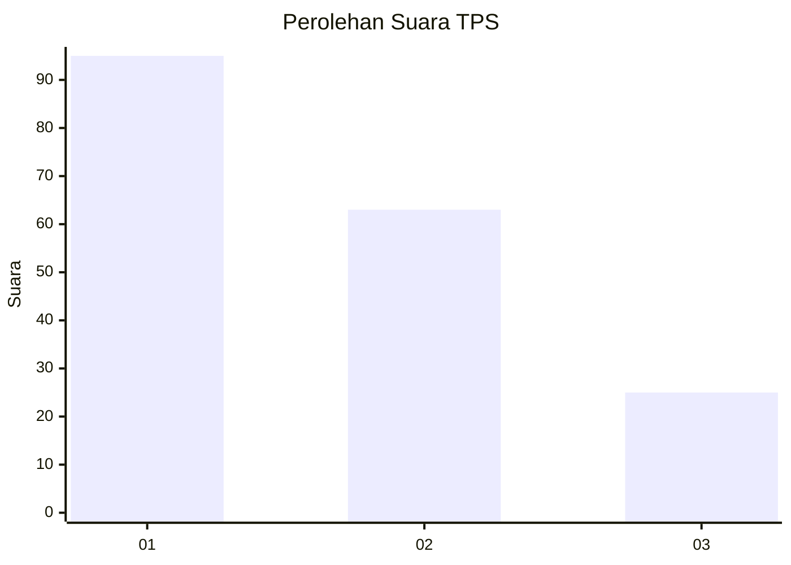
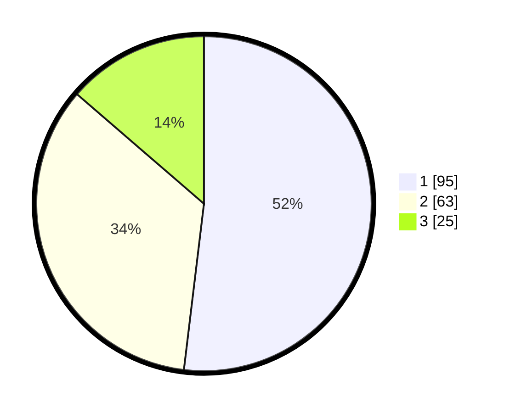

# Hasil

## Grafik

## Tabel

| No. | Nama Paslon    | Suara | Suara (raw) | Persentase |
|:--- |:-------------- | -----:| -----------:| ----------:|
| 1   | ANIES MUHAIMIN | 95    | [95][p-1]   | 51,91      |
| 2   | PRABOWO GIBRAN | 63    | [63][p-2]   | 34,43      |
| 3   | GANJAR MAHFUD  | 25    | [25][p-3]   | 13,66      |

[p-1]: https://github.com/gigit-pemilu/pemilu-2024-35-jawa-timur/blob/main/pilpres/hitung-suara/sub/35-jawa-timur/sub/09-jember/sub/30-silo/sub/2007-sumberjati/sub/030-tps/sub/paslon-1.txt
[p-2]: https://github.com/gigit-pemilu/pemilu-2024-35-jawa-timur/blob/main/pilpres/hitung-suara/sub/35-jawa-timur/sub/09-jember/sub/30-silo/sub/2007-sumberjati/sub/030-tps/sub/paslon-2.txt
[p-3]: https://github.com/gigit-pemilu/pemilu-2024-35-jawa-timur/blob/main/pilpres/hitung-suara/sub/35-jawa-timur/sub/09-jember/sub/30-silo/sub/2007-sumberjati/sub/030-tps/sub/paslon-3.txt

## Foto C Plano

https://sirekap-obj-formc.kpu.go.id/22b3/pemilu/ppwp/35/09/30/20/07/3509302007030-20240214-232653--383d12b5-12c5-40d2-a9c1-97b89f73a11d.jpg

https://sirekap-obj-formc.kpu.go.id/22b3/pemilu/ppwp/35/09/30/20/07/3509302007030-20240214-232811--a650ab00-5146-4024-ad07-0717152395a7.jpg

https://sirekap-obj-formc.kpu.go.id/22b3/pemilu/ppwp/35/09/30/20/07/3509302007030-20240214-212045--30fa6a8f-6bab-4647-884e-a99ad62c0b12.jpg

## Metadata

| Key        | Value               |
| ---------- | ------------------- |
| Time Stamp | 2024-02-15 20:30:46 |

