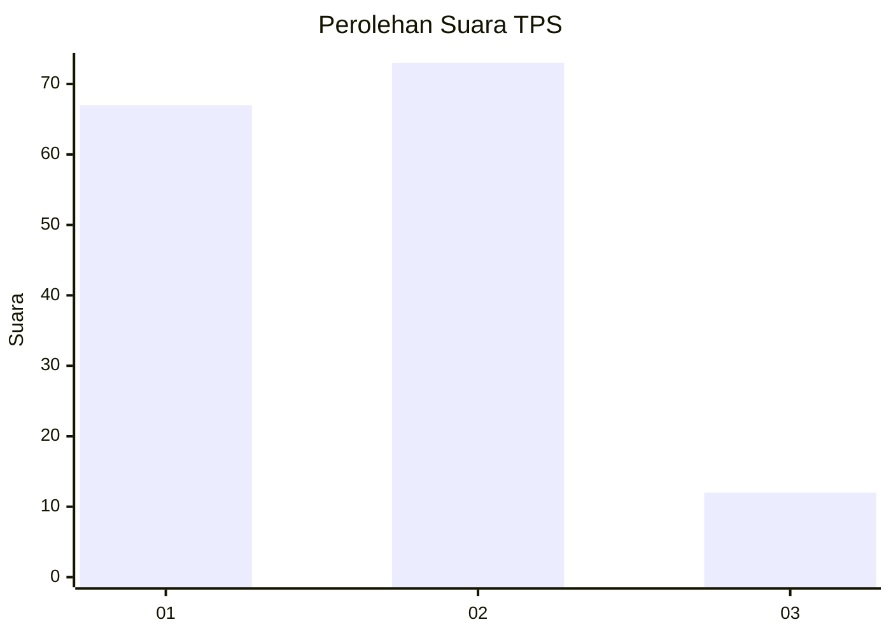
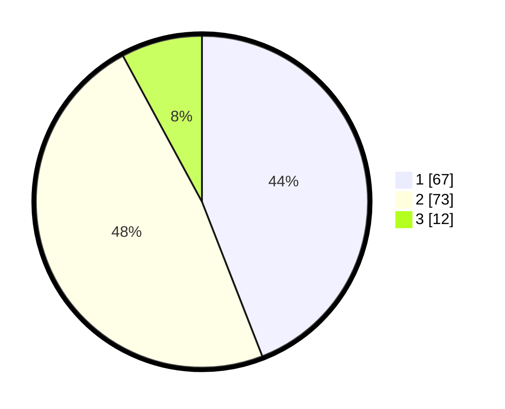

# Hasil

## Grafik

## Tabel

| No. | Nama Paslon    | Suara | Suara (raw) | Persentase |
|:--- |:-------------- | -----:| -----------:| ----------:|
| 1   | ANIES MUHAIMIN | 67    | [67][p-1]   | 44,08      |
| 2   | PRABOWO GIBRAN | 73    | [73][p-2]   | 48,03      |
| 3   | GANJAR MAHFUD  | 12    | [12][p-3]   | 7,89       |

[p-1]: https://github.com/gigit-pemilu/pemilu-2024/blob/main/pilpres/hitung-suara/sub/35-jawa-timur/sub/09-jember/sub/30-silo/sub/2007-sumberjati/sub/031-tps/sub/paslon-1.txt
[p-2]: https://github.com/gigit-pemilu/pemilu-2024/blob/main/pilpres/hitung-suara/sub/35-jawa-timur/sub/09-jember/sub/30-silo/sub/2007-sumberjati/sub/031-tps/sub/paslon-2.txt
[p-3]: https://github.com/gigit-pemilu/pemilu-2024/blob/main/pilpres/hitung-suara/sub/35-jawa-timur/sub/09-jember/sub/30-silo/sub/2007-sumberjati/sub/031-tps/sub/paslon-3.txt

## Foto C Plano

https://sirekap-obj-formc.kpu.go.id/9c12/pemilu/ppwp/35/09/30/20/07/3509302007031-20240216-172723--a3acb6fb-b7c2-4a58-b01a-97a1b3e428fc.jpg

https://sirekap-obj-formc.kpu.go.id/9c12/pemilu/ppwp/35/09/30/20/07/3509302007031-20240214-200846--bc33b0f4-3a6b-474d-aa32-e8f3d5f63969.jpg

https://sirekap-obj-formc.kpu.go.id/9c12/pemilu/ppwp/35/09/30/20/07/3509302007031-20240214-200936--9d1a691e-88f5-47db-9954-9f9a64f044a7.jpg

## Metadata

| Key        | Value               |
| ---------- | ------------------- |
| Time Stamp | 2024-02-25 16:00:00 |

