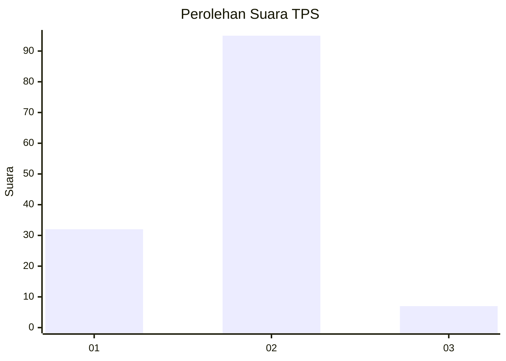
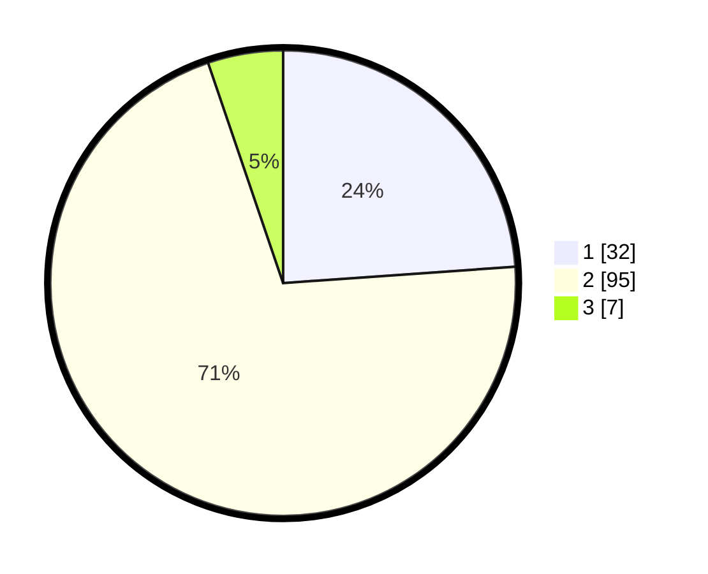

# Hasil

## Grafik

## Tabel

| No. | Nama Paslon    | Suara | Suara (raw) | Persentase |
|:--- |:-------------- | -----:| -----------:| ----------:|
| 1   | ANIES MUHAIMIN | 32    | [32][p-1]   | 23,88      |
| 2   | PRABOWO GIBRAN | 95    | [95][p-2]   | 70,90      |
| 3   | GANJAR MAHFUD  | 7     | [7][p-3]    | 5,22       |

[p-1]: https://github.com/gigit-pemilu/pemilu-2024-35-jawa-timur/blob/main/pilpres/hitung-suara/sub/35-jawa-timur/sub/09-jember/sub/30-silo/sub/2008-garahan/sub/011-tps/sub/paslon-1.txt
[p-2]: https://github.com/gigit-pemilu/pemilu-2024-35-jawa-timur/blob/main/pilpres/hitung-suara/sub/35-jawa-timur/sub/09-jember/sub/30-silo/sub/2008-garahan/sub/011-tps/sub/paslon-2.txt
[p-3]: https://github.com/gigit-pemilu/pemilu-2024-35-jawa-timur/blob/main/pilpres/hitung-suara/sub/35-jawa-timur/sub/09-jember/sub/30-silo/sub/2008-garahan/sub/011-tps/sub/paslon-3.txt

## Foto C Plano

https://sirekap-obj-formc.kpu.go.id/1a6b/pemilu/ppwp/35/09/30/20/08/3509302008011-20240215-154442--8582f948-c080-4b87-ab46-2443428a0ad0.jpg

https://sirekap-obj-formc.kpu.go.id/1a6b/pemilu/ppwp/35/09/30/20/08/3509302008011-20240215-154817--467d69fe-b4fe-409a-a357-5200231bd256.jpg

https://sirekap-obj-formc.kpu.go.id/1a6b/pemilu/ppwp/35/09/30/20/08/3509302008011-20240215-002941--44d9af39-809e-4da9-bea9-5bdde24fd17a.jpg

## Metadata

| Key        | Value               |
| ---------- | ------------------- |
| Time Stamp | 2024-02-15 21:01:18 |

