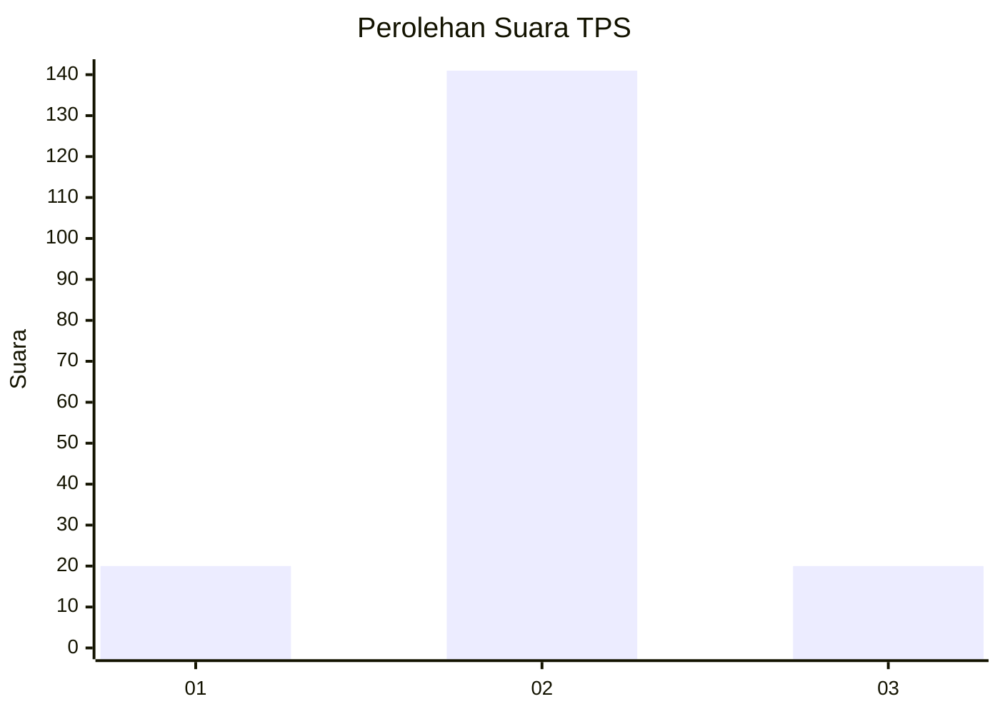
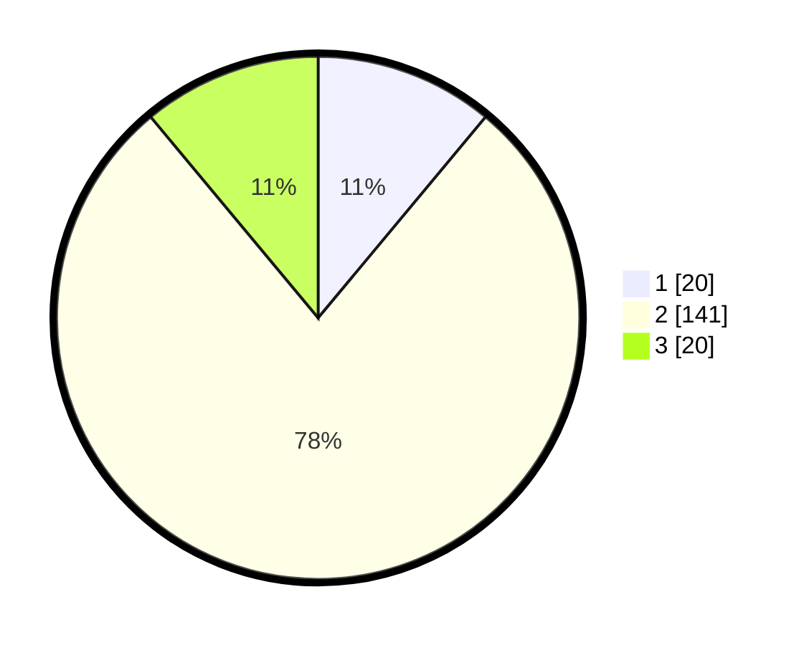

# Hasil

## Grafik

## Tabel

| No. | Nama Paslon    | Suara | Suara (raw) | Persentase |
|:--- |:-------------- | -----:| -----------:| ----------:|
| 1   | ANIES MUHAIMIN | 20    | [20][p-1]   | 11,05      |
| 2   | PRABOWO GIBRAN | 141   | [141][p-2]  | 77,90      |
| 3   | GANJAR MAHFUD  | 20    | [20][p-3]   | 11,05      |

[p-1]: https://github.com/gigit-pemilu/pemilu-2024-35-jawa-timur/blob/main/pilpres/hitung-suara/sub/35-jawa-timur/sub/09-jember/sub/30-silo/sub/2008-garahan/sub/022-tps/sub/paslon-1.txt
[p-2]: https://github.com/gigit-pemilu/pemilu-2024-35-jawa-timur/blob/main/pilpres/hitung-suara/sub/35-jawa-timur/sub/09-jember/sub/30-silo/sub/2008-garahan/sub/022-tps/sub/paslon-2.txt
[p-3]: https://github.com/gigit-pemilu/pemilu-2024-35-jawa-timur/blob/main/pilpres/hitung-suara/sub/35-jawa-timur/sub/09-jember/sub/30-silo/sub/2008-garahan/sub/022-tps/sub/paslon-3.txt

## Foto C Plano

https://sirekap-obj-formc.kpu.go.id/a223/pemilu/ppwp/35/09/30/20/08/3509302008022-20240214-222501--fb8bfcaa-3466-409b-9250-29e7ba82ace9.jpg

https://sirekap-obj-formc.kpu.go.id/a223/pemilu/ppwp/35/09/30/20/08/3509302008022-20240214-222410--bb2d0056-2836-4244-b541-04df4ee1feb6.jpg

https://sirekap-obj-formc.kpu.go.id/a223/pemilu/ppwp/35/09/30/20/08/3509302008022-20240214-222231--b523fcb4-ca7d-4f5e-afb0-d5b07faa7bb3.jpg

## Metadata

| Key        | Value               |
| ---------- | ------------------- |
| Time Stamp | 2024-02-15 17:30:25 |

