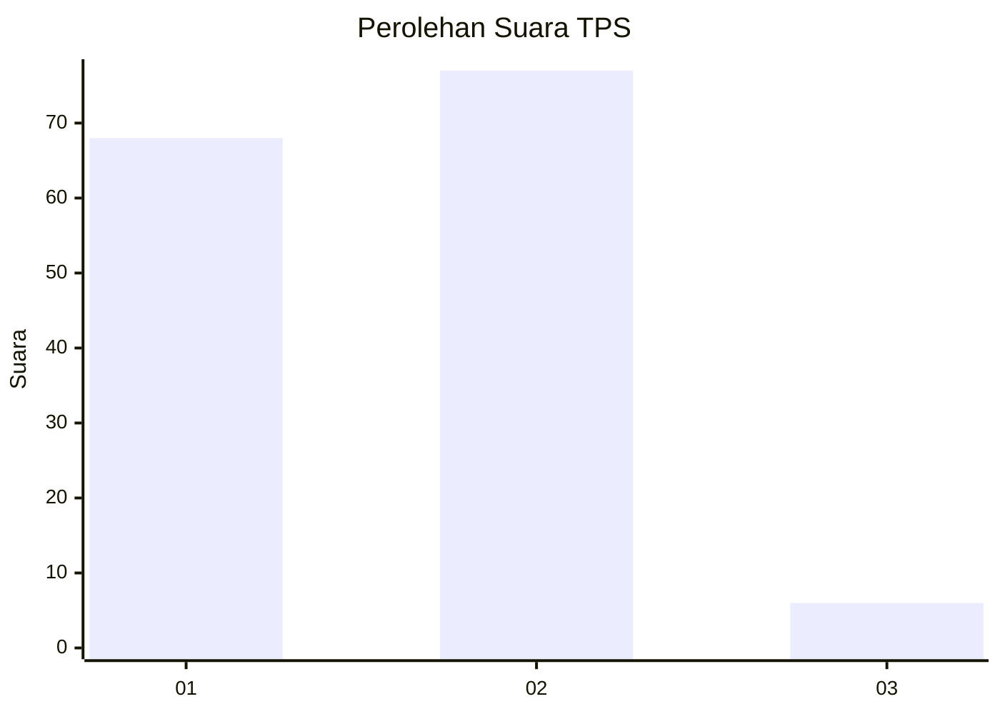
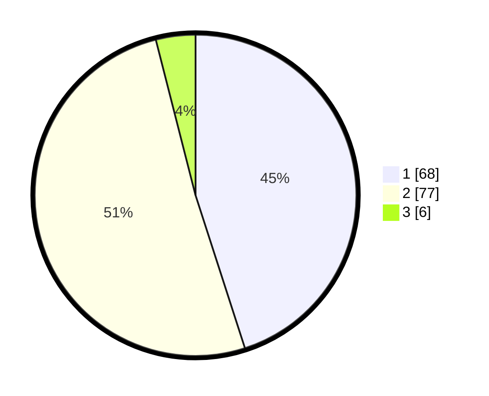

# Hasil

## Grafik

## Tabel

| No. | Nama Paslon    | Suara | Suara (raw) | Persentase |
|:--- |:-------------- | -----:| -----------:| ----------:|
| 1   | ANIES MUHAIMIN | 68    | [68][p-1]   | 45,03      |
| 2   | PRABOWO GIBRAN | 77    | [77][p-2]   | 50,99      |
| 3   | GANJAR MAHFUD  | 6     | [6][p-3]    | 3,97       |

[p-1]: https://github.com/gigit-pemilu/pemilu-2024/blob/main/pilpres/hitung-suara/sub/35-jawa-timur/sub/09-jember/sub/30-silo/sub/2008-garahan/sub/024-tps/sub/paslon-1.txt
[p-2]: https://github.com/gigit-pemilu/pemilu-2024/blob/main/pilpres/hitung-suara/sub/35-jawa-timur/sub/09-jember/sub/30-silo/sub/2008-garahan/sub/024-tps/sub/paslon-2.txt
[p-3]: https://github.com/gigit-pemilu/pemilu-2024/blob/main/pilpres/hitung-suara/sub/35-jawa-timur/sub/09-jember/sub/30-silo/sub/2008-garahan/sub/024-tps/sub/paslon-3.txt

## Foto C Plano

https://sirekap-obj-formc.kpu.go.id/ca77/pemilu/ppwp/35/09/30/20/08/3509302008024-20240215-003641--56c5f6af-e57f-47ad-b649-804164335352.jpg

https://sirekap-obj-formc.kpu.go.id/ca77/pemilu/ppwp/35/09/30/20/08/3509302008024-20240215-003713--fc71dbc0-c679-425c-84bb-5aae1ffcf634.jpg

## Metadata

| Key        | Value               |
| ---------- | ------------------- |
| Time Stamp | 2024-02-15 15:30:25 |

