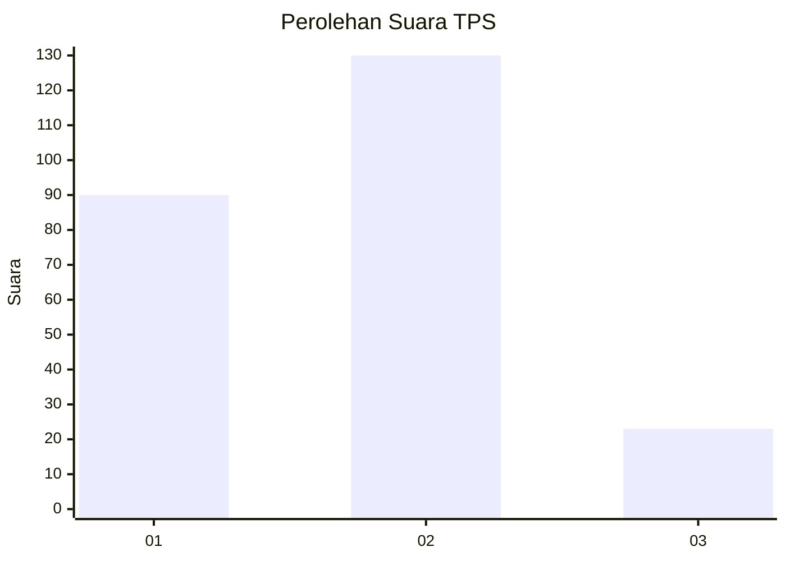

# Hasil

## Grafik

## Tabel

| No. | Nama Paslon    | Suara | Suara (raw) | Persentase |
|:--- |:-------------- | -----:| -----------:| ----------:|
| 1   | ANIES MUHAIMIN | 90    | [90][p-1]   | 37,04      |
| 2   | PRABOWO GIBRAN | 130   | [130][p-2]  | 53,50      |
| 3   | GANJAR MAHFUD  | 23    | [23][p-3]   | 9,47       |

[p-1]: https://github.com/gigit-pemilu/pemilu-2024-35-jawa-timur/blob/main/pilpres/hitung-suara/sub/35-jawa-timur/sub/09-jember/sub/30-silo/sub/2008-garahan/sub/029-tps/sub/paslon-1.txt
[p-2]: https://github.com/gigit-pemilu/pemilu-2024-35-jawa-timur/blob/main/pilpres/hitung-suara/sub/35-jawa-timur/sub/09-jember/sub/30-silo/sub/2008-garahan/sub/029-tps/sub/paslon-2.txt
[p-3]: https://github.com/gigit-pemilu/pemilu-2024-35-jawa-timur/blob/main/pilpres/hitung-suara/sub/35-jawa-timur/sub/09-jember/sub/30-silo/sub/2008-garahan/sub/029-tps/sub/paslon-3.txt

## Foto C Plano

https://sirekap-obj-formc.kpu.go.id/80af/pemilu/ppwp/35/09/30/20/08/3509302008029-20240215-081905--0102d65b-3978-4876-9a61-d1cc7fb933ec.jpg

https://sirekap-obj-formc.kpu.go.id/80af/pemilu/ppwp/35/09/30/20/08/3509302008029-20240215-082157--d4e8a565-9fc4-4a48-a5a4-955452c2630c.jpg

https://sirekap-obj-formc.kpu.go.id/80af/pemilu/ppwp/35/09/30/20/08/3509302008029-20240215-082737--abd9cf2c-7e4c-40da-b5c7-358f1cc2355e.jpg

## Metadata

| Key        | Value               |
| ---------- | ------------------- |
| Time Stamp | 2024-02-15 17:30:25 |

