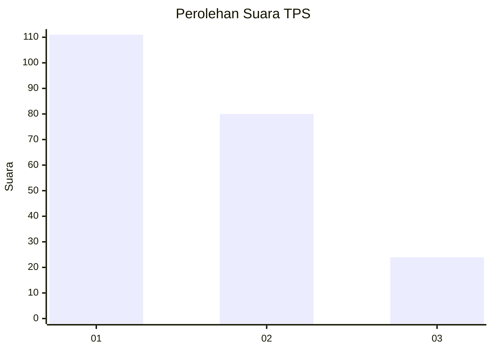
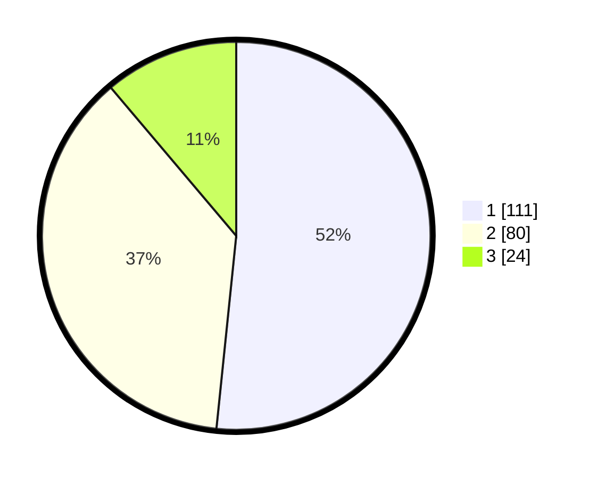

# Hasil

## Grafik

## Tabel

| No. | Nama Paslon    | Suara | Suara (raw) | Persentase |
|:--- |:-------------- | -----:| -----------:| ----------:|
| 1   | ANIES MUHAIMIN | 111   | [111][p-1]  | 51,63      |
| 2   | PRABOWO GIBRAN | 80    | [80][p-2]   | 37,21      |
| 3   | GANJAR MAHFUD  | 24    | [24][p-3]   | 11,16      |

[p-1]: https://github.com/gigit-pemilu/pemilu-2024-35-jawa-timur/blob/main/pilpres/hitung-suara/sub/35-jawa-timur/sub/09-jember/sub/30-silo/sub/2008-garahan/sub/039-tps/sub/paslon-1.txt
[p-2]: https://github.com/gigit-pemilu/pemilu-2024-35-jawa-timur/blob/main/pilpres/hitung-suara/sub/35-jawa-timur/sub/09-jember/sub/30-silo/sub/2008-garahan/sub/039-tps/sub/paslon-2.txt
[p-3]: https://github.com/gigit-pemilu/pemilu-2024-35-jawa-timur/blob/main/pilpres/hitung-suara/sub/35-jawa-timur/sub/09-jember/sub/30-silo/sub/2008-garahan/sub/039-tps/sub/paslon-3.txt

## Foto C Plano

https://sirekap-obj-formc.kpu.go.id/0ab4/pemilu/ppwp/35/09/30/20/08/3509302008039-20240215-100026--e1fbe027-3393-416c-bd3e-3d4affc9df5a.jpg

https://sirekap-obj-formc.kpu.go.id/0ab4/pemilu/ppwp/35/09/30/20/08/3509302008039-20240215-100108--cc81854b-c3d1-4b66-9634-74c5d31c9d45.jpg

https://sirekap-obj-formc.kpu.go.id/0ab4/pemilu/ppwp/35/09/30/20/08/3509302008039-20240215-100243--a6d2e625-2f5e-4c35-bf87-4e636e3dfeb8.jpg

## Metadata

| Key        | Value               |
| ---------- | ------------------- |
| Time Stamp | 2024-02-15 19:00:26 |

