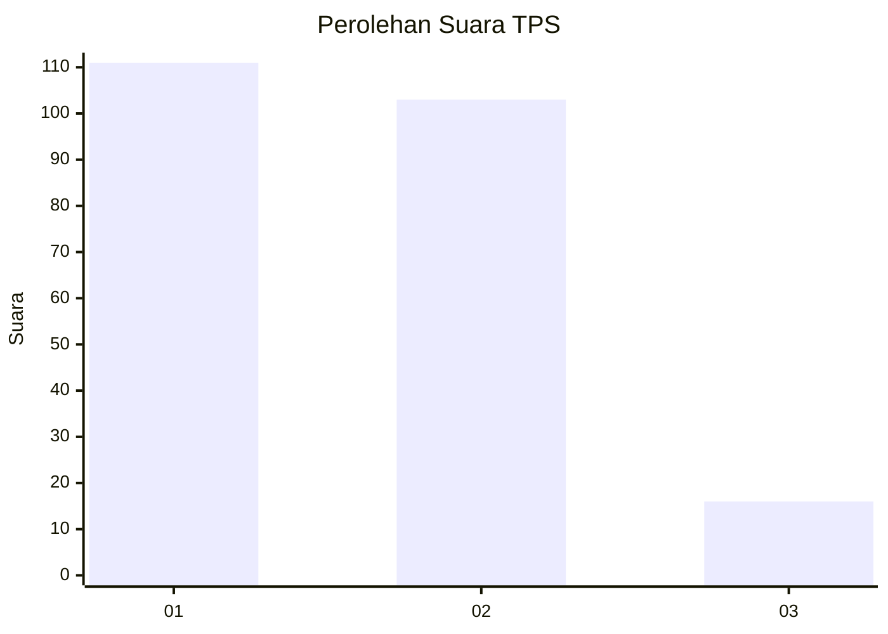
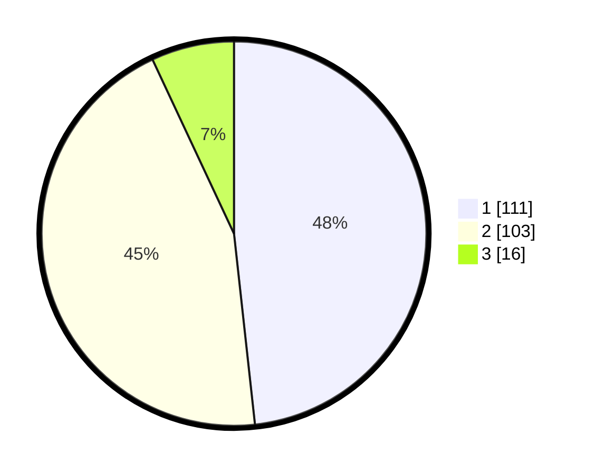

# Hasil

## Grafik

## Tabel

| No. | Nama Paslon    | Suara | Suara (raw) | Persentase |
|:--- |:-------------- | -----:| -----------:| ----------:|
| 1   | ANIES MUHAIMIN | 111   | [111][p-1]  | 48,26      |
| 2   | PRABOWO GIBRAN | 103   | [103][p-2]  | 44,78      |
| 3   | GANJAR MAHFUD  | 16    | [16][p-3]   | 6,96       |

[p-1]: https://github.com/gigit-pemilu/pemilu-2024-35-jawa-timur/blob/main/pilpres/hitung-suara/sub/35-jawa-timur/sub/09-jember/sub/30-silo/sub/2009-sidomulyo/sub/003-tps/sub/paslon-1.txt
[p-2]: https://github.com/gigit-pemilu/pemilu-2024-35-jawa-timur/blob/main/pilpres/hitung-suara/sub/35-jawa-timur/sub/09-jember/sub/30-silo/sub/2009-sidomulyo/sub/003-tps/sub/paslon-2.txt
[p-3]: https://github.com/gigit-pemilu/pemilu-2024-35-jawa-timur/blob/main/pilpres/hitung-suara/sub/35-jawa-timur/sub/09-jember/sub/30-silo/sub/2009-sidomulyo/sub/003-tps/sub/paslon-3.txt

## Foto C Plano

https://sirekap-obj-formc.kpu.go.id/e55e/pemilu/ppwp/35/09/30/20/09/3509302009003-20240215-200303--547f81bc-853a-4661-96cc-6118895d8489.jpg

https://sirekap-obj-formc.kpu.go.id/e55e/pemilu/ppwp/35/09/30/20/09/3509302009003-20240215-200333--5a019c7b-0731-4131-908c-3f33527b4038.jpg

https://sirekap-obj-formc.kpu.go.id/e55e/pemilu/ppwp/35/09/30/20/09/3509302009003-20240215-200336--63babd52-10ad-4420-bbdd-3fc92b45b70e.jpg

## Metadata

| Key        | Value               |
| ---------- | ------------------- |
| Time Stamp | 2024-02-15 22:30:27 |

