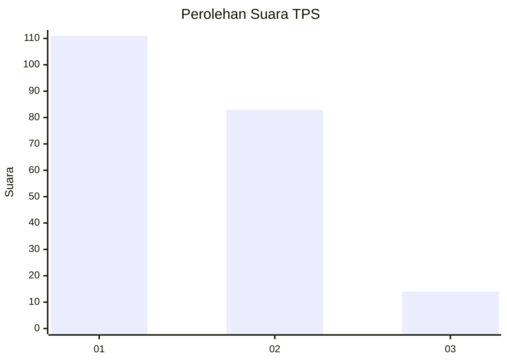
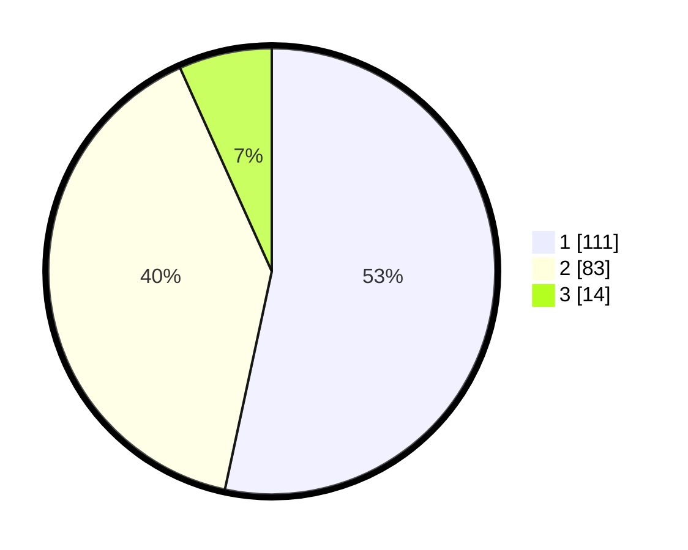

# Hasil

## Grafik

## Tabel

| No. | Nama Paslon    | Suara | Suara (raw) | Persentase |
|:--- |:-------------- | -----:| -----------:| ----------:|
| 1   | ANIES MUHAIMIN | 111   | [111][p-1]  | 53,37      |
| 2   | PRABOWO GIBRAN | 83    | [83][p-2]   | 39,90      |
| 3   | GANJAR MAHFUD  | 14    | [14][p-3]   | 6,73       |

[p-1]: https://github.com/gigit-pemilu/pemilu-2024-35-jawa-timur/blob/main/pilpres/hitung-suara/sub/35-jawa-timur/sub/09-jember/sub/30-silo/sub/2009-sidomulyo/sub/004-tps/sub/paslon-1.txt
[p-2]: https://github.com/gigit-pemilu/pemilu-2024-35-jawa-timur/blob/main/pilpres/hitung-suara/sub/35-jawa-timur/sub/09-jember/sub/30-silo/sub/2009-sidomulyo/sub/004-tps/sub/paslon-2.txt
[p-3]: https://github.com/gigit-pemilu/pemilu-2024-35-jawa-timur/blob/main/pilpres/hitung-suara/sub/35-jawa-timur/sub/09-jember/sub/30-silo/sub/2009-sidomulyo/sub/004-tps/sub/paslon-3.txt

## Foto C Plano

https://sirekap-obj-formc.kpu.go.id/796d/pemilu/ppwp/35/09/30/20/09/3509302009004-20240214-213523--274e04b7-362c-4aa0-912c-d4cd26564bc2.jpg

https://sirekap-obj-formc.kpu.go.id/796d/pemilu/ppwp/35/09/30/20/09/3509302009004-20240214-214439--2cfde72d-e0a7-4ffa-ae6e-aabda537ca24.jpg

https://sirekap-obj-formc.kpu.go.id/796d/pemilu/ppwp/35/09/30/20/09/3509302009004-20240214-214607--c114086f-800d-43d8-b712-7004ecb9600f.jpg

## Metadata

| Key        | Value               |
| ---------- | ------------------- |
| Time Stamp | 2024-02-15 17:30:25 |

