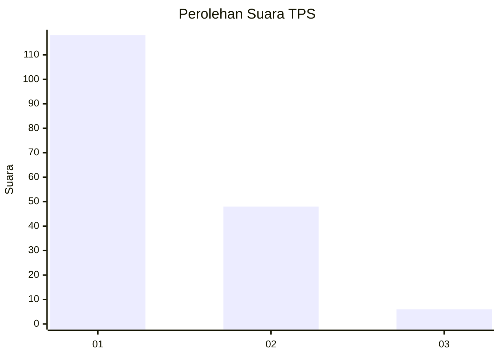
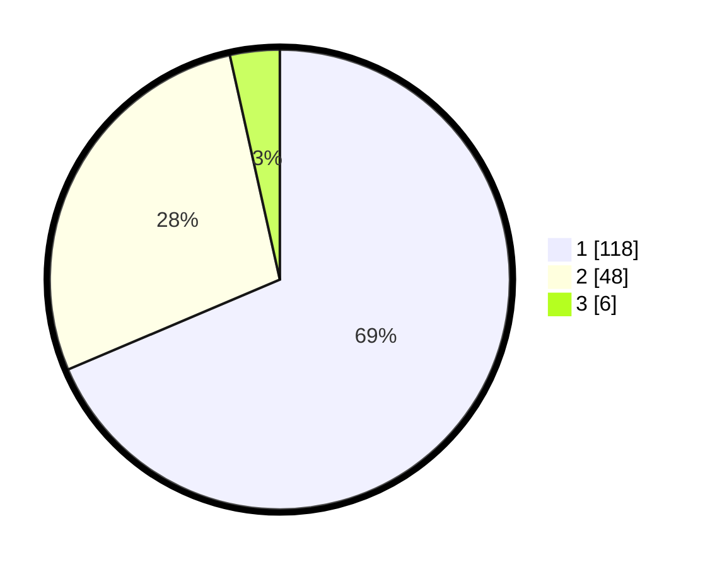

# Hasil

## Grafik

## Tabel

| No. | Nama Paslon    | Suara | Suara (raw) | Persentase |
|:--- |:-------------- | -----:| -----------:| ----------:|
| 1   | ANIES MUHAIMIN | 118   | [118][p-1]  | 68,60      |
| 2   | PRABOWO GIBRAN | 48    | [48][p-2]   | 27,91      |
| 3   | GANJAR MAHFUD  | 6     | [6][p-3]    | 3,49       |

[p-1]: https://github.com/gigit-pemilu/pemilu-2024/blob/main/pilpres/hitung-suara/sub/35-jawa-timur/sub/09-jember/sub/30-silo/sub/2009-sidomulyo/sub/006-tps/sub/paslon-1.txt
[p-2]: https://github.com/gigit-pemilu/pemilu-2024/blob/main/pilpres/hitung-suara/sub/35-jawa-timur/sub/09-jember/sub/30-silo/sub/2009-sidomulyo/sub/006-tps/sub/paslon-2.txt
[p-3]: https://github.com/gigit-pemilu/pemilu-2024/blob/main/pilpres/hitung-suara/sub/35-jawa-timur/sub/09-jember/sub/30-silo/sub/2009-sidomulyo/sub/006-tps/sub/paslon-3.txt

## Foto C Plano

https://sirekap-obj-formc.kpu.go.id/c965/pemilu/ppwp/35/09/30/20/09/3509302009006-20240214-220424--b8707b62-81bb-4295-ae9e-ae4b88bafafc.jpg

https://sirekap-obj-formc.kpu.go.id/c965/pemilu/ppwp/35/09/30/20/09/3509302009006-20240214-220540--02c79099-4260-48e0-861c-6ba85b687ec0.jpg

https://sirekap-obj-formc.kpu.go.id/c965/pemilu/ppwp/35/09/30/20/09/3509302009006-20240214-220628--e312ad24-3789-4acf-841f-aec14a867e9e.jpg

## Metadata

| Key        | Value               |
| ---------- | ------------------- |
| Time Stamp | 2024-02-15 17:30:25 |

