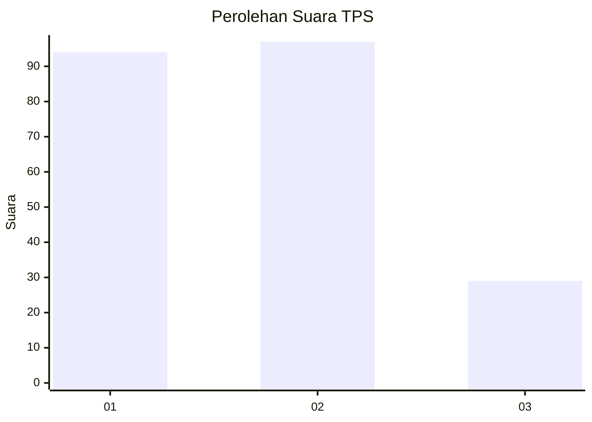
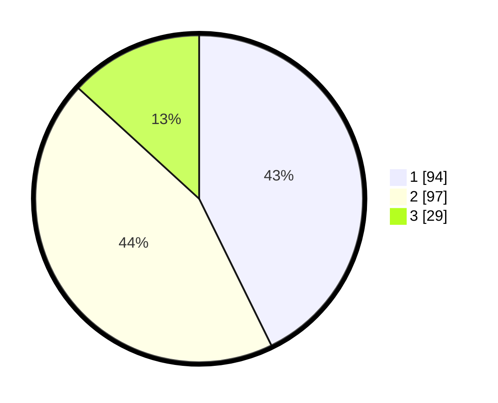

# Hasil

## Grafik

## Tabel

| No. | Nama Paslon    | Suara | Suara (raw) | Persentase |
|:--- |:-------------- | -----:| -----------:| ----------:|
| 1   | ANIES MUHAIMIN | 94    | [94][p-1]   | 42,73      |
| 2   | PRABOWO GIBRAN | 97    | [97][p-2]   | 44,09      |
| 3   | GANJAR MAHFUD  | 29    | [29][p-3]   | 13,18      |

[p-1]: https://github.com/gigit-pemilu/pemilu-2024/blob/main/pilpres/hitung-suara/sub/35-jawa-timur/sub/09-jember/sub/30-silo/sub/2009-sidomulyo/sub/011-tps/sub/paslon-1.txt
[p-2]: https://github.com/gigit-pemilu/pemilu-2024/blob/main/pilpres/hitung-suara/sub/35-jawa-timur/sub/09-jember/sub/30-silo/sub/2009-sidomulyo/sub/011-tps/sub/paslon-2.txt
[p-3]: https://github.com/gigit-pemilu/pemilu-2024/blob/main/pilpres/hitung-suara/sub/35-jawa-timur/sub/09-jember/sub/30-silo/sub/2009-sidomulyo/sub/011-tps/sub/paslon-3.txt

## Foto C Plano

https://sirekap-obj-formc.kpu.go.id/613e/pemilu/ppwp/35/09/30/20/09/3509302009011-20240215-021904--4dfb1412-0c1e-4971-b942-453351f53a8d.jpg

https://sirekap-obj-formc.kpu.go.id/613e/pemilu/ppwp/35/09/30/20/09/3509302009011-20240215-021950--d95999ad-968d-4b39-91fd-d442ef7a19f2.jpg

https://sirekap-obj-formc.kpu.go.id/613e/pemilu/ppwp/35/09/30/20/09/3509302009011-20240214-223657--6bbea27e-15cf-414f-8566-aaf1362d071a.jpg

## Metadata

| Key        | Value               |
| ---------- | ------------------- |
| Time Stamp | 2024-02-19 06:16:00 |

