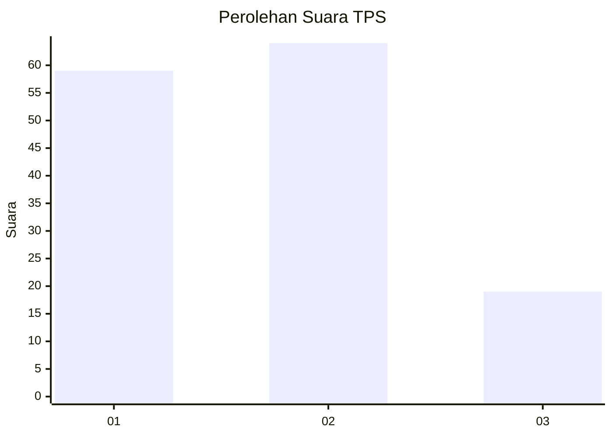
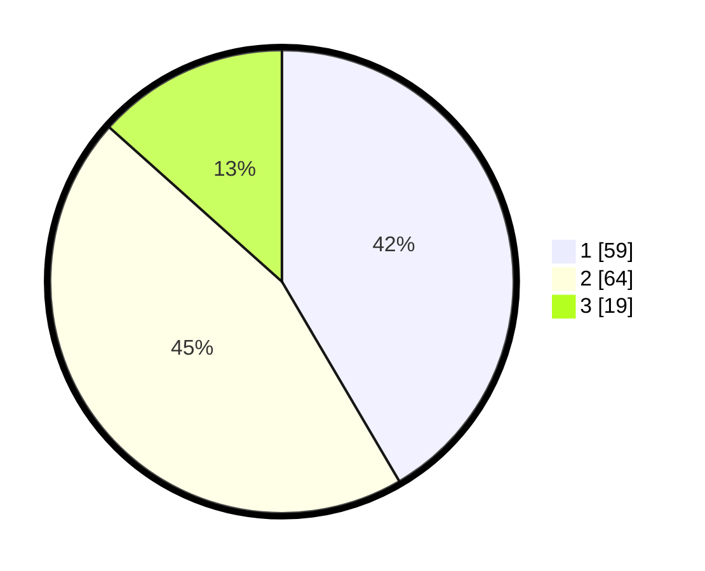

# Hasil

## Grafik

## Tabel

| No. | Nama Paslon    | Suara | Suara (raw) | Persentase |
|:--- |:-------------- | -----:| -----------:| ----------:|
| 1   | ANIES MUHAIMIN | 59    | [59][p-1]   | 41,55      |
| 2   | PRABOWO GIBRAN | 64    | [64][p-2]   | 45,07      |
| 3   | GANJAR MAHFUD  | 19    | [19][p-3]   | 13,38      |

[p-1]: https://github.com/gigit-pemilu/pemilu-2024/blob/main/pilpres/hitung-suara/sub/35-jawa-timur/sub/09-jember/sub/30-silo/sub/2009-sidomulyo/sub/012-tps/sub/paslon-1.txt
[p-2]: https://github.com/gigit-pemilu/pemilu-2024/blob/main/pilpres/hitung-suara/sub/35-jawa-timur/sub/09-jember/sub/30-silo/sub/2009-sidomulyo/sub/012-tps/sub/paslon-2.txt
[p-3]: https://github.com/gigit-pemilu/pemilu-2024/blob/main/pilpres/hitung-suara/sub/35-jawa-timur/sub/09-jember/sub/30-silo/sub/2009-sidomulyo/sub/012-tps/sub/paslon-3.txt

## Foto C Plano

https://sirekap-obj-formc.kpu.go.id/8fc9/pemilu/ppwp/35/09/30/20/09/3509302009012-20240215-020217--63ccafbb-4d47-4bdc-bda5-cfd94fc7d71f.jpg

https://sirekap-obj-formc.kpu.go.id/8fc9/pemilu/ppwp/35/09/30/20/09/3509302009012-20240215-020350--7c96f313-1a00-4d3b-86ce-45dcb865be8f.jpg

https://sirekap-obj-formc.kpu.go.id/8fc9/pemilu/ppwp/35/09/30/20/09/3509302009012-20240215-020533--a89844b1-01a8-4fe2-819c-3cbe39f41b6f.jpg

## Metadata

| Key        | Value               |
| ---------- | ------------------- |
| Time Stamp | 2024-02-15 15:30:25 |

