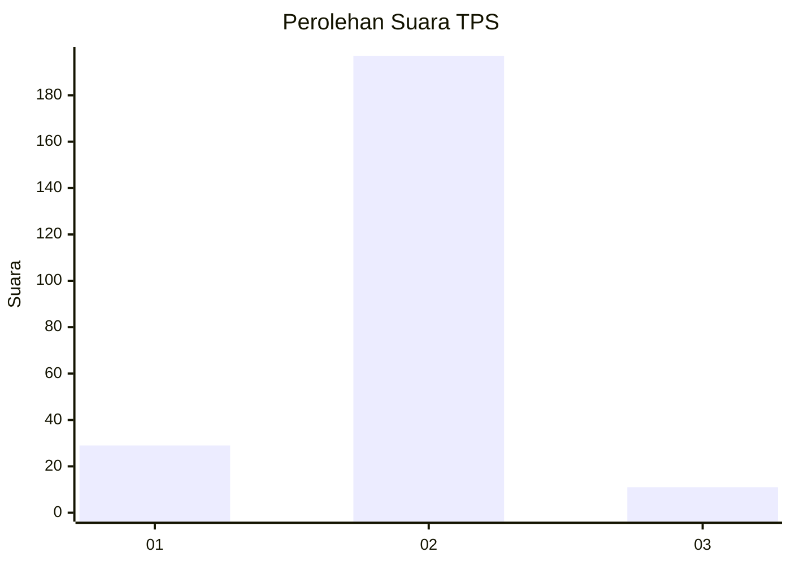
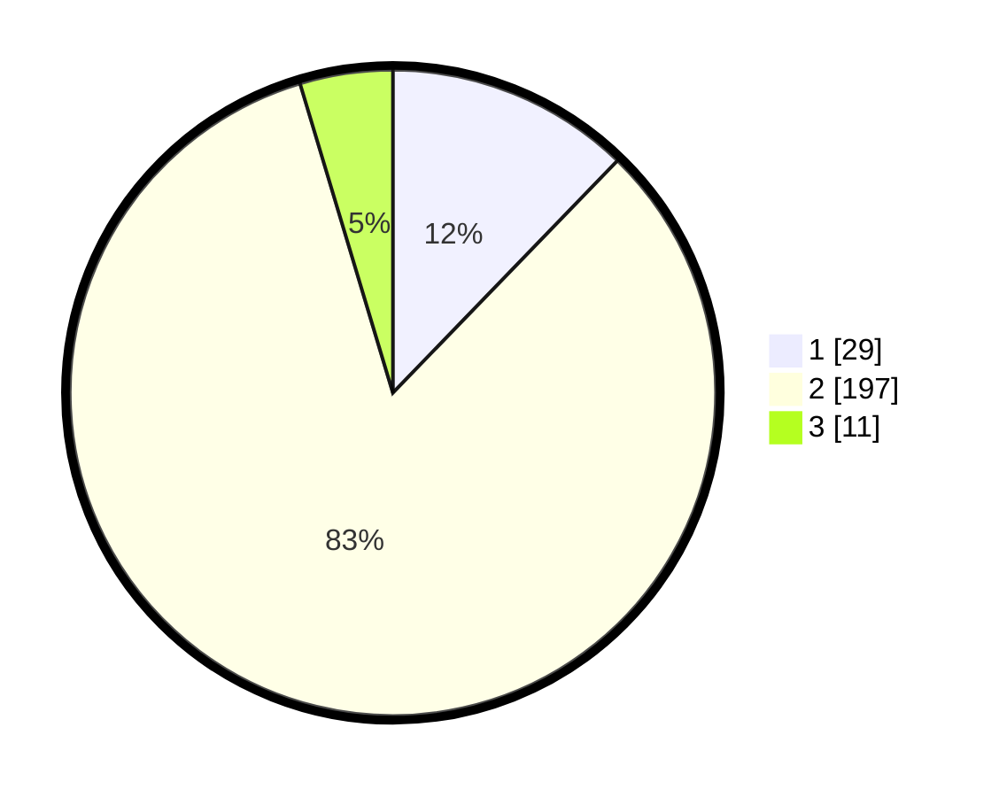

# Hasil

## Grafik

## Tabel

| No. | Nama Paslon    | Suara | Suara (raw) | Persentase |
|:--- |:-------------- | -----:| -----------:| ----------:|
| 1   | ANIES MUHAIMIN | 29    | [29][p-1]   | 12,24      |
| 2   | PRABOWO GIBRAN | 197   | [197][p-2]  | 83,12      |
| 3   | GANJAR MAHFUD  | 11    | [11][p-3]   | 4,64       |

[p-1]: https://github.com/gigit-pemilu/pemilu-2024-35-jawa-timur/blob/main/pilpres/hitung-suara/sub/35-jawa-timur/sub/09-jember/sub/30-silo/sub/2009-sidomulyo/sub/025-tps/sub/paslon-1.txt
[p-2]: https://github.com/gigit-pemilu/pemilu-2024-35-jawa-timur/blob/main/pilpres/hitung-suara/sub/35-jawa-timur/sub/09-jember/sub/30-silo/sub/2009-sidomulyo/sub/025-tps/sub/paslon-2.txt
[p-3]: https://github.com/gigit-pemilu/pemilu-2024-35-jawa-timur/blob/main/pilpres/hitung-suara/sub/35-jawa-timur/sub/09-jember/sub/30-silo/sub/2009-sidomulyo/sub/025-tps/sub/paslon-3.txt

## Foto C Plano

https://sirekap-obj-formc.kpu.go.id/2f76/pemilu/ppwp/35/09/30/20/09/3509302009025-20240216-123302--a0f4a266-ff5c-4305-bb5c-c653f0a939a5.jpg

https://sirekap-obj-formc.kpu.go.id/2f76/pemilu/ppwp/35/09/30/20/09/3509302009025-20240215-005933--8298f177-8f9e-478d-96a8-ecbbf04d7e39.jpg

https://sirekap-obj-formc.kpu.go.id/2f76/pemilu/ppwp/35/09/30/20/09/3509302009025-20240215-103654--1ae984b9-b294-49ed-8272-975634f998b1.jpg

## Metadata

| Key        | Value               |
| ---------- | ------------------- |
| Time Stamp | 2024-02-16 12:51:22 |

