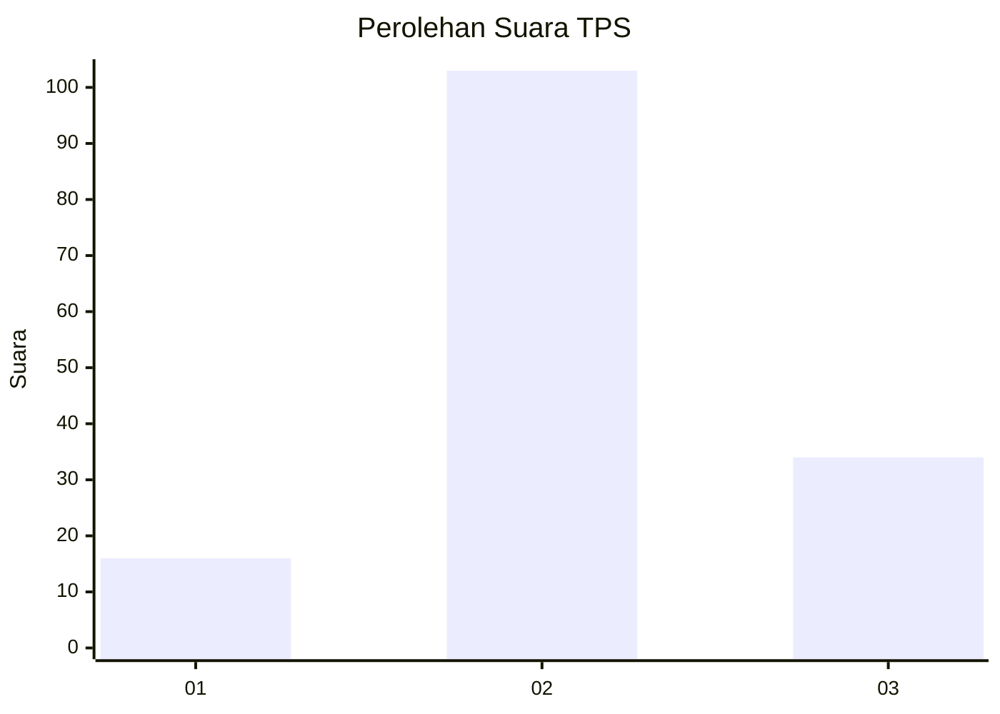
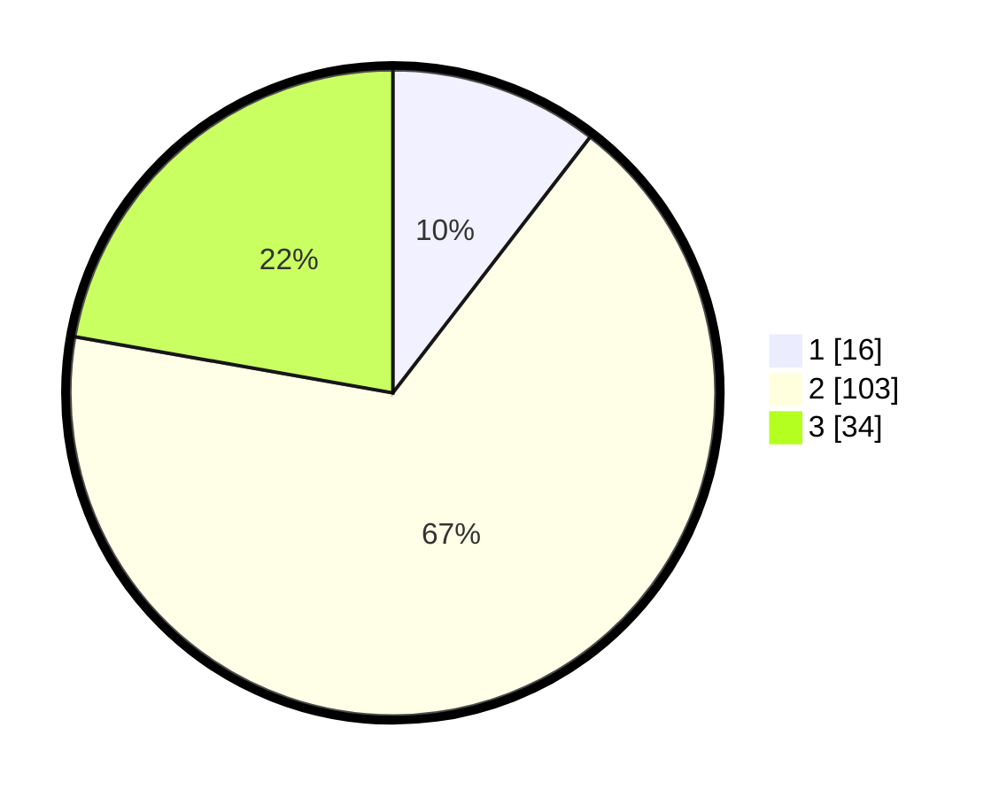

# Hasil

## Grafik

## Tabel

| No. | Nama Paslon    | Suara | Suara (raw) | Persentase |
|:--- |:-------------- | -----:| -----------:| ----------:|
| 1   | ANIES MUHAIMIN | 16    | [16][p-1]   | 10,46      |
| 2   | PRABOWO GIBRAN | 103   | [103][p-2]  | 67,32      |
| 3   | GANJAR MAHFUD  | 34    | [34][p-3]   | 22,22      |

[p-1]: https://github.com/gigit-pemilu/pemilu-2024/blob/main/pilpres/hitung-suara/sub/35-jawa-timur/sub/09-jember/sub/30-silo/sub/2009-sidomulyo/sub/029-tps/sub/paslon-1.txt
[p-2]: https://github.com/gigit-pemilu/pemilu-2024/blob/main/pilpres/hitung-suara/sub/35-jawa-timur/sub/09-jember/sub/30-silo/sub/2009-sidomulyo/sub/029-tps/sub/paslon-2.txt
[p-3]: https://github.com/gigit-pemilu/pemilu-2024/blob/main/pilpres/hitung-suara/sub/35-jawa-timur/sub/09-jember/sub/30-silo/sub/2009-sidomulyo/sub/029-tps/sub/paslon-3.txt

## Foto C Plano

https://sirekap-obj-formc.kpu.go.id/e9d1/pemilu/ppwp/35/09/30/20/09/3509302009029-20240215-030453--057df708-0e9e-4539-957a-5a24a16ed9d1.jpg

https://sirekap-obj-formc.kpu.go.id/e9d1/pemilu/ppwp/35/09/30/20/09/3509302009029-20240215-030503--79f59c61-7b6f-4fb1-817a-b4f276db8d78.jpg

https://sirekap-obj-formc.kpu.go.id/e9d1/pemilu/ppwp/35/09/30/20/09/3509302009029-20240215-030516--c28c776b-76d1-4535-825f-839cdbe97f04.jpg

## Metadata

| Key        | Value               |
| ---------- | ------------------- |
| Time Stamp | 2024-02-15 18:00:26 |

