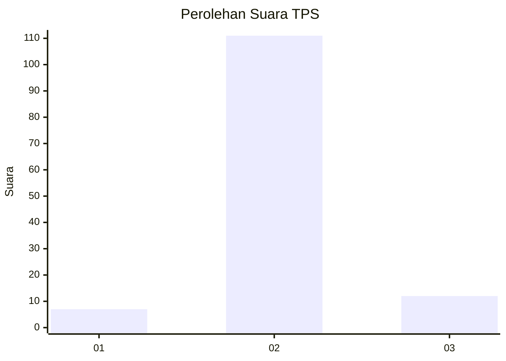
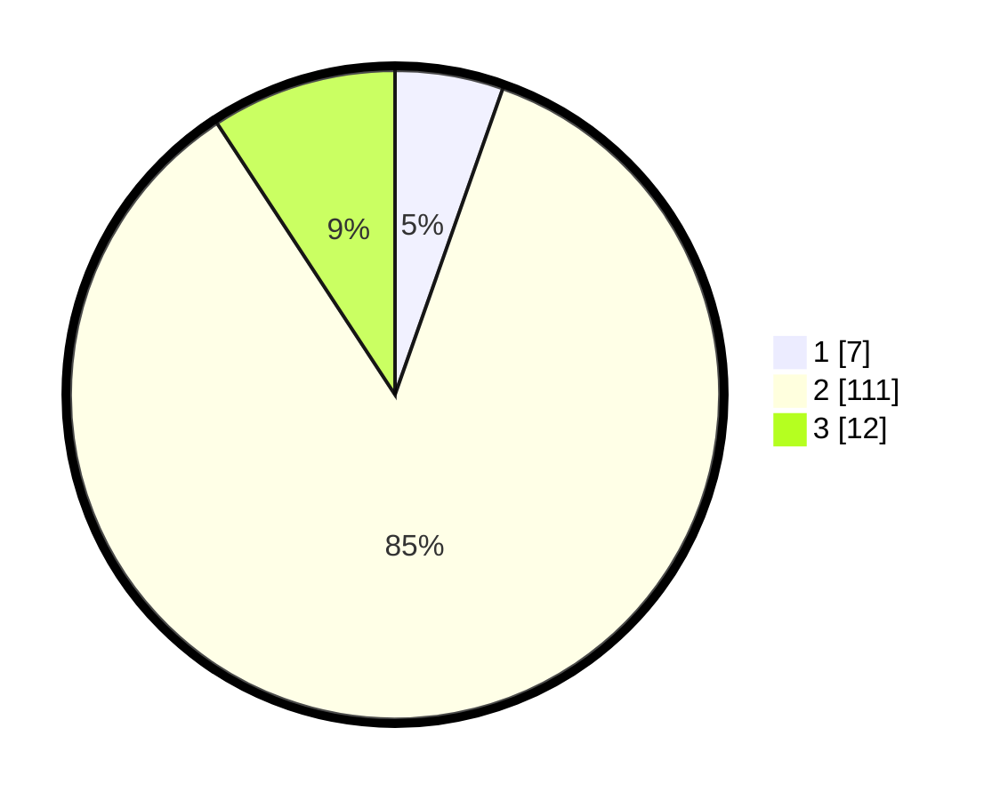

# Hasil

## Grafik

## Tabel

| No. | Nama Paslon    | Suara | Suara (raw) | Persentase |
|:--- |:-------------- | -----:| -----------:| ----------:|
| 1   | ANIES MUHAIMIN | 7     | [7][p-1]    | 5,38       |
| 2   | PRABOWO GIBRAN | 111   | [111][p-2]  | 85,38      |
| 3   | GANJAR MAHFUD  | 12    | [12][p-3]   | 9,23       |

[p-1]: https://github.com/gigit-pemilu/pemilu-2024/blob/main/pilpres/hitung-suara/sub/35-jawa-timur/sub/09-jember/sub/31-sumberjambe/sub/2001-plerean/sub/002-tps/sub/paslon-1.txt
[p-2]: https://github.com/gigit-pemilu/pemilu-2024/blob/main/pilpres/hitung-suara/sub/35-jawa-timur/sub/09-jember/sub/31-sumberjambe/sub/2001-plerean/sub/002-tps/sub/paslon-2.txt
[p-3]: https://github.com/gigit-pemilu/pemilu-2024/blob/main/pilpres/hitung-suara/sub/35-jawa-timur/sub/09-jember/sub/31-sumberjambe/sub/2001-plerean/sub/002-tps/sub/paslon-3.txt

## Foto C Plano

https://sirekap-obj-formc.kpu.go.id/7f7d/pemilu/ppwp/35/09/31/20/01/3509312001002-20240218-113328--bd72c87e-7119-43df-b2ca-89e691f29ba2.jpg

https://sirekap-obj-formc.kpu.go.id/7f7d/pemilu/ppwp/35/09/31/20/01/3509312001002-20240218-113436--24669bd2-8c70-4460-9b43-80edbbaa785c.jpg

## Metadata

| Key        | Value               |
| ---------- | ------------------- |
| Time Stamp | 2024-02-25 20:00:00 |

